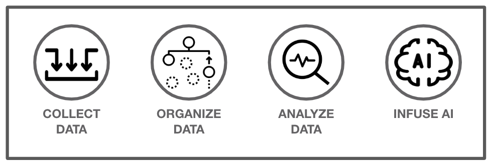

# Cloud Pak for Data Workshop

## Background Info

This is a workshop for Cloud Pak for Data where the following sections are covered:

## [1. Environments](01-environment.md)

A briefly talk about IBM's Data and AI offerings.

## [2. Data](02-data.md)

In this lab we will be setting up a new Cloud Pak for Data project, importing data, visualizing it, and virtualizing data.

## [3. Machine Learning](03-ml.md)

In this lab we will be creating and deploying a model using Watson Machine Learning.

## [4. Monitoring Models](04-openscale.md)

In this lab we will be monitoring the model (that we just created) for fairness.
