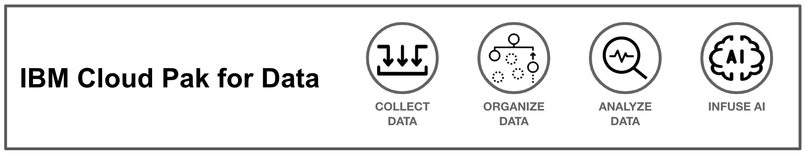

# Cloud Pak for Data Workshop

  

## Background Info

This is a workshop for Cloud Pak for Data where the following sections are covered:

## [1. Environments](01-environment.md)

The first chapter of this guide will walk you through the necessary requirements that are needed to complete this workshop, including initial setup for the server, macOS dashboard and iOS client.

## [2. Data](02-data.md)

This chapter will be the setup for the server side of the application.  We will be setting up our WebSocket class so that the clients can successfully connect to it in later chapters.

## [3. Machine Learning](03-ml.md)

This chapter will be the setup for the dashboard of the application.  The dashboard will allow iOS users to connect to it and be visible on the map presented in the dashboard.

## [4. Monitoring Models](03-openscale.md)

This chapter will be the setup for the dashboard of the application.  The dashboard will allow iOS users to connect to it and be visible on the map presented in the dashboard.
