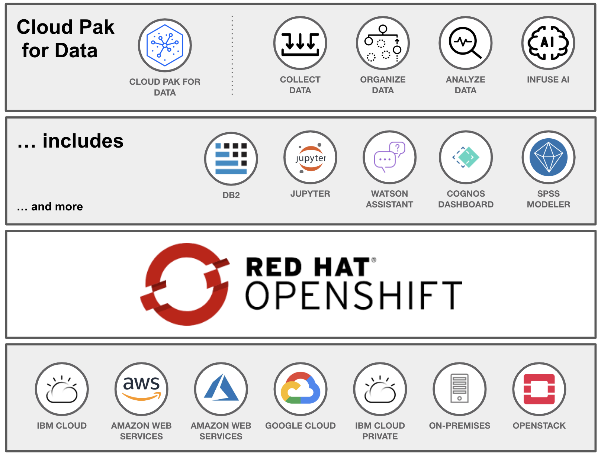

# Telco Churn Workshop

## Agenda

We'll be using the Cloud Pak for Data platform to perform the following tasks:

* **Pre-work**
  * Setting up a project
  * About the data set
  * (Optional) Seeding our Db2 database
* **Data Analysis**
  * Add a new Data Source connection
  * Virtualize Db2 data with Data Virtualization
  * Visualize data with Cognos Dashboards
* **Data Visualization with Data Refinery**
  * Refine data with R code or menu operations
  * Use Data Flow steps to keep track of your work
  * Profile Data
  * Visualize with charts and graphs
* **Machine Learning**
  * Build a model with Spark
  * Deploying a model with Watson Machine Learning
  * Testing the model with built-in UI
  * (Optional) Create a Python Flask app that uses the model
* **Monitoring models**
  * Monitor model with Watson OpenScale

## About Cloud Pak for Data

Cloud Pak for Data represents an all-in-one platform for all your data needs. Cloud Pak for data tries to eliminate silos between Architect, Data Scientist, Developer, and Data Stewards. Cloud Pak for Data helps to streamline work by creating a pipeline for collecting, organizing, analyzing, and consuming data.

### A few other noteworthy mentions

Cloud Pak for Data:

* ... has a [new CP4D 2.5 version]http://rhea.svl.ibm.com:9081/support/knowledgecenter/SSQNUZ_2.5.0/cpd/overview/overview.html)
* ... is installed on Red Hat OpenShift providing an enterprise quality container platform
* ...you can choose the services that you want to run on Cloud Pak for Data. This means you are running only the services that are important for your line of business.
* ...you can extend the functionality of IBM Cloud Pak for Data by installing services and by integrating Cloud Pak for Data with other applications.
* ... added [Services](http://rhea.svl.ibm.com:9081/support/knowledgecenter/SSQNUZ_2.5.0/cpd/svc/services.html) include:
  * Watson Assistant
  * Watson OpenScale
  * R Studio
  * Data Virtualization
  * any many more
* ... can be deployed on any major cloud provider (AWS, Azure, GCP)
* ... provides a free 7-day trial -- [Cloud Pak Experience](https://www.ibm.com/cloud/garage/cloud-pak-experiences/)

### Our Cloud Pak for Data environment

For this workshop we'll be using Cloud Pak for Data with the following add-ons:

* Watson Machine Learning
* Watson OpenScale
* Data Virtualization
* Data Refinery

The environment was deployed on an 8-node cluster with 3 master nodes (32 VCPU, 32 GB RAM), and 5 worker nodes (32 VCPU, 128 GB RAM).
