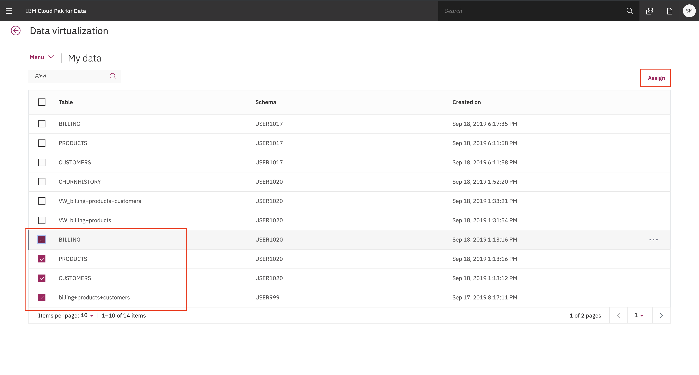
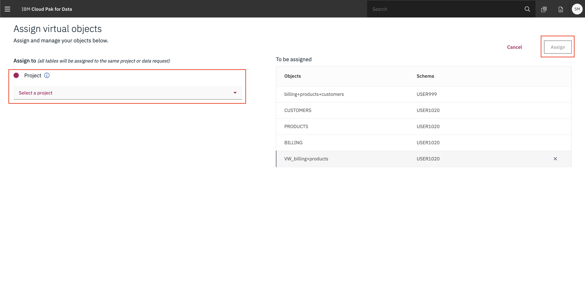

# Importing data in your projects

There are many ways to bring your data into your project, in this section we'll cover using from the following data sources:

* Using virtualized data

## Using Virtualized Data

For this section we'll now use the Data Virtualization tool to import the data from Db2 Warehouse, which is now exposed as an Connection in Cloud Pak for Data.

### Assign the data to your project

From the menu click on *Collections -> Virtualized Data*, you'll be brought to the *My data* section. Here you should see the data that the administrator has assigned to you. Choose the three data sets available and click *Assign* to start importing it to your project.

From here, choose the project you previously created.

Switching to our project should show all three virtualized tables, and two joined tables. Do not go to the next section until this step is performed.

