# Admin guide

> **NOTE**: This section requires `Admin` user access to the Cloud Pak for Data cluster. An administrator will present this part for the workshop.

## Virtualize Db2 data with Data Virtualization

For this section we'll now use the Data Virtualization tool to import the data from Db2 Warehouse, which is now exposed as an Connection in Cloud Pak for Data.

## Provision Data Virtualization

Go to the `Services` tab. Use the `Category` pulldown and select `Data sources`. Click on the `Data Virtualization` tile.


Follow the instructions to provision Data Virtualization.

> For deployment using Managed OpenShift you must do the following:  
> **IMPORTANT:** Decide whether to check the *Updated the kernel semaphore parameter* checkbox.  
> **IMPORTANT:** Do **NOT** choose the defaults for storage. You must choose *ibmc-file-gold-gid* as the storage class

## Create an IBM Cloud instance of DB2 Warehouse

It is suggested to use [DB2 Warehouse on IBM Cloud](https://cloud.ibm.com/catalog/services/db2-warehouse) in order to conserve resources on the CPD cluster.

<!-- (Db2WH Local) IF you wish to use the local DB2 on the cluster, skip to the next section. -->

Provision an instance of DB2 Warehouse on the IBM Cloud.

Go to `Service credentials` and click `New credential +`. Click the `Copy to clipboard` icon and save the credentials for use later:

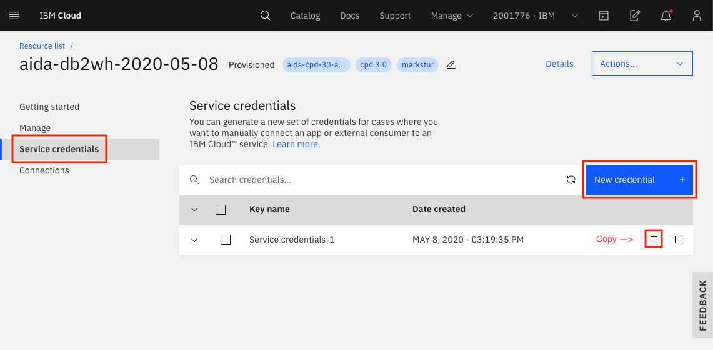

Now go to `Manage` and click `Open Console`:


From the upper-left (☰) hamburger menu click `LOAD` -> `Load Data`:

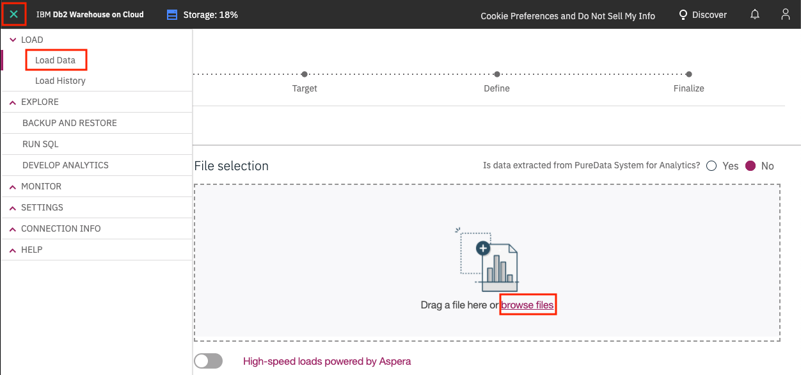

Click on `browse files` and navigate to where you cloned this repository, then to `data/split/` and choose `billing.csv`, then click `Next`.
Choose Schema `NULLIDRA` and click `+ New Table`. Under `Create a new Table` type "BILLING" and click `Create`, then `Next`. Accept the defaults and click `Next`. Click `Begin Load`.
Click `Load More Data` and repeat for the `products.csv` file, naming the table `PRODUCTS` and the `customer-service.csv` file, naming the table `CUSTOMERS`.

<!-- (Db2WH Local)
## Load Data into Local DB2 Warehouse

These instructions are for loading the data into the local CP4D version of DB2 Warehouse. If you've used the IBM Cloud instance of DB2 Warehouse, you can skip to the next section.

You will need to already have done the `Provision instance` for DB2 Warehouse.
Go to `Services` and click on `DB2 Warehouse` and click `Open`:


Under `Menu` choose `Load` and `Load Data`:


Choose `Browse file` and navigate to where you cloned this repository, then to `data/split/` and choose `billing.csv`, then click `Next`.
Choose Schema `NULLIDRA` and click `+ New Table`. Under "New Table Name" type "BILLING" and click `Create`, then `Next`. Accept the defaults and click `Next`. Click `Begin Load`.
Repeat for the `products.csv` file, naming the table `PRODUCTS` and the `customer-service.csv` file, naming the table `CUSTOMERS`.
-->

### Get IBM Cloud DB2 SSL cert

You will need an SSL cert for Cloud Pak for Data to use the IBM Cloud DB2 Warehouse instance.

In the DB2 Warehouse console, from the upper-left (☰) hamburger menu click `CONNECTION INFO` -> `Connection Information`. Then click `Download SSL Certificate`:

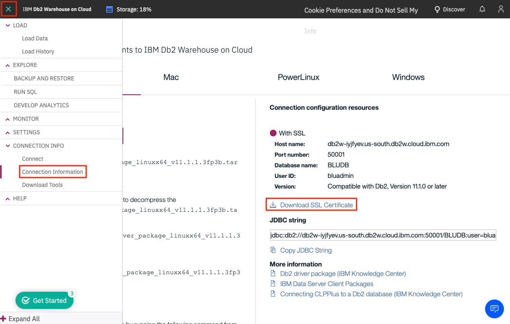

You'll need to convert the SSL certificate from `.crt` to a `.pem` file using [openssl](https://www.openssl.org/). Run the following command:

```bash
openssl x509 -in DigiCertGlobalRootCA.crt -out DigiCertGlobalRootCA.pem -outform PEM -inform DER
```

### Add DB Connections & Virtualization prep

For Cloud Pak for Data to read our Db2 Warehouse data we need to add a new *Data Source* to Cloud Pak for Data. This requires inputting the usual JDBC details.

#### Get IBM Cloud DB2 connection info

If you didn't already copy this when you provisioned the IBM Cloud DB2 instance above, go back and get the credentials as instructed.

<!-- (Db2WH Local)
#### Get local DB2 connection info

To get the connection info for you local DB2 Warehouse, go to the (☰) menu and click on the *My Instances* option.


In *My instances* go to the *Provisioned instances* tab. Highlight your local DB2 Warehouse and click the 3 vertical dots on the far right, and then click `View Details`:


Either keep this window open in a separate tab, or copy the required Connection info: *Host*, *Port*, *Database name*, *Username*, and *Password*. You can get the port from the *JDBC Connection URL*, i.e for the URL `jdbc:db2://os-workshop-nov22worker-05.vz-cpd-nov22.com:30290/BLUDB` the port is the number after the colin in the URL `30290`:


-->

#### Add DB2 as new data source

To add a new data source, go to the (☰) menu and click on the *Connections* option.


At the overview, click `New connection +`.

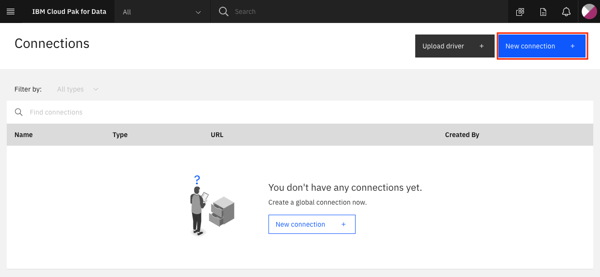

Start by giving your *New connection* a name and select *Db2 Warehouse on Cloud* as your connection type. More fields should apper. Fill the new fields with the same credentials for your own Db2 Warehouse connection from the previous section.

Click the check box for `Use SSL`. Next click `Select file` and navigate to where you converted the SSL certificate for DB2 Warehouse form a `.crt` file to a `.pem` file (probably called DigiCertGlobalRootCA.pem).

Click `Test connection` and, after that succeeds, click `Create`.


The new connection will be listed in the overview.

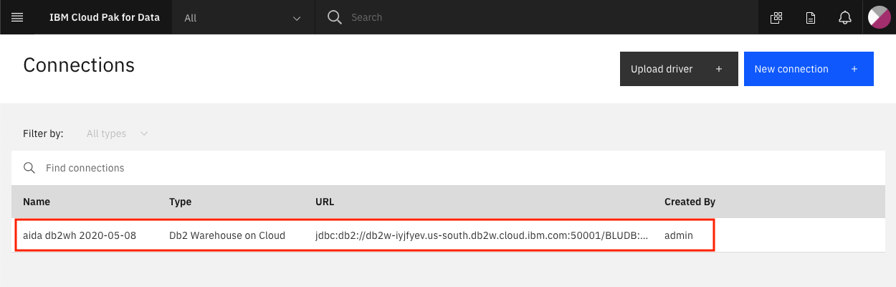

### Add a Data Source to Data Virtualization

To launch the data virtualization tool, go the (☰) menu and click `Collect` and then `Data Virtualization`.

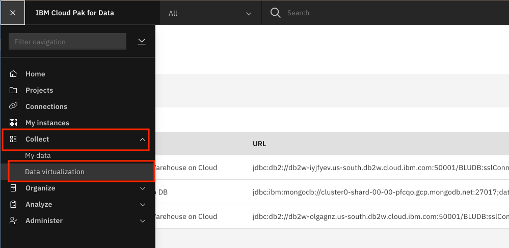

At the empty overview, click the pulldown next to `Add new data source` and select `From existing connections`.

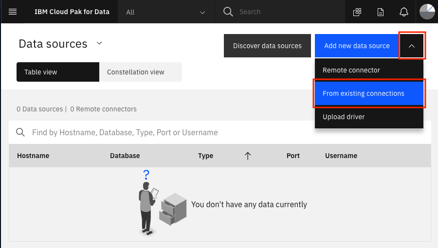

Select the data source we made in the previous step, and click *Next*.

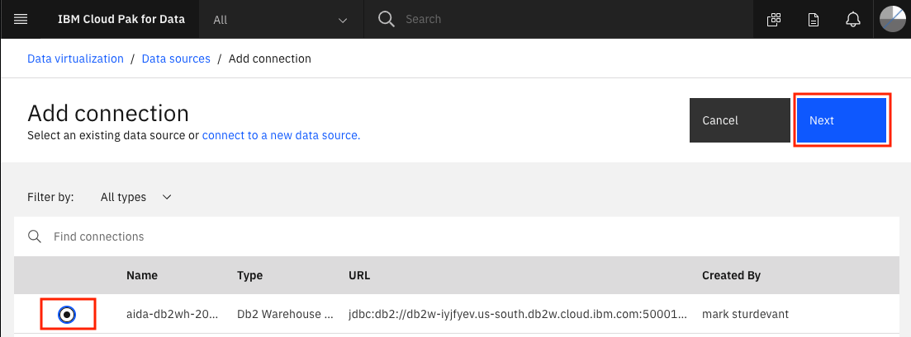

The new connection will be listed as a data source for data virtualization.

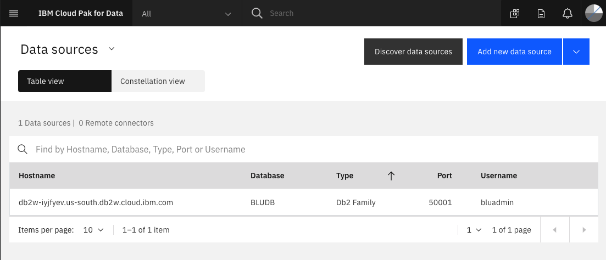

### Start virtualizing data

In this section, since we now have access to the Db2 Warehouse data, we can virtualize the data to our Cloud Pak for Data project. Click on the *Data sources* pulldown and choose *Virtualize*.


Several tables will appear (many are created as sample data when a Db2 Warehouse instance is provisioned) in the table. Find the tables you created earlier, the instructions suggested naming them: `CUSTOMER`, `PRODUCT` and `BILLING`. Once selected click on *Add to cart* and then on *View cart*.
You can search for the Schema `NULLIDRA` and they should show up:

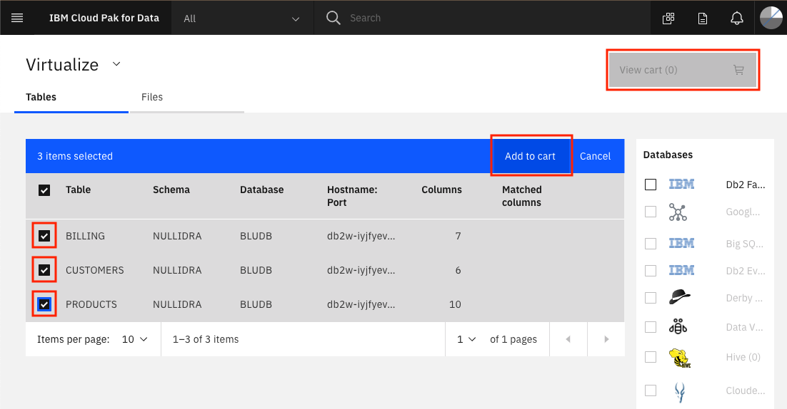

The next panel prompts the user to choose which project to assign the data to, choose `My virtualized data`, **uncheck** `Submit to catalog`, and click `Virtualize` to start the process.


You'll be notified that the virtual tables have been created! Let's see the new virtualized data from the Data Virtualization tool by clicking `View my virtualized data`.


### Join the virtualized data

Now we're going to **join** the tables we created so we have a merged set of data. It will be easier to do it here rather than in a notebook where we'd have to write code to handle three different data sets. Click on any two tables (`PRODUCTS` and `BILLING` for instance) and click the `Join` button.


To join the tables we need to pick a key that is common to both data sets. Here we choose to map `customerID` from the first table to `customerID` on the second table. Do this by clicking on one and dragging it to another. When the line is drawn click on `Next`.


Next, you have a chance to `Edit column names`. We'll keep them as-is. Click `Next`.

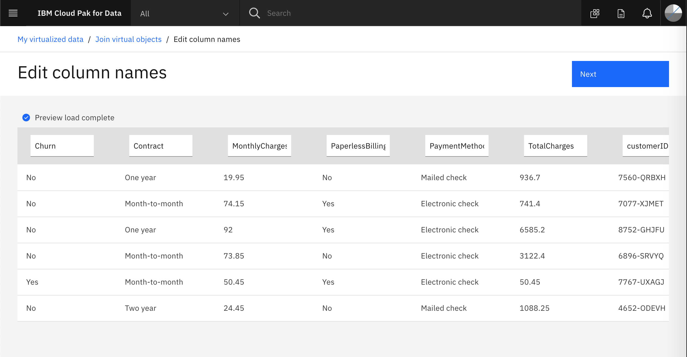

In the next panel we'll give our joined data a name, I chose `BILLINGPRODUCTS`. Under *Assign to*, choose `My virtualized data`, then uncheck `Submit to catalog`, and click `Create view` to start the process.


You'll be notified that the join has succeeded! Click on *View my virtualized data*.


**IMPORTANT:** Now join the new joined view (`BILLINGPRODUCTS`) and the last virtualized table (`CUSTOMERS`), to create a new joined view that has all three tables, let's call it `BILLINGPRODUCTSCUSTOMERS`.

You should now see all three virtualized tables, and two joined tables. Do not go to the next section until this step is performed.

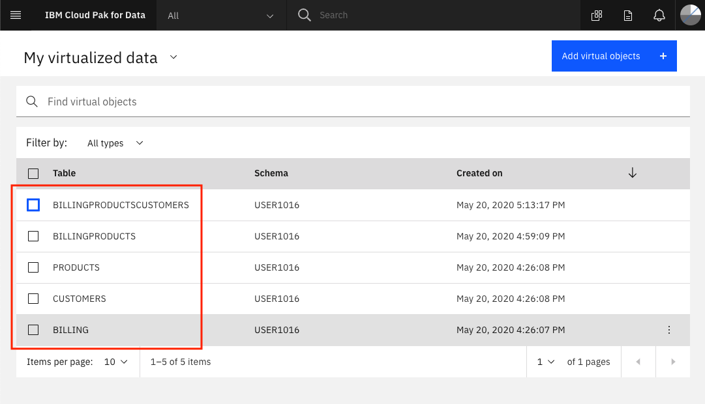

### Assign the "Engineer" role to the attendees

Use the *My virtualized data* pulldown and click on *User management*


Click on *Add users* and ensure all users have the *Engineer* role.


## Adding users to the cluster

From the hamburger menu, click Administer -> Manage users, then add users!


## Watson Knowledge Catalog setup

### Setup the Enterprise catalog

* See the separate instructions to [setup WKC Enterprise Catalog](./wkc-setup-readme.md)

* Go to `Organize` -> `Data discovery` then click `Workspaces` and `Add workspace`. Name it *Enterprise*.

* In your `Enterprise` Data discovery workspace, go to `Settings` -> `Users and groups` and add the CPD cluster users (your workshop attendees).

### Setup Data Discovery

* In `Data discovery` click on `New Discovery job` -> `Quick scan`.

* Under `Select a connection` click your DB connection.

* Under `Discovery root` drill down and check `CUSTOMER`, `INSURANCE`, and `MORTGAGE`.

* Click all the options and choose `1000` for max number of records to scan.

* Under `Select a workspace` choose `Enterprise`.

* click the `Discover` button.

> NOTE: All workshop attendees will need to be added to the Enterprise catalog as a Viewer and added to the Enterprise Catalog Data project as an Editor. They will not be able to view the Data Flow as a Viewer.

### WKC for admins

* To run the [WKC for admins](../watson-knowledge-catalog/README.md) module, the users will need CPD cluster admin role.

## DataStage setup

### Provision the service

* Go to the `Services` tab. Use the `Category` pulldown and select `Data governance`. Click on the `DataStage Edition` tile.


* Follow the instructions to provision DataStage. After the service has been provisioned, you should be able to see `Transform data` under `(☰) Hamburger menu` > `Organize` on CP4D.


### Assign the Data Engineer role to the attendees

Users need to have the *Data Engineer* role in order to see the `Transform data` option under `(☰) Hamburger menu` > `Organize`. This is where they can create a Data Transformation project within which they will be running the data transformation jobs.

* Login as the admin user.

* Go to `(☰) Hamburger menu` > `Administer` > `Manage users`.


* Look for the user that you wish to assign the *Data Engineer* role to and on the right side of that record, click the `Edit` icon.


* Check the checkbox for `Data Engineer` and click `Save`.


### Load the data into DB2 Warehouse

The input data for the DataStage lab is to be retained within the DB2 warehouse instance and the output from the data transformation job will also be stored back into DB2WH. 

The input consists of two tables - the `DEPT` table containing departmental information and the `EMP` table containing the employee information.

The `DEPT` table contains the following columns:

| Column Name | Data Type |
| - | - |
| DEPTNO | VARCHAR(3) |
| DEPTNAME | VARCHAR(28) |
| MGRNO | VARCHAR(6) |
| ADMRDEPT | VARCHAR(3) |
| LOCATION | VARCHAR(5) |

The `EMP` table contains the following columns:

| Column Name | Data Type |
| - | - |
| EMPNO | INTEGER |
| FIRSTNME | VARCHAR(9) |
| MIDINIT | VARCHAR(1) |
| LASTNAME | VARCHAR(10) |
| WORKDEPT | VARCHAR(3) |
| PHONENO | VARCHAR(4) |
| HIREDATE | DATE |
| JOB | VARCHAR(8) |
| EDLEVEL | SMALLINT |
| SEX | VARCHAR(1) |
| BIRTHDATE | DATE |
| SALARY | DECIMAL(10,2) |
| BONUS | DECIMAL(8,2) |
| COMM | DECIMAL(8,2) |

You can load the input data into the DB2 warehouse instance either by loading CSV files or by using an SQL script. Expand one of the sections below to look at the instructions:

<details>
  <summary>Load data using CSV files</summary>

* From the upper-left (☰) hamburger menu click `LOAD` -> `Load Data`. Click on `browse files` and navigate to where you cloned this repository, then to `data/ds/` and choose [dept.csv](/data/ds/dept.csv), then click `Next`.


* Choose Schema `NULLIDRA` and click `+ New Table`. Under `Create a new Table`, type "DEPT", click `Create` and then click `Next`. 


* Verify that the data types identified for all the columns match the column description given [earlier](#-load-the-data-into-db2-warehouse). If it doesn't match, disable the `Detect data types` button and then click on the pencil icon next to the data type of the column that you want to update. Specify the correct data type in the modal and click `OK`. Once all columns have been verified, click `Next`.


* Click `Begin Load`.

* Once loading is successful, click on `Load More Data` and repeat for the [/data/ds/emp.csv](/data/ds/emp.csv) file, naming the table `EMP`.


</details>

<details>
  <summary>Load data using SQL script</summary>

* From the upper-left (☰) hamburger menu, click `Run SQL`:


* Click on `From file` and then browse and select the [/workshop/admin-guide/scripts/LoadDataStageInput.sql](/workshop/admin-guide/scripts/LoadDataStageInput.sql) SQL file:


* Click `Run all` to run all the statements within the SQL script. Since the DEPT and EMP tables do not exist before running this script, the script will fail on the two DROP statements. You can ignore these failures:


</details>

### Create transformation project

* Back on Cloud Pak for Data, go to `(☰) Hamburger menu` > `Organize` > `Transform data`.


* Click `+ Create`. In the modal that opens up, type in a name for the project and click `Create`.


The project takes a few minutes to be created and once ready, it will be visible on the page. Click on the name of the project to open it.


### Create DB2WH connection in DataStage

The input tables - `EMP` (containing employee data) and `DEPT` (containing department data) - are already loaded in Db2 Warehouse. Let's add the Db2 warehouse instance as a `Connection` in DataStage.

* Click on the `Connections` tab and then click `+ Create` to add a new connection. Provide the name of the connection as `DB2WH`.


* Switch to the `Connection` tab. Provide the JDBC connection details using the credentials copied in the [Create an IBM Cloud instance of DB2 Warehouse](#-create-an-ibm-cloud-instance-of-db2-warehouse) section above. Provide the `Connector type` as `JDBC`, the `URL` as the *ssljdbcurl* value from the copied credentials, the `User name` as the *username* from the copied credentials, and the `Password` as the *password* from the copied credentials. Click `OK` to save the connection. Click `Save` on the new modal that pops up.


A tile for the new connection will now be displayed in the `Connections` tab.


### Troubleshooting for DataStage

#### Invalid universe credentials error

* The first time a user uses the newly deployed DataStage service, they may run into the following error:


* To get past this, you will need to use the bash commands given below to perform the following steps:

1. exec into the engine conductor
2. add new DataStage credentials
3. resave the newly added DataStage credentials as default

> **NOTE**: When you run the following commands, if you get an error that says "Error Failed to login:CDIHT0401E: Login failed.  Ensure the user ID and password are correct.", it means that isadmin/$ISADMIN_PASSWORD doesn’t exist. Replace isadmin/$ISADMIN_PASSWORD with admin/password instead.

```bash
oc exec -it is-en-conductor-0 bash

cd /opt/IBM/InformationServer/ASBNode/bin
./DirectoryCommand.sh -user isadmin -password $ISADMIN_PASSWORD -url https://is-servicesdocker:9446 -datastage_server is-en-conductor-0.en-cond -add_ds_credentials isadmin\$!~\!

./DirectoryCommand.sh -user isadmin -password $ISADMIN_PASSWORD -url https://is-servicesdocker:9446 -datastage_server is-en-conductor-0.en-cond -set_default_ds_credentials dsadm~$DSADM_PASSWORD
```

If the above commands run successfully, you should see the following output:

```bash
------------------ Executing "set_default_ds_credentials" command. ------------------
Default DataStage credentials for "is-en-conductor-0.en-cond" set to user "dsadm" and password "********".
```

#### DisconnectNonTransientConnectionException - Received fatal alert: handshake_failure

Adding a DB2WH connection to the DataStage project might go through smoothly, however, at this point the connection has not been tested. When a user tries to add a ***Connection*** connector to the job canvas and tries to specify the DB2WH connection as the source, they may run into the following error:

```
com.ibm.iis.cas.shared.exceptions.ConnectionException: The connector failed to connect to the data source. The reported error is: com.ibm.db2.jcc.am.DisconnectNonTransientConnectionException: [jcc][t4][2030][11211][4.16.53] A communication error occurred during operations on the connection's underlying socket, socket input stream, or socket output stream. Error location: Reply.fill() - socketInputStream.read (-1). Message: Received fatal alert: handshake_failure. ERRORCODE=-4499, SQLSTATE=08001
```

The issue here is that there are 2 drivers for db2 in the system and because of the order in which they were loaded, it is possible that the driver version being used does not match the DB2WH version.

In order to get past this, you need to remove one of the drivers and restart the engine conductor.

* Exec into the engine conductor:

```bash
oc exec -it is-en-conductor-0 bash
```

* Check the log file for the error stack trace and find the driver version that was loaded:

> ***Note***: The error stack trace will be available only after you run into the error on the DataStage Flow Designer.

```bash
cat /opt/IBM/InformationServer/ASBNode/logs/asb-agent-0.out
```

It should look something like this:

```
[06/30/20 07:34:27:852 UTC] 87 com.ibm.iis.cas log INFO CDICC3000I: The driver version is: 4.16
[06/30/20 07:34:28:335 UTC] 87 com.ibm.iis.cas log INFO CDICC3000I: The connector encountered a Java exception:
com.ibm.db2.jcc.am.DisconnectNonTransientConnectionException: [jcc][t4][2030][11211][4.16.53] A communication error occurred during operations on the connection's underlying socket, socket input stream,
or socket output stream.  Error location: Reply.fill() - socketInputStream.read (-1).  Message: Received fatal alert: handshake_failure. ERRORCODE=-4499, SQLSTATE=08001
```

* Check the db2 drivers on the machine under /opt/IBM/InformationServer/ASBNode/lib/java:

```bash
cd /opt/IBM/InformationServer/ASBNode/lib/java
ls -l db2jcc*.jar
```

You may see something like this:

```bash
-rwxr-xr-x. 1 dsadm dstage 3866524 May 27 13:37 db2jcc4.jar
-rwxr-xr-x. 1 dsadm dstage 3657990 May 27 12:03 db2jcc.jar
-rwxr-xr-x. 1 dsadm dstage    2068 May 27 12:03 db2jcc_license_cisuz.jar
-rwxr-xr-x. 1 dsadm dstage    1015 May 27 12:03 db2jcc_license_cu.jar
```

The first two records indicate that there are 2 jars in the system. We will have to move the *4.jar (since the log indicated that it was loaded) and see if the system picks up the other driver (db2jcc.jar) and if the connection works with this driver.

* Move the db2jcc4.jar to /tmp:

```bash
mv db2jcc4.jar /tmp
```

* Restart the engine conductor:

```bash
/opt/IBM/InformationServer/ASBNode/bin/NodeAgents.sh restart
```

* Try adding the connector to the job again and see if you can connect to DB2WH.