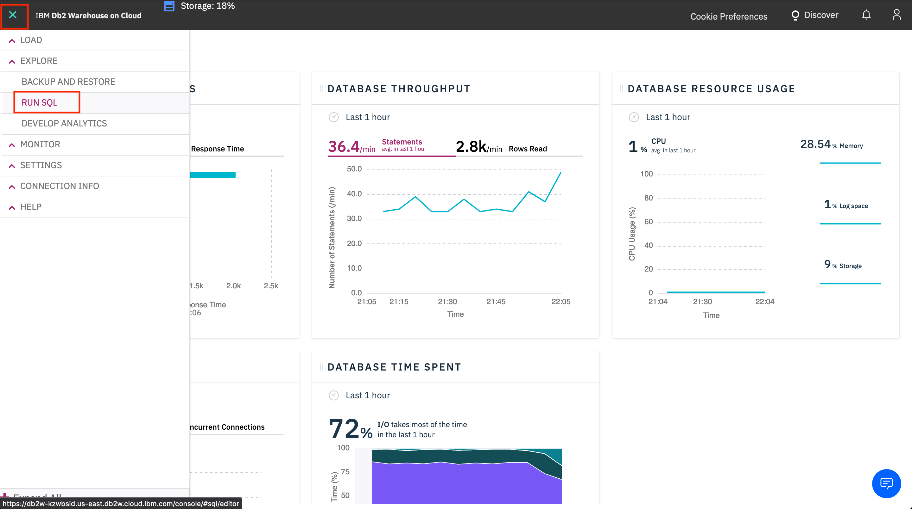

## DataStage setup

### Provision the service

* Go to the `Services` tab. Use the `Category` pulldown and select `Data governance`. Click on the `DataStage Edition` tile.


* Follow the instructions to provision DataStage. After the service has been provisioned, you should be able to see `Transform data` under `(☰) Hamburger menu` > `Organize` on CP4D.


### Assign the Data Engineer role to the attendees

Users need to have the *Data Engineer* role in order to see the `Transform data` option under `(☰) Hamburger menu` > `Organize`. This is where they can create a Data Transformation project within which they will be running the data transformation jobs.

* Login as the admin user.

* Go to `(☰) Hamburger menu` > `Administer` > `Manage users`.


* Look for the user that you wish to assign the *Data Engineer* role to and on the right side of that record, click the `Edit` icon.


* Check the checkbox for `Data Engineer` and click `Save`.


### Load the data into DB2 Warehouse

> ***Note***: DataStage on CP4D works with a number of databases such as DB2, Netezza Performance Server, Greenplum, Hive, Salesforce, Teradata, Oracle, etc. The instuctions given here only apply to Db2 Warehouse on IBM Cloud and may differ for the other databases. 

The input data for the DataStage lab is to be retained within the DB2 warehouse instance and the output from the data transformation job will also be stored back into DB2WH. You will need to [create an IBM Cloud instance of DB2 Warehouse](./virtualizing-db2-data-with-dv-setup-readme.md#create-an-ibm-cloud-instance-of-db2-warehouse) before proceeding with the instructions given below.

The input consists of two tables - the `DEPT` table containing departmental information and the `EMP` table containing the employee information.

The `DEPT` table contains the following columns:

| Column Name | Data Type |
| - | - |
| DEPTNO | VARCHAR(3) |
| DEPTNAME | VARCHAR(28) |
| MGRNO | VARCHAR(6) |
| ADMRDEPT | VARCHAR(3) |
| LOCATION | VARCHAR(5) |

The `EMP` table contains the following columns:

| Column Name | Data Type |
| - | - |
| EMPNO | INTEGER |
| FIRSTNME | VARCHAR(9) |
| MIDINIT | VARCHAR(1) |
| LASTNAME | VARCHAR(10) |
| WORKDEPT | VARCHAR(3) |
| PHONENO | VARCHAR(4) |
| HIREDATE | DATE |
| JOB | VARCHAR(8) |
| EDLEVEL | SMALLINT |
| SEX | VARCHAR(1) |
| BIRTHDATE | DATE |
| SALARY | DECIMAL(10,2) |
| BONUS | DECIMAL(8,2) |
| COMM | DECIMAL(8,2) |

You can load the input data into the DB2 warehouse instance either by loading CSV files or by using an SQL script. Expand one of the sections below to look at the instructions:

<details>
  <summary>Load data using CSV files</summary>

* From the upper-left (☰) hamburger menu click `LOAD` -> `Load Data`. Click on `browse files` and navigate to where you cloned this repository, then to `data/ds/` and choose [dept.csv](/data/ds/dept.csv), then click `Next`.


* Choose Schema `NULLIDRA` and click `+ New Table`. Under `Create a new Table`, type "DEPT", click `Create` and then click `Next`. 


* Verify that the data types identified for all the columns match the column description given [earlier](#-load-the-data-into-db2-warehouse). If it doesn't match, disable the `Detect data types` button and then click on the pencil icon next to the data type of the column that you want to update. Specify the correct data type in the modal and click `OK`. Once all columns have been verified, click `Next`.


* Click `Begin Load`.

* Once loading is successful, click on `Load More Data` and repeat for the [/data/ds/emp.csv](/data/ds/emp.csv) file, naming the table `EMP`.


</details>

<details>
  <summary>Load data using SQL script</summary>

* From the upper-left (☰) hamburger menu, click `Run SQL`:



* Click on `From file` and then browse and select the [/workshop/admin-guide/scripts/LoadDataStageInput.sql](/workshop/admin-guide/scripts/LoadDataStageInput.sql) SQL file:


* Click `Run all` to run all the statements within the SQL script. Since the DEPT and EMP tables do not exist before running this script, the script will fail on the two DROP statements. You can ignore these failures:


</details>

### Create transformation project

* Back on Cloud Pak for Data, go to `(☰) Hamburger menu` > `Organize` > `Transform data`.


* Click `+ Create`. In the modal that opens up, type in a name for the project and click `Create`.


The project takes a few minutes to be created and once ready, it will be visible on the page. Click on the name of the project to open it.


### Create DB2WH connection in DataStage

The input tables - `EMP` (containing employee data) and `DEPT` (containing department data) - are already loaded in Db2 Warehouse. Let's add the Db2 warehouse instance as a `Connection` in DataStage.

* Click on the `Connections` tab and then click `+ Create` to add a new connection. Provide the name of the connection as `DB2WH`.


* Switch to the `Connection` tab. Provide the JDBC connection details using the credentials copied in the [Create an IBM Cloud instance of DB2 Warehouse](./virtualizing-db2-data-with-dv-setup-readme.md#create-an-ibm-cloud-instance-of-db2-warehouse) section above. Provide the `Connector type` as `JDBC`, the `URL` as the *ssljdbcurl* value from the copied credentials, the `User name` as the *username* from the copied credentials, and the `Password` as the *password* from the copied credentials. Click `OK` to save the connection. Click `Save` on the new modal that pops up.


A tile for the new connection will now be displayed in the `Connections` tab.


### Troubleshooting for DataStage

#### Invalid universe credentials error

* The first time a user uses the newly deployed DataStage service, they may run into the following error:


* To get past this, you will need to use the bash commands given below to perform the following steps:

1. exec into the engine conductor
2. add new DataStage credentials
3. resave the newly added DataStage credentials as default

> **NOTE**: When you run the following commands, if you get an error that says "Error Failed to login:CDIHT0401E: Login failed.  Ensure the user ID and password are correct.", it means that isadmin/$ISADMIN_PASSWORD doesn’t exist. Replace isadmin/$ISADMIN_PASSWORD with admin/password instead.

```bash
oc exec -it is-en-conductor-0 bash

cd /opt/IBM/InformationServer/ASBNode/bin
./DirectoryCommand.sh -user isadmin -password $ISADMIN_PASSWORD -url https://is-servicesdocker:9446 -datastage_server is-en-conductor-0.en-cond -add_ds_credentials isadmin\$!~\!

./DirectoryCommand.sh -user isadmin -password $ISADMIN_PASSWORD -url https://is-servicesdocker:9446 -datastage_server is-en-conductor-0.en-cond -set_default_ds_credentials dsadm~$DSADM_PASSWORD
```

If the above commands run successfully, you should see the following output:

```bash
------------------ Executing "set_default_ds_credentials" command. ------------------
Default DataStage credentials for "is-en-conductor-0.en-cond" set to user "dsadm" and password "********".
```

#### DisconnectNonTransientConnectionException - Received fatal alert: handshake_failure

Adding a DB2WH connection to the DataStage project might go through smoothly, however, at this point the connection has not been tested. When a user tries to add a ***Connection*** connector to the job canvas and tries to specify the DB2WH connection as the source, they may run into the following error:

```
com.ibm.iis.cas.shared.exceptions.ConnectionException: The connector failed to connect to the data source. The reported error is: com.ibm.db2.jcc.am.DisconnectNonTransientConnectionException: [jcc][t4][2030][11211][4.16.53] A communication error occurred during operations on the connection's underlying socket, socket input stream, or socket output stream. Error location: Reply.fill() - socketInputStream.read (-1). Message: Received fatal alert: handshake_failure. ERRORCODE=-4499, SQLSTATE=08001
```

The issue here is that there are 2 drivers for db2 in the system and because of the order in which they were loaded, it is possible that the driver version being used does not match the DB2WH version.

In order to get past this, you need to remove one of the drivers and restart the engine conductor.

* Exec into the engine conductor:

```bash
oc exec -it is-en-conductor-0 bash
```

* Check the log file for the error stack trace and find the driver version that was loaded:

> ***Note***: The error stack trace will be available only after you run into the error on the DataStage Flow Designer.

```bash
cat /opt/IBM/InformationServer/ASBNode/logs/asb-agent-0.out
```

It should look something like this:

```
[06/30/20 07:34:27:852 UTC] 87 com.ibm.iis.cas log INFO CDICC3000I: The driver version is: 4.16
[06/30/20 07:34:28:335 UTC] 87 com.ibm.iis.cas log INFO CDICC3000I: The connector encountered a Java exception:
com.ibm.db2.jcc.am.DisconnectNonTransientConnectionException: [jcc][t4][2030][11211][4.16.53] A communication error occurred during operations on the connection's underlying socket, socket input stream,
or socket output stream.  Error location: Reply.fill() - socketInputStream.read (-1).  Message: Received fatal alert: handshake_failure. ERRORCODE=-4499, SQLSTATE=08001
```

* Check the db2 drivers on the machine under /opt/IBM/InformationServer/ASBNode/lib/java:

```bash
cd /opt/IBM/InformationServer/ASBNode/lib/java
ls -l db2jcc*.jar
```

You may see something like this:

```bash
-rwxr-xr-x. 1 dsadm dstage 3866524 May 27 13:37 db2jcc4.jar
-rwxr-xr-x. 1 dsadm dstage 3657990 May 27 12:03 db2jcc.jar
-rwxr-xr-x. 1 dsadm dstage    2068 May 27 12:03 db2jcc_license_cisuz.jar
-rwxr-xr-x. 1 dsadm dstage    1015 May 27 12:03 db2jcc_license_cu.jar
```

The first two records indicate that there are 2 jars in the system. We will have to move the *4.jar (since the log indicated that it was loaded) and see if the system picks up the other driver (db2jcc.jar) and if the connection works with this driver.

* Move the db2jcc4.jar to /tmp:

```bash
mv db2jcc4.jar /tmp
```

* Restart the engine conductor:

```bash
/opt/IBM/InformationServer/ASBNode/bin/NodeAgents.sh restart
```

* Try adding the connector to the job again and see if you can connect to DB2WH.