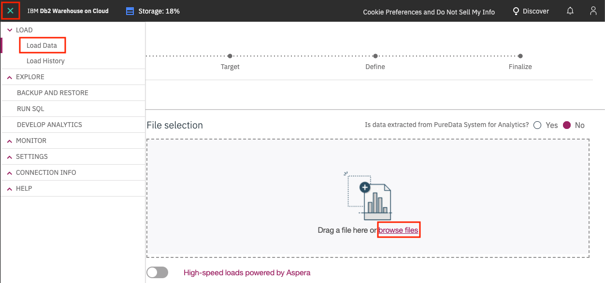

## Virtualize Db2 data with Data Virtualization setup

For this section we'll now use the Data Virtualization tool to import the data from Db2 Warehouse, which is now exposed as an Connection in Cloud Pak for Data.

## Provision Data Virtualization

Go to the `Services` tab. Use the `Category` pulldown and select `Data sources`. Click on the `Data Virtualization` tile.


Follow the instructions to provision Data Virtualization.

> For deployment using Managed OpenShift you must do the following:  
> **IMPORTANT:** Decide whether to check the *Updated the kernel semaphore parameter* checkbox.  
> **IMPORTANT:** Do **NOT** choose the defaults for storage. You must choose *ibmc-file-gold-gid* as the storage class

## Create an IBM Cloud instance of DB2 Warehouse

It is suggested to use [DB2 Warehouse on IBM Cloud](https://cloud.ibm.com/catalog/services/db2-warehouse) in order to conserve resources on the CPD cluster.

<!-- (Db2WH Local) IF you wish to use the local DB2 on the cluster, skip to the next section. -->

Provision an instance of DB2 Warehouse on the IBM Cloud.

Go to `Service credentials` and click `New credential +`. Click the `Copy to clipboard` icon and save the credentials for use later:


Now go to `Manage` and click `Open Console`:


From the upper-left (☰) hamburger menu click `LOAD` -> `Load Data`:



Click on `browse files` and navigate to where you cloned this repository, then to `data/split/` and choose `billing.csv`, then click `Next`.
Choose Schema `NULLIDRA` and click `+ New Table`. Under `Create a new Table` type "BILLING" and click `Create`, then `Next`. Accept the defaults and click `Next`. Click `Begin Load`.
Click `Load More Data` and repeat for the `products.csv` file, naming the table `PRODUCTS` and the `customer-service.csv` file, naming the table `CUSTOMERS`.

<!-- (Db2WH Local)
## Load Data into Local DB2 Warehouse

These instructions are for loading the data into the local CP4D version of DB2 Warehouse. If you've used the IBM Cloud instance of DB2 Warehouse, you can skip to the next section.

You will need to already have done the `Provision instance` for DB2 Warehouse.
Go to `Services` and click on `DB2 Warehouse` and click `Open`:


Under `Menu` choose `Load` and `Load Data`:


Choose `Browse file` and navigate to where you cloned this repository, then to `data/split/` and choose `billing.csv`, then click `Next`.
Choose Schema `NULLIDRA` and click `+ New Table`. Under "New Table Name" type "BILLING" and click `Create`, then `Next`. Accept the defaults and click `Next`. Click `Begin Load`.
Repeat for the `products.csv` file, naming the table `PRODUCTS` and the `customer-service.csv` file, naming the table `CUSTOMERS`.
-->

### Get IBM Cloud DB2 SSL cert

You will need an SSL cert for Cloud Pak for Data to use the IBM Cloud DB2 Warehouse instance.

In the DB2 Warehouse console, from the upper-left (☰) hamburger menu click `CONNECTION INFO` -> `Connection Information`. Then click `Download SSL Certificate`:


You'll need to convert the SSL certificate from `.crt` to a `.pem` file using [openssl](https://www.openssl.org/). Run the following command:

```bash
openssl x509 -in DigiCertGlobalRootCA.crt -out DigiCertGlobalRootCA.pem -outform PEM -inform DER
```

### Add DB Connections & Virtualization prep

For Cloud Pak for Data to read our Db2 Warehouse data we need to add a new *Data Source* to Cloud Pak for Data. This requires inputting the usual JDBC details.

#### Get IBM Cloud DB2 connection info

If you didn't already copy this when you provisioned the IBM Cloud DB2 instance above, go back and get the credentials as instructed.

<!-- (Db2WH Local)
#### Get local DB2 connection info

To get the connection info for you local DB2 Warehouse, go to the (☰) menu and click on the *My Instances* option.


In *My instances* go to the *Provisioned instances* tab. Highlight your local DB2 Warehouse and click the 3 vertical dots on the far right, and then click `View Details`:


Either keep this window open in a separate tab, or copy the required Connection info: *Host*, *Port*, *Database name*, *Username*, and *Password*. You can get the port from the *JDBC Connection URL*, i.e for the URL `jdbc:db2://os-workshop-nov22worker-05.vz-cpd-nov22.com:30290/BLUDB` the port is the number after the colin in the URL `30290`:


-->

#### Add DB2 as new data source

To add a new data source, go to the (☰) menu and click on the *Connections* option.


At the overview, click `New connection +`.


Start by giving your *New connection* a name and select *Db2 Warehouse on Cloud* as your connection type. More fields should apper. Fill the new fields with the same credentials for your own Db2 Warehouse connection from the previous section.

Click the check box for `Use SSL`. Next click `Select file` and navigate to where you converted the SSL certificate for DB2 Warehouse form a `.crt` file to a `.pem` file (probably called DigiCertGlobalRootCA.pem).

Click `Test connection` and, after that succeeds, click `Create`.


The new connection will be listed in the overview.


### Add a Data Source to Data Virtualization

To launch the data virtualization tool, go the (☰) menu and click `Collect` and then `Data Virtualization`.


At the empty overview, click the pulldown next to `Add new data source` and select `From existing connections`.


Select the data source we made in the previous step, and click *Next*.


The new connection will be listed as a data source for data virtualization.


### Start virtualizing data

In this section, since we now have access to the Db2 Warehouse data, we can virtualize the data to our Cloud Pak for Data project. Click on the *Data sources* pulldown and choose *Virtualize*.


Several tables will appear (many are created as sample data when a Db2 Warehouse instance is provisioned) in the table. Find the tables you created earlier, the instructions suggested naming them: `CUSTOMER`, `PRODUCT` and `BILLING`. Once selected click on *Add to cart* and then on *View cart*.
You can search for the Schema `NULLIDRA` and they should show up:


The next panel prompts the user to choose which project to assign the data to, choose `My virtualized data`, **uncheck** `Submit to catalog`, and click `Virtualize` to start the process.


You'll be notified that the virtual tables have been created! Let's see the new virtualized data from the Data Virtualization tool by clicking `View my virtualized data`.


### Join the virtualized data

Now we're going to **join** the tables we created so we have a merged set of data. It will be easier to do it here rather than in a notebook where we'd have to write code to handle three different data sets. Click on any two tables (`PRODUCTS` and `BILLING` for instance) and click the `Join` button.


To join the tables we need to pick a key that is common to both data sets. Here we choose to map `customerID` from the first table to `customerID` on the second table. Do this by clicking on one and dragging it to another. When the line is drawn click on `Next`.


Next, you have a chance to `Edit column names`. We'll keep them as-is. Click `Next`.


In the next panel we'll give our joined data a name, I chose `BILLINGPRODUCTS`. Under *Assign to*, choose `My virtualized data`, then uncheck `Submit to catalog`, and click `Create view` to start the process.


You'll be notified that the join has succeeded! Click on *View my virtualized data*.


**IMPORTANT:** Now join the new joined view (`BILLINGPRODUCTS`) and the last virtualized table (`CUSTOMERS`), to create a new joined view that has all three tables, let's call it `BILLINGPRODUCTSCUSTOMERS`.

You should now see all three virtualized tables, and two joined tables. Do not go to the next section until this step is performed.


### Assign the "Engineer" role to the attendees

Use the *My virtualized data* pulldown and click on *User management*


Click on *Add users* and ensure all users have the *Engineer* role.


## Adding users to the cluster

From the hamburger menu, click Administer -> Manage users, then add users!

