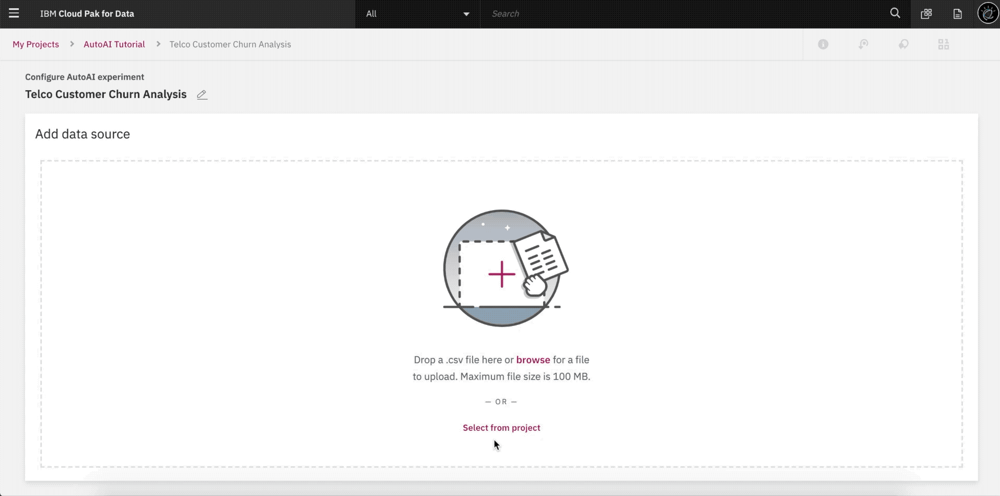
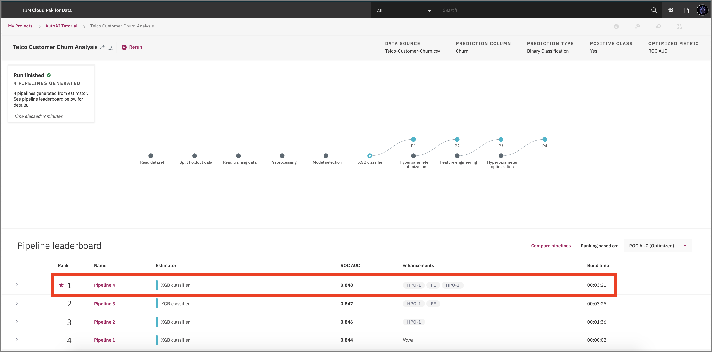
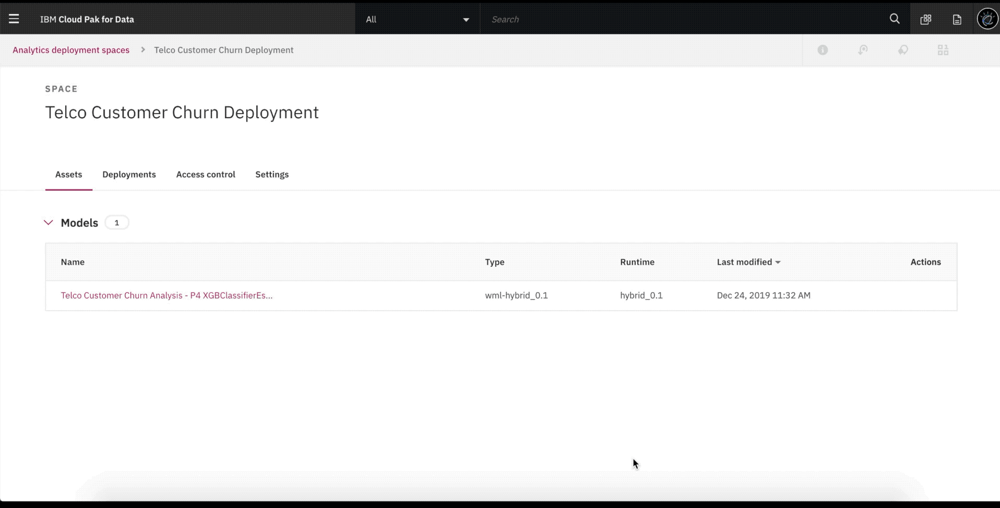
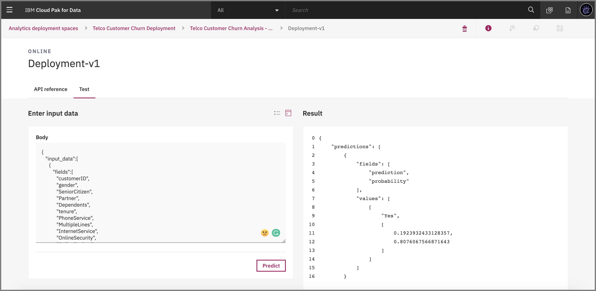

# Automate model building with AutoAI

With the aim of creating AI for AI, IBM introduced a service on Watson&trade; Studio called [AutoAI](https://www.ibm.com/support/producthub/icpdata/docs/content/SSQNUZ_current/wsj/analyze-data/autoai-overview.html).

AutoAI is a service that automates machine learning tasks to ease the tasks of data scientists. It automatically prepares your data for modeling, chooses the best algorithm for your problem, and creates pipelines for the trained models.

AutoAI can be run in public clouds and in private clouds, including IBM Cloud Pak for Data.


## Learning objectives

This tutorial explains the benefits of the AutoAI service on a use case so you can have a better understanding of how regression and classification problems can be handled without any code and how the tasks (feature engineering, model selection, hyperparameter tuning, etc.) are done with this service. The tutorial also includes details for choosing the best model among the pipelines and how to deploy and use these models via IBM Cloud Pak for Data platform.

## Estimated time

This tutorial takes approximately 20 minutes to complete, including the training in AutoAI.

## Steps

After creating an IBM Cloud Lite account and signing in, you can follow these steps.

### Step 1: Create a Project and AutoAI insatancce

#### Create a Watson Studio project

1. From the Projects page, click **New Project**.

    

2. Select **Create an empty project**.

    

3. Name your project.

    

4. The data assets page opens and is where your project assets are stored and organized. By clicking the **Assets** bar, you can load your dataset from the left interface.

1. Upload the [Telco-Customer-Churn.csv](dataset/Telco-Customer-Churn.csv) dataset.

    

#### Set up your AutoAI environment and generate pipelines

1. To start the AutoAI experience, click **Add to Project** from the top and select **AutoAI**.

    

2. Name your service and choose one of the compute configuration options listed with a drop-down menu. Then, click **Create**.

    

3. Select your dataset (you can upload it from your local or select from project).

#### Information about the dataset (from [Kaggle](https://www.kaggle.com/blastchar/telco-customer-churn))
Each row represents a customer, each column contains customer’s attributes described on the column Metadata.

The data set includes information about:
•	Customers who left within the last month – the column is called Churn
•	Services that each customer has signed up for – phone, multiple lines, internet, online security, online backup, device protection, tech support, and streaming TV and movies
•	Customer account information – how long they’ve been a customer, contract, payment method, paperless billing, monthly charges, and total charges
•	Demographic info about customers – gender, age range, and if they have partners and dependents

*	To set up your AutoAI instance, check out this video.

    


#### AutoAI pipeline

The experiment begins just after you complete the previous processes. The AutoAI process follows this sequence to build candidate pipelines:

*	Data pre-processing
*	Automated model selection (Pipeline 1)
* Hyperparameter optimization (Pipeline 2)
*	Automated feature engineering (Pipeline 3)
*	Hyperparameter optimization (Pipeline 4)



The next step is to select the model that gives the best result by looking at the metrics. In this case, Pipeline 4 gave the best result with the metric "Area under the ROC Curve (ROC AUC)." You can view the detailed results by clicking the corresponding pipeline from the leaderboard. an then save your model with **Save as model** button from the top-right side. You are going to simple save the model that gave the best result for us.


A window opens that asks for the model name, description (optional), and so on. After completing this fields, click **Save**.


You receive a notification to indicate that your model is saved to your project. Click **View in project**.


#### Deploy and test the model

1. To make the model ready for deployment, from the Overview tab click **Promote to deployment space**.

    

2. To promote an asset, you must associate your project with a deployment space. Click **Associate Deployment Space**.

    

3. If there is a deployment space you created before you can continue with the Existing tab. Otherwise, go to **New** tab, and give a name for your deployment space, then click **Associate**.

    

4. After you promote the model to the deployment space succesfully, a notification will pop-up on the top as below. Click **deployment space** from this notification. Also you can reach this page by using the (☰) menu and click Analyze -> Analytics deployments.

    

5. Refer to the following video for the next steps.

    

6. Now you can test your model from the interface that is provided after the deployment. You can either provide your input in JSON format or enter the input details to the fields given in the interface.

    * Input with JSON format
    

    * Input to the fields
    

   ```
   Input data:
   { "input_data":[ { "fields":[ "customerID", "gender", "SeniorCitizen", "Partner", "Dependents", "tenure", "PhoneService", "MultipleLines", "InternetService", "OnlineSecurity", "OnlineBackup", "DeviceProtection", "TechSupport", "StreamingTV", "StreamingMovies", "Contract", "PaperlessBilling", "PaymentMethod", "MonthlyCharges", "TotalCharges" ],
     "values":[ [ "7567-VHVEG", "Female", 0, "No", "No", 0, "No", "No phone service", "DSL", "No", "No", "Yes", "No", "No", "Yes", "Month-to-month", "No", "Bank transfer (automatic)", 85.25, 85.25 ] ] } ] }
   ```

## Conclusion

In this tutorial, I explained how to train your model with the AutoAI service on the Cloud Pak for Data platform. Along with this training process, you have learned how to deploy and test the models.
