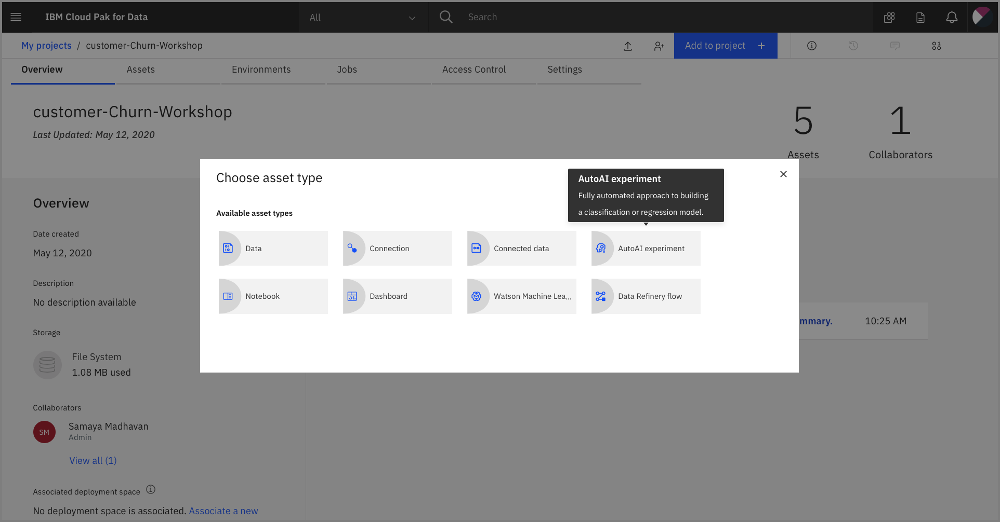
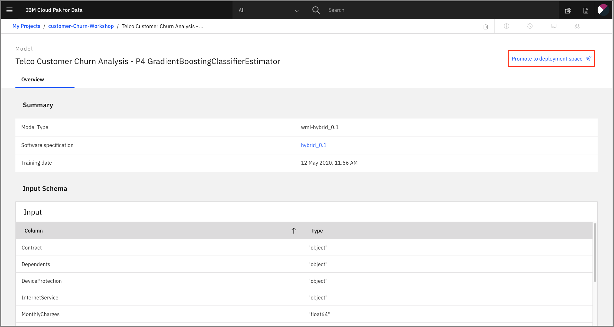
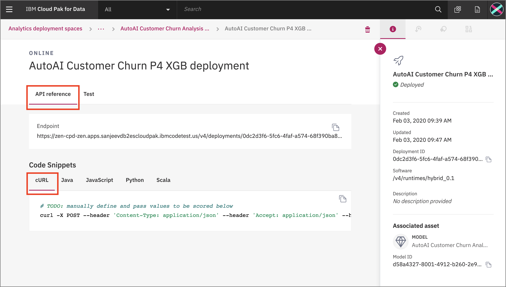
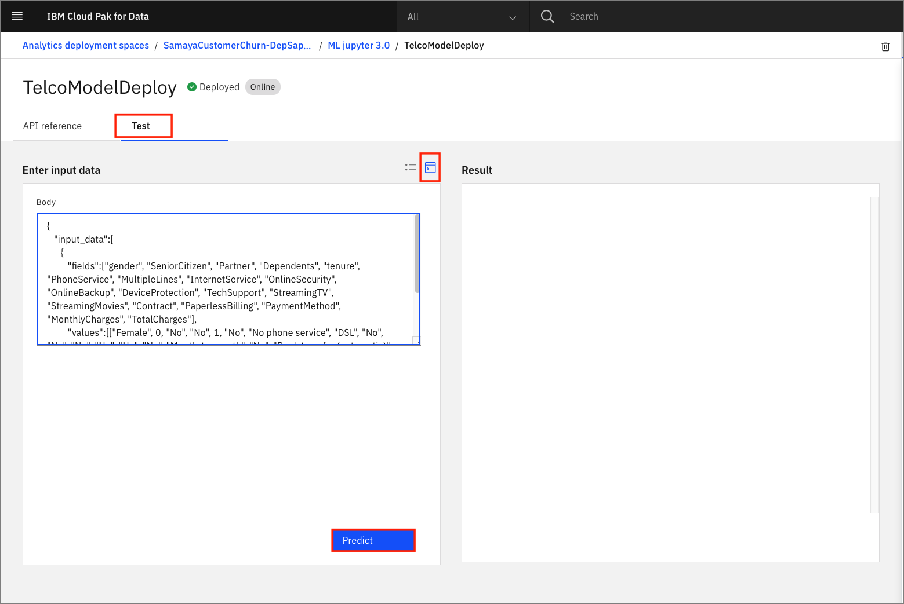
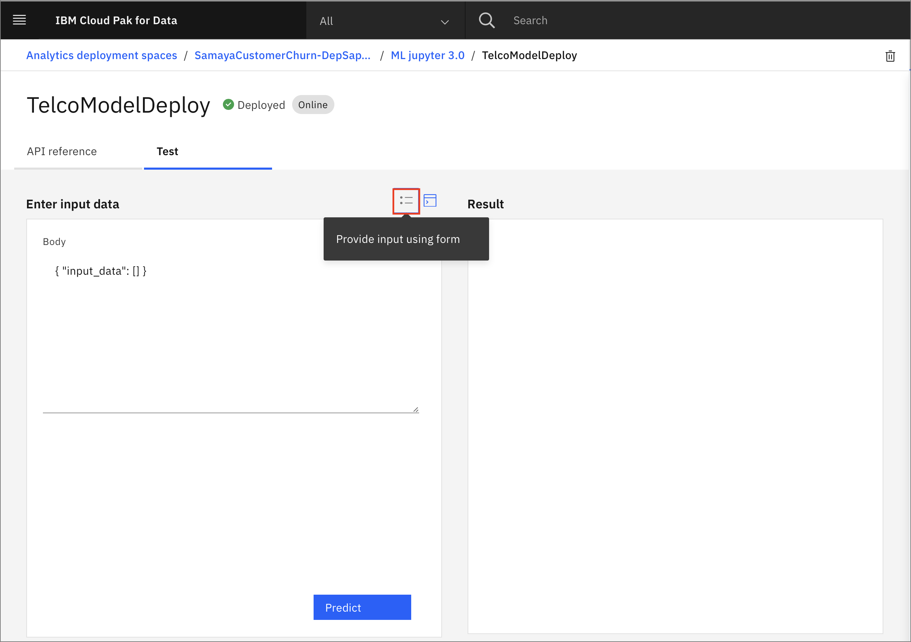

# Automate model building with AutoAI

For this part of the workshop, we'll learn how to use [AutoAI](https://www.ibm.com/support/producthub/icpdata/docs/content/SSQNUZ_current/wsj/analyze-data/autoai-overview.html).
AutoAI is a service that automates machine learning tasks to ease the tasks of data scientists. It automatically prepares your data for modeling, chooses the best algorithm for your problem, and creates pipelines for the trained models.

This section is broken up into the following steps:

1. [Create a Project and AutoAI instance](#1-create-a-project-and-autoai-instance)
2. [Set up your AutoAI environment and generate pipelines](#2-set-up-your-autoai-environment-and-generate-pipelines)
3. [AutoAI pipeline](#3-autoai-pipeline)
4. [Deploy and test the model](#4-deploy-and-test-the-model)

## 1. Create a Project and AutoAI instance

### Create a Watson Studio project

* Click the (☰) hamburger menu in the upper left corner and click `Projects`. From the Projects page, click `New Project`:


* Select `Create an empty project`:


* Give your project, give a  name and optional description:


The data assets page opens and is where your project assets are stored and organized. By clicking the `Assets` bar, you can load your dataset from the interface on the right.

* Upload the [Telco-Customer-Churn.csv](dataset/Telco-Customer-Churn.csv) dataset:


## 2. Set up your AutoAI environment and generate pipelines

* To start the AutoAI experience, click `Add to Project` from the top and select `AutoAI`:



* Name your service and choose one of the compute configuration options listed with a drop-down menu. Then, click `Create`:


* Select your dataset.

* Under *Select prediction column* click `Churn`. Then click `> Run experiment`:


* The AutoAI experiment will run. The UI will show progress:


* The experiment will take approximately 14 minutes. Upon completion you will see a message that the pipelines have been created:


## 3. AutoAI pipeline

The experiment begins just after you complete the previous processes. The AutoAI process follows this sequence to build candidate pipelines:

* Data pre-processing
* Automated model selection (Pipeline 1)
* Hyperparameter optimization (Pipeline 2)
* Automated feature engineering (Pipeline 3)
* Hyperparameter optimization (Pipeline 4)

* Scroll down to see the *Pipeline leaderboard*:


The next step is to select the model that gives the best result by looking at the metrics. In this case, Pipeline 4 gave the best result with the metric "Area under the ROC Curve (ROC AUC)." You can view the detailed results by clicking the corresponding pipeline from the leaderboard.

* Save your model by clicking `Save as model` and then `Save`.


A window opens that asks for the model name, description (optional), and so on. After completing this fields, click `Save`:


You receive a notification to indicate that your model is saved to your project. Click `View in project`:


Alternately, at the top level project under the *Assets* tab, click the name of your saved model under *Models*:


## 4. Deploy and test the model

* To prepare the model for deployment click `Promote to deployment space`:



*  To promote an asset, you must associate your project with a deployment space. Click `Associate Deployment Space`:


* You should have already created a deployment space in the *pre-work* section of the workshop. Click on `Existing` and choose that deployment.

* If you do not have an existing deployment, go to `New` tab, and give a name for your deployment space, then click `Associate`.


* After you promote the model to the deployment space succesfully, a notification will pop-up on the top as below. Click `deployment space` from this notification. Also you can reach this page by using the (☰) hamburger menu and click `Analyze` -> `Analytics deployments`:


* If you came in through the `Menu` -> `Analyze` -> `Analytics deployments` path, Click on your deployment space:


* Under the *Assets* tab, click on your model:


* Under the *Deployments* tab, click `Deploy` to deploy this model:


* Give your deployment an name and optional description and click `Create`:


* The Deployment will show as *in progress* and then switch to *Deployed* when done. Click on the deployment:


* The Deployment *API reference* tab show how to use the model using *curl*, *Java*, *Javascript*, *Python*, and *Scala*:



Now you can test your model from the interface that is provided after the deployment.

* Click on the *Input with JSON format* icon and paste the following data under *Body*, then click `Predict`:

```json
   { "input_data":[ { "fields":[ "customerID", "gender", "SeniorCitizen", "Partner", "Dependents", "tenure", "PhoneService", "MultipleLines", "InternetService", "OnlineSecurity", "OnlineBackup", "DeviceProtection", "TechSupport", "StreamingTV", "StreamingMovies", "Contract", "PaperlessBilling", "PaymentMethod", "MonthlyCharges", "TotalCharges" ],
     "values":[ [ "7567-VHVEG", "Female", 0, "No", "No", 0, "No", "No phone service", "DSL", "No", "No", "Yes", "No", "No", "Yes", "Month-to-month", "No", "Bank transfer (automatic)", 85.25, 85.25 ] ] } ] }
```



* Alternately, you can click the *Provide input using form* icon and input the various fields, then click `Predict`:


