# Data Visualization and Data Refinery

Let's take a quick detour to the *Data Refinery* tool. Data Refinery can quickly filter and mutate data, create quick visualizations, and do other data cleansing tasks from an easy to use user interface.

This section is broken up into the following steps:

1. [Load the *BILLING* data table into data refinery](#1-load-the-billing-data-table-into-data-refinery)
1. [Refine your data](#2-refine-your-data)
1. [Use Data Flow steps to keep track of your work](#3-use-data-flow-steps-to-keep-track-of-your-work)
1. [Profile the data](#4-profile-the-data)
1. [Visualize with charts and graphs](#5-visualize-with-charts-and-graphs)

## 1. Load the *BILLING* data table into data refinery

From the *Project* home, under the *Assets* tab, click on the *Data assets* arrow to toggle it and open up the list of data assets. Click the box next to *USERxxxx.BILLING* (where `USERxxxx` is your username or the username of the person who granted you data access) to check it, and click the 3 dots to the right, and then *Refine* :

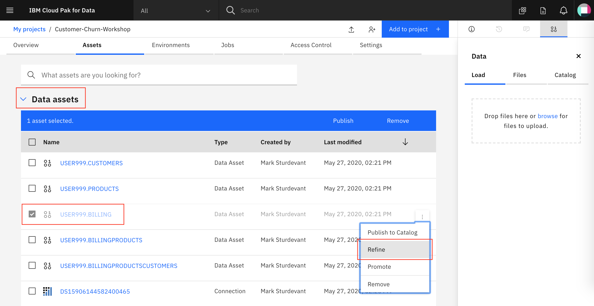

Data Refinery should launch and open the data like the image below:

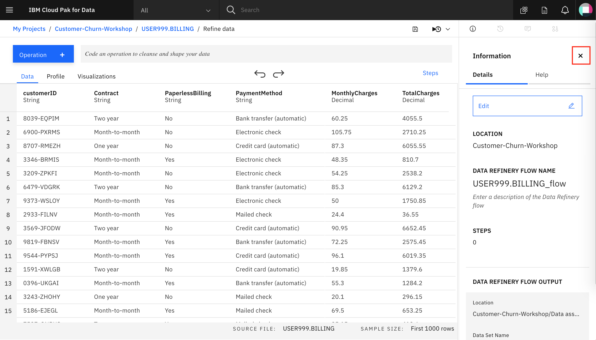

Click the `X` by the *Details* button to close it.

## 2. Refine your data

We'll start out in the *Data* tab.

### Transform your sample data set by entering R code in the command line or selecting operations from the menu

For example, type *filter* on the Command line and observe that autocomplete will give hints on the syntax and how to use the command:

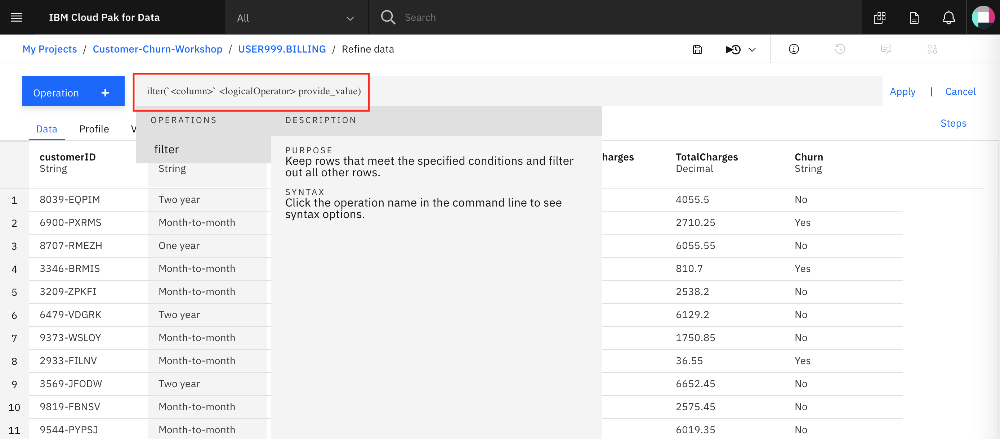

When you have completed a command, click Apply to apply the operation to your data set.

Click the `Operation +` button:

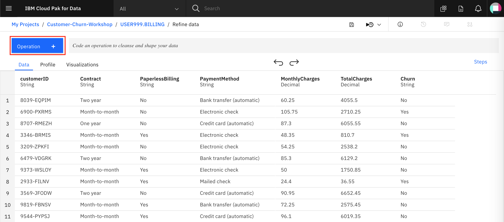

We want to make sure that there are no empty values, and there may be some for the *TotalCharges* column, so let's fix that. Click on `Filter` and choose the *TotalCharges* column from the drop down, then the Operator *Is empty*, then `Apply`:

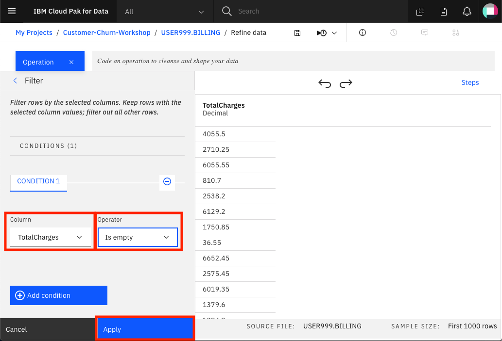

We can see that there is only 1 row with an empty value for *TotalCharges*:

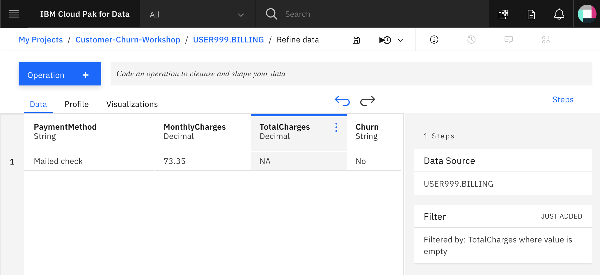

It should be safe to just drop these rows from the data set, so let's do that.

First, remove the filter that you just added. You can delete it from the "Steps" section of clicking the undo arrow on top of the page.

Next, choose the Operation *Remove empty rows*, select the *TotalCharges* column, click `Next` and then click `Apply`:

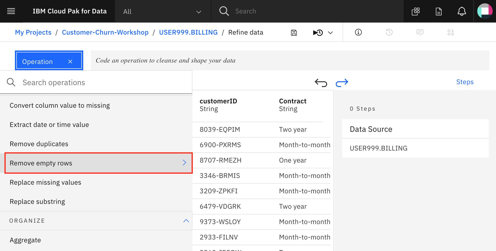

Finally, we can remove the *CustomerID* column, since that won't be useful for training a machine learning model in the next exercise. Choose the *Remove* operator, then choose `Change column selection`. Under `Select column` pick *customerID*, click `Next` and then click `Apply`:

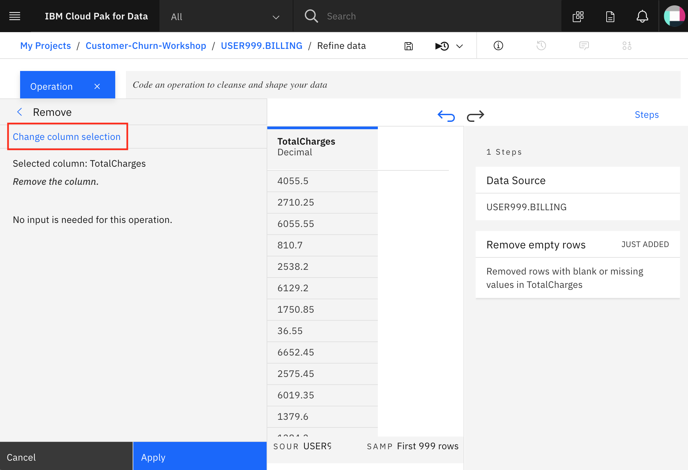

### 3. Use Data Flow steps to keep track of your work

What if you need to show a non-technical person the steps you took? What if we do something we don't want?

Within Data Refinery, we keep track of the steps and we can even undo (or redo) an action using the circular arrows:

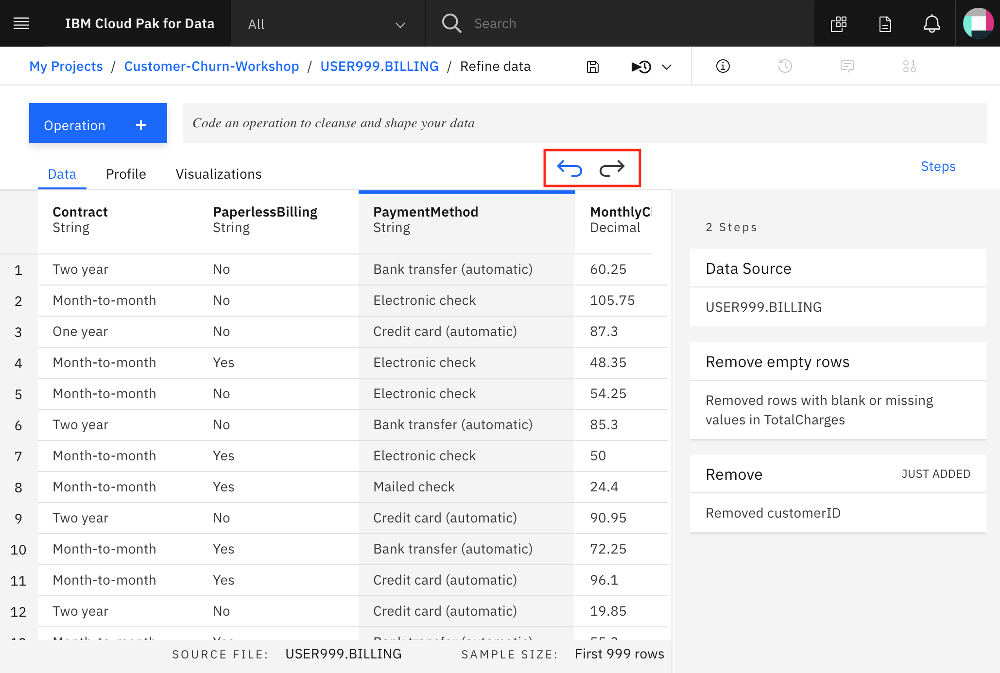

As you refine your data, IBM Data Refinery keeps track of the steps in your data flow. You can modify them and even select a step to return to a particular moment in your data’s transformation.

To see the steps in the data flow that you have performed, click the *Steps* button. The operations that you have performed on the data will be shown:

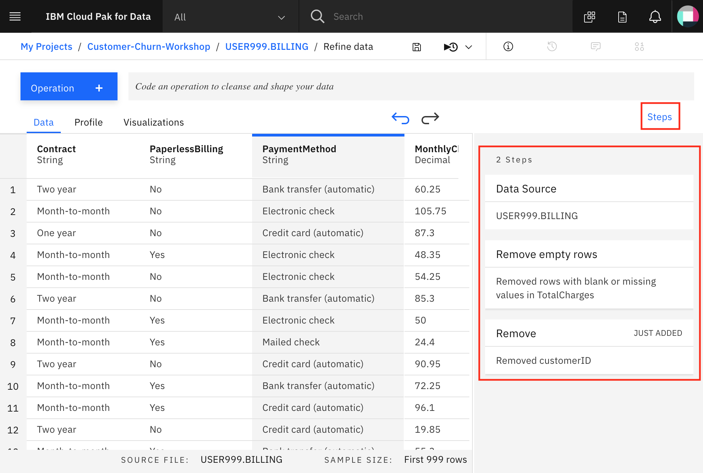

You can modify these steps in real time and save for future use.

### 4. Profile the data

Clicking on the *Profile* tab will bring up a quick view of several histograms about the data.

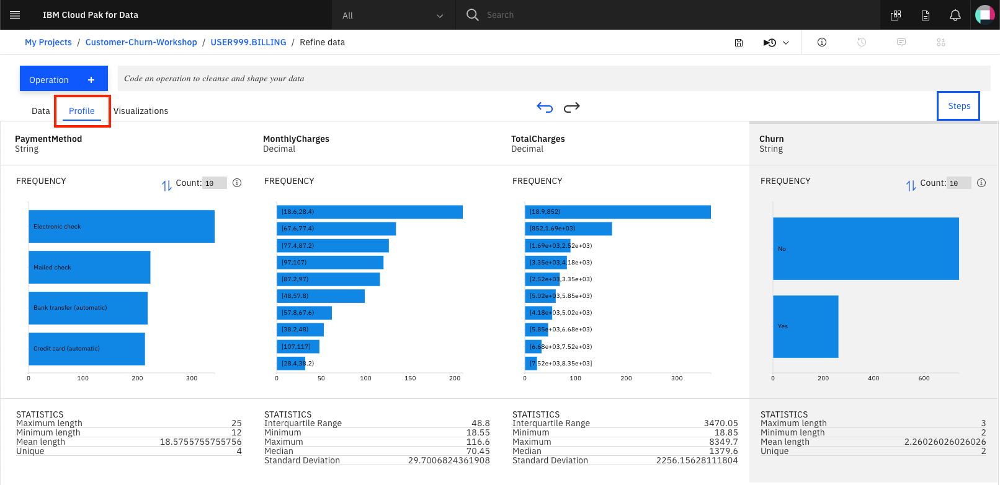

You can get insight into the data from the histograms:

* Twice as many customers are month-to-month as either 2-year or 1-year contract.

* More choose paperless billing, but around 40% still prefer a paper bill mailed out to them.

* You can see the distribution of *MonthlyCharges* and *TotalCharges*.

* From the Churn column, you can see that a significant number of customers will cancel their service.

### 5. Visualize with charts and graphs

Choose the *Visualizations* tab to bring up an option to choose which columns to visualize. Under *Columns to Visualize* choose *TotalCharges* and click `Visualize data`:

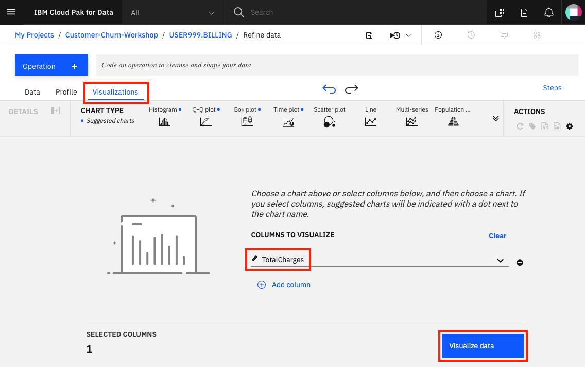

We first see the data in a histogram by default. You can choose other chart types. We'll pick `Scatter plot` next by clicking on it:

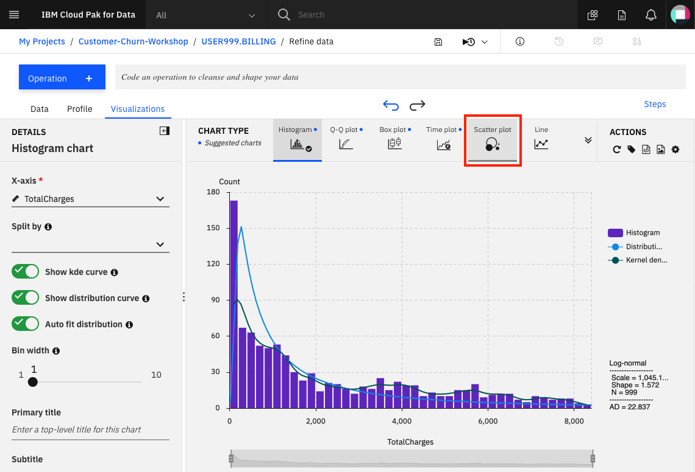

In the scatter plot, choose *TotalCharges* for the x-axis, *MonthlyCharges* for the y-axis, and *Churn* for the *Color map*. Drag the bottom *TotalCharges* filter to show all the data:

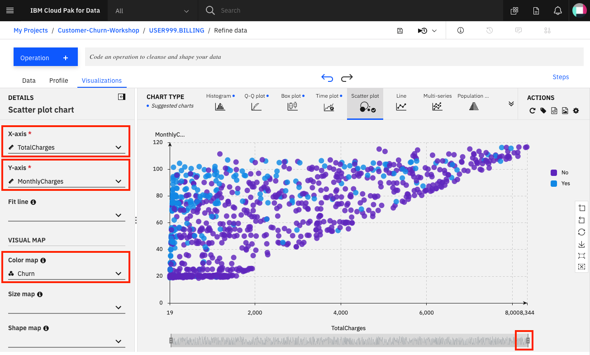

Scroll down and give the scatter plot a title and sub-title if you wish. Under the `Actions` panel, notice that you can perform tasks such as *Start over*, *Download chart details*, *Download chart image*, or set *Global visualization preferences* (_Note: Hover over the icons to see the names_). Click on the "gear" icon in the `Actions` panel

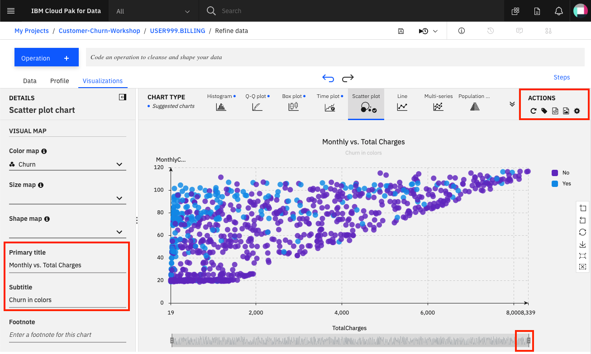

We see that we can do things in the *Global visualization preferences* for *Titles*, *Tools*, *Theme*, and *Notification*. Click on the `Theme` tab and update the color scheme to *Vivid*. Then click the `Apply` button :

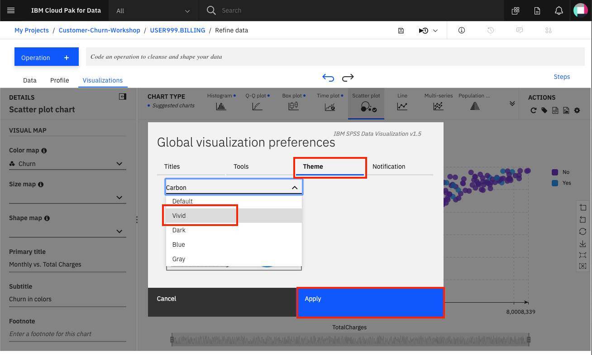

Now the colors for all of our charts will reflect this:

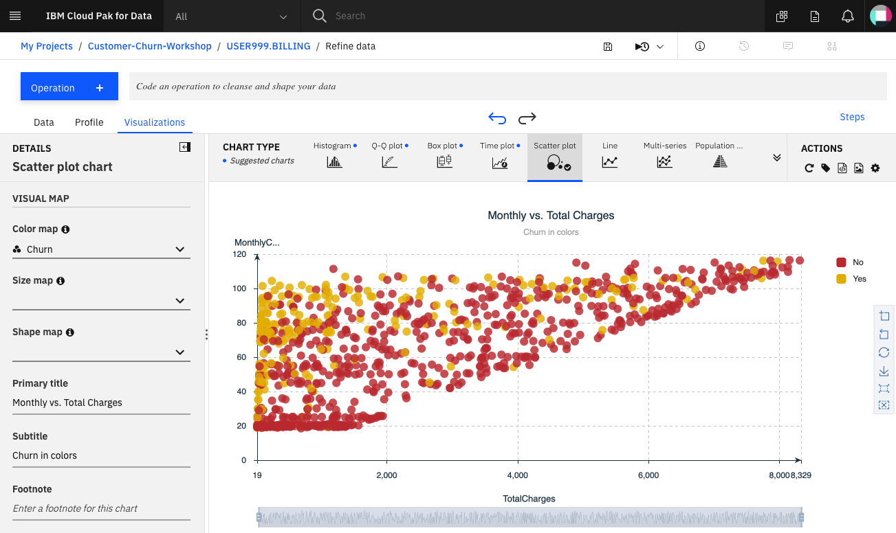

### Conclusion

We've seen a small sampling of the power of Data Refinery on IBM Cloud Pak for Data. We saw how we can transform data using R code, at the command line, or using various Operations on the columns such as filtering the data, removing empty rows, or deleting a column altogether. We next saw that all the steps in our Data Flow are recorded, so we can remove steps, repeat them, or edit an individual step. We were able to quickly profile the data, to see histograms and statistics for each column. And finally we created more in-depth visualizations, creating a scatter plot mapping TotalCharges vs. MonthlyCharges, with the Churn results highlighted in color.
