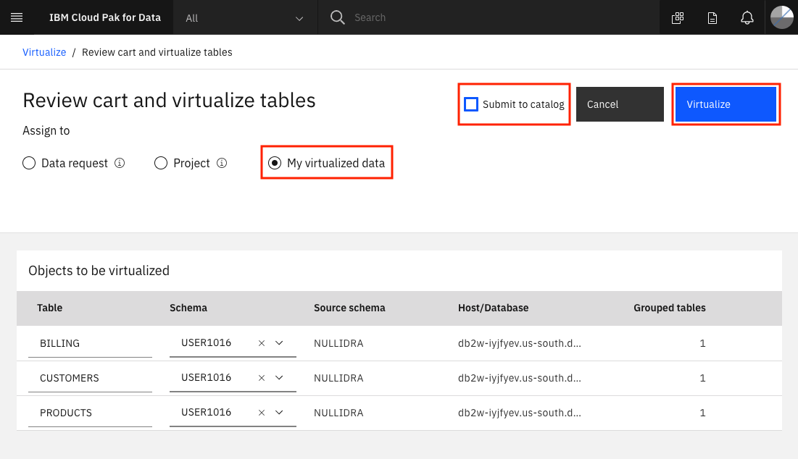
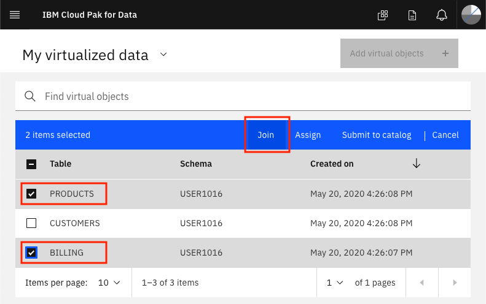
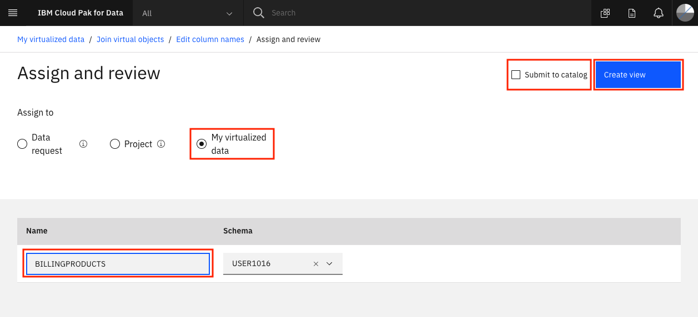
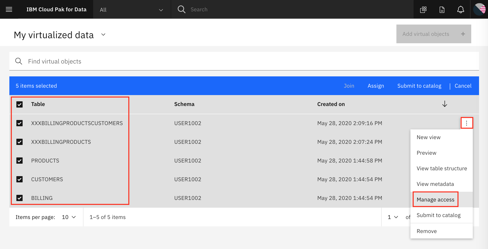
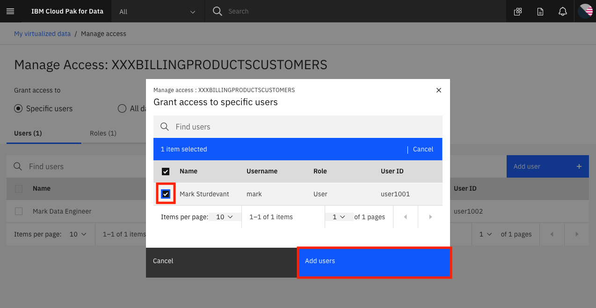

# DB Connection and Virtualization [Admin User]

This section is broken up into the following steps:

1. [Start virtualizing data](#1-start-virtualizing-data)
1. [Grant access to the virtualized data](#2-grant-access-to-the-virtualized-data)

## 1. Start virtualizing data

In this section, since we now have access to the Db2 Warehouse data, we can virtualize the data to our Cloud Pak for Data project.

To launch the data virtualization tool, go the (☰) menu and click `Collect` and then `Data Virtualization`.

 Click on the *(☰) Menu* button and choose *Virtualize*.

Several tables will appear (many are created as sample data when a Db2 Warehouse instance is provisioned) in the table. Find the tables you created earlier, the instructions suggested naming them: `CUSTOMER`, `PRODUCT` and `BILLING`. Once selected click on *Add to cart* and then on *View Cart*.
You can search for the Schema name for the data and they should show up:

The next panel prompts the user to choose which project to assign the data to, choose the project you created in the previous exercise. Click *Virtualize* to start the process.

You'll be notified that the virtual tables have been created! Let's see the new virtualized data from the Data Virtualization tool by clicking *View my data*.

### Join the virtualized data

Now we're going to **join** the tables we created so we have a merged set of data. It will be easier to do it here rather than in a notebook where we'd have to write code to handle three different data sets. Click on any two tables (`PRODUCTS` and `BILLING` for instance) and click the *Join view* button.

To join the tables we need to pick a key that is common to both data sets. Here we choose to map `customerID` from the first table to `customerID` on the second table. Do this by clicking on one and dragging it to another. When the line is drawn click on *Join*.

In the next panel we'll give our joined data a unique name (to be consistent with SQL standards, pick an all uppercase name), I chose `XXXBILLINGPRODUCTS` (where `XXX` is my *All Upper Case* user ID), then review the joined table to ensure all columns are present and only one `customerID` column exists. Click *Next* to continue.

Next we choose which project to assign the joined view to, choose the project you created in the previous exercise. Click *Create view* to start the process.

ou'll be notified that the join has succeeded! Click on *View my virutalized data*. to repeat this again so we have all three tables.

**IMPORTANT** Repeat the same steps as above, but this time choose to join the new joined view (`XXXBILLINGPRODUCTS`) and the last virtualized table (`CUSTOMERS`), to create a new joined view that has all three tables, let's call it `XXXBILLINGPRODUCTSCUSTOMERS`. Switching to our project should show all three virtualized tables, and two joined tables. Do not go to the next section until this step is performed.

## 2. Grant access to the virtualized data

In order for other users to have access to the data that you just virtualized, you need to grant them access. Follow these steps to make your Virtualized data visible to them.

Go to *Data Virtualization* option from the (☰) menu. Click on `Menu` -> `My virtualized data`.

Click on the virtualized data you've created, then click the 3 horizontal dots `...` to the right of one, and choose `Manage access`:

Click the `Specific users` button and click `+ grant access`:

Select the users you wish to grant access to and click `Add`:

## Conclusion

In this section we learned how to make connection to databases that contain our data, how to virtualize them, and how to allow other to collaborate with us and use the virtualized data.

Remember that you can add data from different databases and servers if you need to. Moreover, you can virtualized these data from different sources together as well! The goal is to take care of bringing the data to the platform early on so all the data scientists can use it without reinventing the wheel while you keep full control of who has access to what data.
