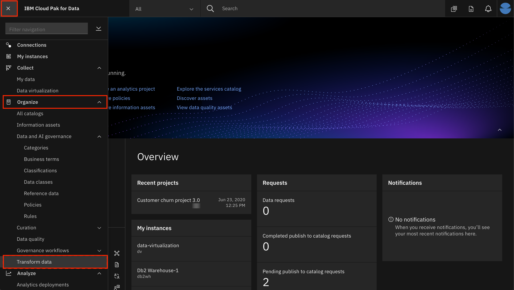
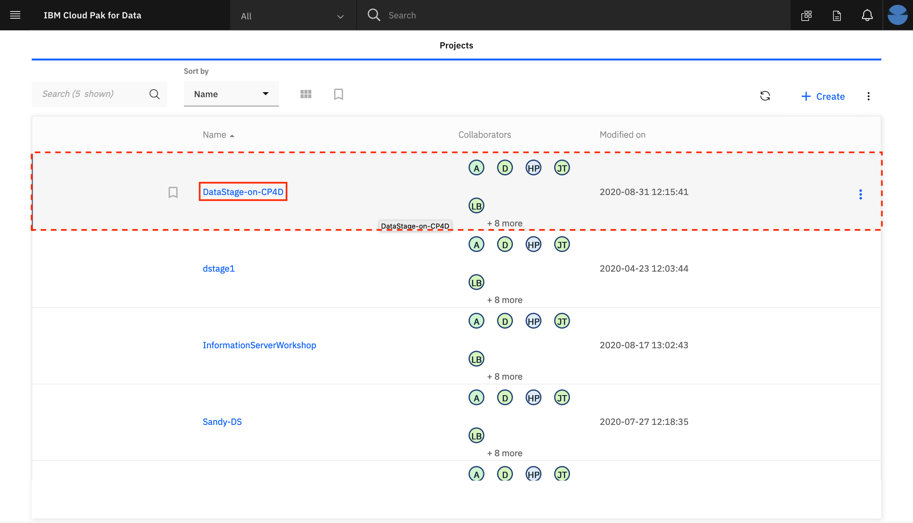
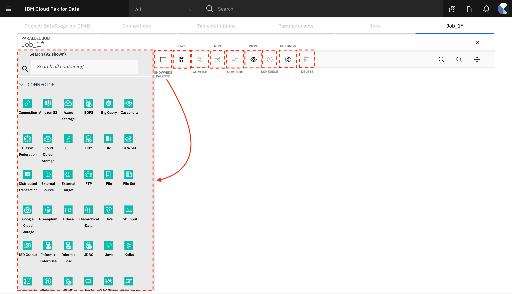
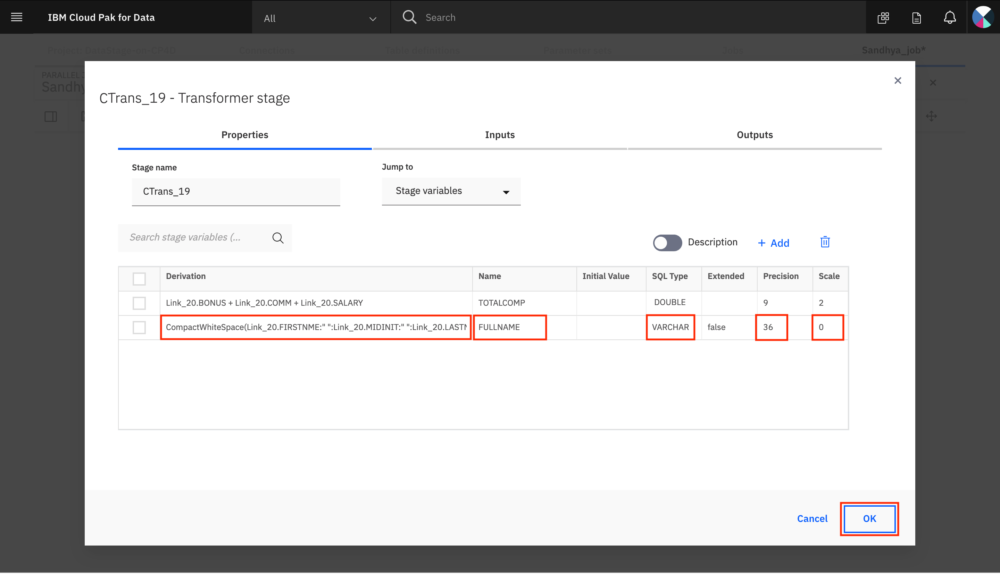

# Perform advanced ETL operations using DataStage

In this part of the workshop, we'll learn how to use [DataStage](https://www.ibm.com/products/infosphere-datastage). IBM DataStage on IBM Cloud Pak for Data enables users to create, edit, load, and run DataStage jobs which can be used to perform integration of data from various sources in order to glean meaningful and valuable information.

The purpose of this lab is to design a DataStage job to satisfy the following problem statement:

> As a data engineer, you have been asked by the Line of Business that you support, to create a new data table that contains all employees whose total compensation is greater than $50,000. The file must also contain the Department Name that the employee works in, and the mean average salary of all employees in that department who earn more than 50,000. In addition, the file must be sorted in descending order, based on the mean average salary amount. Finally, the application that will consume this output data, expects the full name of the employee to be in one field, formatted as first, middle initial, last).

In this lab, you will learn:

* How to create a job in DataStage.
* How to load data from Db2 Warehouse into DataStage.
* How to perform transformations such as modifying tables, joining tables, aggregating table data and sorting table data.
* How to write tabular data from DataStage into a table in Db2 Warehouse.
* How to run jobs.
* How to view logs for jobs.

This lab is comprised of the following steps:

1. [Create the job](#1-create-the-job)
1. [Compile and run the job](#2-compile-and-run-the-job)
1. [View output](#3-view-output)

## 1. Create the job

* Go to your CP4D instance. Navigate to `(☰) Hamburger menu` > `Organize` > `Transform data`.



* Open the `DataStage-on-CP4D` project by clicking on the name of the project.



* Click on the `Jobs` tab and then click `+ Create`. Click `Parallel Job`.


A new tab with the name `Job_1*` opens up where you can now start designing the parallel job. 



* Take a few minutes to look at the various buttons and menus available on the screen.

1. The `Show/Hide Palette` button can be used to show or hide the palette on the left of the screen which contains the connectors and stages that can be used while designing the job.
2. The `Save`, `Compile` and `Run` icons are used to save, compile and run the job respectively.
3. The `Compare` icon is used to compare this job with another job in the Project.
4. The `View` menu has a number of options such as
    1. `Log` - to view the job run log (available once the job has been run).
    2. `View code` - to view the OSH code (available once the job has been successfully compiled).
    3. `Switch view` - to switch to another open job.
    4. `Properties` - to view the properties of the job.
5. The `Schedule` icon is used to set a schedule to run the job.
6. The `Settings` menu has a number of options such as
    1. `Apply horizontal layout` - which arranges all the connectors and stages in the canvas in a horizontal manner with data flowing from left to right.
    2. The ability to view/hide `Annotations`, `Arrows`, `Link names`, and the `Type` of the connector/stage.
    3. `Auto propagation` - to specify if you want automatic propagation of metadata.
    4. `Smart palette` - which applies smart logic based on usage patterns to reorder the items available in the palette. If disabled, the items in the palette are displayed in an alphabetical order.
    5. `Smart stage suggestions` - applies smart logic based on usage patterns to suggest the next stage that you might want to add to the job.

Before we begin designing the job, let's save this empty job by clicking on the `Save` icon. In the modal that pops up, provide the name of the job as `<user>_job` where \<user\> is your name. Click `Save`.


> ***NOTE***: Remember to periodically save the job while designing it. Changes are not auto-saved and you will lose your progress if the browser is closed without saving the job.

The first step in the job is to bring in the input tables `DEPT` and `EMP` which have already been loaded into the DB2WH instance.

The `DEPT` table contains the following columns:

| Column Name | Data Type |
| - | - |
| DEPTNO | VARCHAR(3) |
| DEPTNAME | VARCHAR(28) |
| MGRNO | VARCHAR(6) |
| ADMRDEPT | VARCHAR(3) |
| LOCATION | VARCHAR(5) |

The `EMP` table contains the following columns:

| Column Name | Data Type |
| - | - |
| EMPNO | INTEGER |
| FIRSTNME | VARCHAR(9) |
| MIDINIT | VARCHAR(1) |
| LASTNAME | VARCHAR(10) |
| WORKDEPT | VARCHAR(3) |
| PHONENO | VARCHAR(4) |
| HIREDATE | DATE |
| JOB | VARCHAR(8) |
| EDLEVEL | SMALLINT |
| SEX | VARCHAR(1) |
| BIRTHDATE | DATE |
| SALARY | DECIMAL(10,2) |
| BONUS | DECIMAL(8,2) |
| COMM | DECIMAL(8,2) |

Both of these tables have a column which contains the department number information, however, they refer to this column with different names - in `EMP`, the column name is `WORKDEPT` and in `DEPT`, the column name is `DEPTNO`.

* Drag a ***Connection*** connector from the palette onto the canvas. In the modal that opens up, select the `DB2WH` connection and click `Next`.


* On the next screen, select the `NULLIDRA` schema and click `Next`.


* On the next screen, select the `DEPT` table and click `Next`.


* On the next screen, click `Add to job`.


* Drag another ***Connection*** connector to the canvas and repeat the steps given above but this time, select the `EMP` table instead. Once you complete the steps, you should see the two ***Connection*** connectors on the canvas.


Next we will use a ***Modify*** stage to perform the following modifications to the `MIDINIT` and `WORKDEPT` columns in the `EMP` table:

1. Change the name of the `WORKDEPT` column to `DEPTNO` in order to ensure that both the tables have the same name for the column that contains the department number information. This is needed for a future step where we will ***Join*** the two tables. 
2. Replace any NULL `MIDINIT` values with `" "`. This is needed for a future step where we will combine the FIRSTNME, MIDINIT and LASTNAME columns to create the FULLNAME of the employee.

* Drag and drop a ***Modify*** stage next to the ***Connection*** connector for the `EMP` table. Provide the output of the `EMP` table ***Connection*** connector as the input to the ***Modify*** stage. For this, click on the little blue dot on the right side of the ***Connection*** connector and drag the mouse pointer to the ***Modify*** stage.

**NOTE**: For another method to connect the ***Connection*** connector to the ***Modify*** stage, click on the ***Connection*** connector to select it, then drag and drop the ***Modify*** stage. The ***Modify*** stage will automatically be connected to the ***Connection*** connector.


* Now that an output link has been added to the `EMP` table connector, we can double click on the `EMP` table connector to open up the Stage page. 

* Click on `View` to view the contents of the `EMP` table. You can see how some MIDINIT values are "-". These are the entries that we will update to `" "` using the ***Modify*** stage. Click on `OK` to go back. Click on `Cancel` to clos the Stage page.


* Next, drag and drop a ***Join*** stage to the canvas and provide the output of the ***Modify*** stage as the input to this ***Join*** stage.


* Double click on the ***Modify*** stage to open up the stage page. In the `Properties` tab, we will provide 2 specifications. Click `+ Add Specification`. Add the following specifications in the 2 spaces available on the screen.

```ini
DEPTNO=WORKDEPT

MIDINIT=handle_null(MIDINIT," ")
```


* Switch to the `Outputs` tab. Click on the row for `WORKDEPT` to expand it. Update the `Column Name` to `DEPTNO`. Click `Apply`. Click `OK`.


* Both the tables now have a column called `DEPTNO` which can be used to join the tables. Provide the output of the `DEPT` table ***Connection*** connector as the second input to the ***Join*** stage. 

* Double click the ***Join*** stage to bring up the stage page. Here, you can verify that the `DEPTNO` is being used as the `JOIN KEY` and the `Join Type` is `Inner`. If the `JOIN KEY` is blank, click on the drop-down list and select `DEPTNO` from the list. Click `OK` to go back to the canvas.


* Next, add a ***Transformer*** stage to the canvas and provide the output of the ***Join*** stage as the input to the ***Transformer*** stage.


* Double click the ***Transformer*** stage to open the Stage page. We will add 2 stage variables to this ***Transformer*** stage. In the `Properties` tab, click `+ Add`. A new entry is added in the table below. Use this to define a stage variable named `TOTALCOMP` which will represent the total compensation (the sum of bonus, commission and salary) of the employee. Double click on `{derivation}` to open up the Derivation Builder.


* Build the derivation rule for TOTALCOMP by finding the `BONUS`, `COMM` and `SALARY` input columns in the table. Clicking on the entries in the table will insert them in the "Derivation" at the top. Type in `+` signs between them in order to complete the derivation. You can also use the search bar to look for the fields. When inserted in the "Derivation", the column names will be prepended with the identifier for the input link. Click `OK` to go back to the Stage page.


* Update the *Name* of the stage variable to *TOTALCOMP*, the *SQL type* to *Double*, the *Precision* to *9* and the *Scale* to *2*.


* Repeat the process above to add another Stage variable `FULLNAME` which will represent the complete name of the employee. Provide the *Derivation* as `CompactWhiteSpace(<Link>.FIRSTNME:" ":<Link>.MIDINIT:" ":<Link>.LASTNAME)`, the *Name* of the stage variable as *FULLNAME*, the *SQL type* as *Varchar* and the *Precision* as *36* and the *Scale* as *0*. Click `OK` to save the changes and return to the canvas.

**NOTE**: `<Link>` is a placeholder for the input link coming into the ***Transformer*** stage. When you search for the FIRSTNME, MIDINIT and LASTNAME variables in the inputs table on the Derivation Builder screen, the link name is already specified there for all the input variables. `CompactWhiteSpace` is a function that will compact any continuous white spaces into a single white space. *CompactWhiteSpace* is also available in the table shown in the Derivation Builder screen. `:` (colon) is the operator used for concatenation.



* Next, add a ***Join*** stage and an ***Aggregator*** stage to the canvas. Connect the ***Transformer*** stage to both these stages such that the output of the ***Transformer*** stage is provided as the input to both these stages.


Since the output links have now been added, we can provide the 2 stage variables `TOTALCOMP` and `FULLNAME` as outputs of the ***Transformer*** stage and once that is done, these values will be available as inputs in the subsequent stages.

* Double click on the ***Transformer*** stage to open the stage page. Go to the `Outputs` tab. Click on `+Add` twice to add 2 new entries in the table. Update one entry with the *Derivation* value as *TOTALCOMP*, the *Column name* as *TOTALCOMP*, the *SQL type* as *Double*, the *Precision* as *9*, the *Scale* as *2* and set *Nullable* to *true*. Update the second entry with the *Derivation* value as *FULLNAME*, the *Column name* as *FULLNAME*, the *SQL type* as *Varchar*, the *Precision* as *36* and the *Scale* as *0*.

* We also need to add a *Constraint* here, which will ensure that only the records with `TOTALCOMP` more than 50000 are sent in the output. Click on the empty space under `Constraint` to open up the Derivation Builder. Specify the derivation as `TOTALCOMP>50000`.

* Switch to the second output link by clicking on the `Link_<number>` under *Output name* and repeat the above steps to add the 2 stage variables to the output and to add the constraint. Click `OK` to save the changes and return to the canvas.


* Provide the output of the ***Aggregator*** stage as the input to the ***Join*** stage. Double click on the ***Aggregator*** stage to open the stage page. Select `DEPTNAME` as the grouping key.


* Scroll down to the *Aggregations* and select the *Aggregation Type* as `Calculation`, *Column* as `TOTALCOMP`, *Calculation Type* as `Mean Value` and click `+ Add Calculation`.


* Go to the `Outputs` tab and verify that you can see 2 output columns - `MEAN_TOTALCOMP` and `DEPTNAME`. Click `OK` to save the changes and return to the canvas.


* Drag and drop a ***Sort*** stage on the canvas and provide the output of the ***Join stage*** as the input to the ***Sort*** stage.


* Double click on the ***Join*** stage to open the stage page. On the `Stage` tab, verify that the *Join Key* is `DEPTNAME` and the *Join Type* is `Inner`.


* Go to the `Outputs` tab and verify that you can see `FULLNAME` and `MEAN_TOTALCOMP` in the output column list. Click `OK` to go back to the canvas.


* Double click on the ***Sort*** stage to open up the stage page. Specify the *Sorting Key* as `MEAN_TOTALCOMP` and the *Sort Order* as `Descending`. Click `OK`.


* Drag and drop a ***Connection*** connector to the canvas. In the modal that opens up, select the `DB2WH` connection and click on `Add as target`.


* Provide the output of the ***Sort*** stage as the input to the ***Connection*** connector. Double click the ***Connection*** connector to open the stage page. The *URL*, *User name* and *Password* should already be populated. 


* Scroll down and under the `Usage` section, provide the Table name as `NULLIDRA.<user>DEPTEMP` where \<user\> is your name, and update the Table action to `Replace`. Click `OK`.


The job design is complete and the job is now ready to be compiled and run.

## 2. Compile and run the job

* Click the `Save` icon to save the job. Once the job is saved, click on the `Compile` icon to compile it. If compilation is successful, you should see a green check mark and the message `Compiled successfully` displayed on the screen.


* Click the `Run` icon to run the job. In the modal that opens up, click `Run`.


* Once the job completes, you should see a message that says `Run result: Successful with warnings`. Click on `Log` to view the warnings.


* Scroll down and look for the warnings. You can see that the warning was raised because the job attempted to DROP the `NULLIDRA.<user>DEPTEMP` table which does not exist at this point. You can ignore this warning. If you run the job again, the warning should go away as this time the table already exists and you should see a `Run result: Successful` message. Click on `Close` to go back.


## 3. View output

The output was saved in the `NULLIDRA.<user>DEPTEMP` table in DB2WH. While you can view the contents of the table by going to the DB2WH instance, we will verify the output within the job canvas itself. 

* Double click on the output ***Connection*** connector to open the `Stage` page. Click on `View`.


The contents of the table will be displayed on the screen.


**CONGRATULATIONS!!** You have completed this lab!
