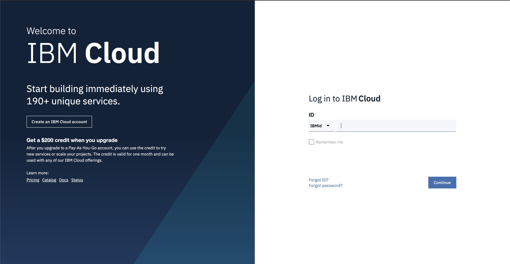
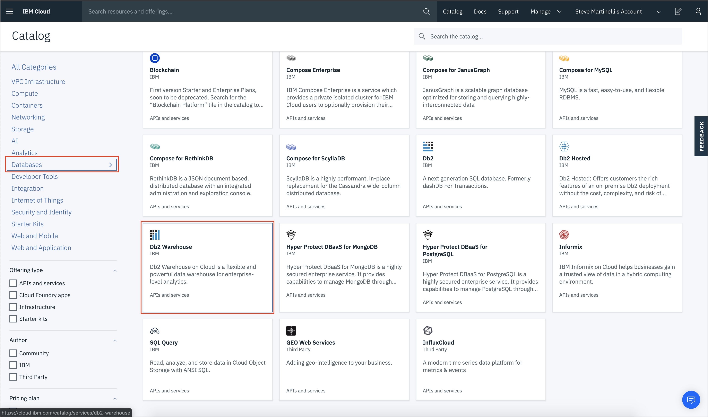
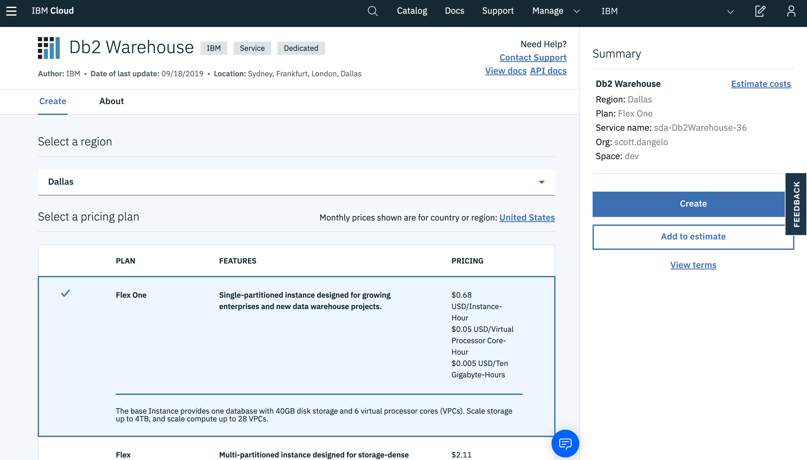
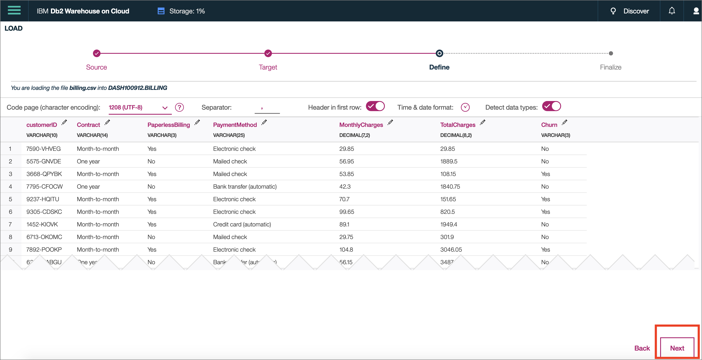

# Pre-work

This section is broken up into the following steps:

1. [Clone the repo](#1-clone-the-repo)
1. [About the data set](#2-about-the-data-set)
1. [(Optional) Seeding our Db2 Warehouse database](#3-optional-seeding-our-db2-warehouse-database)
1. [Creating a new Cloud Pak for Data project](#4-creating-a-new-cloud-pak-for-data-project)

## 1. Clone the repo

Various parts of this workshop will require the attendee to upload files or run scripts that we've stored in the repository. So let's get that done early on, you'll need [`git`](https://git-scm.com) on your laptop to clone the repository directly, or access to [GitHub.com](https://github.com/) to download the zip file.

Either run the following command:

```bash
git clone https://github.com/IBM/cloudpakfordata-telco-churn-workshop
cd cloudpakfordata-telco-churn-workshop
```

Alternatively, if `git` is not supported, go to the [GitHub repo for this workshop](https://github.com/IBM/cloudpakfordata-telco-churn-workshop) and download the archived version of the workshop and extract it on your laptop.


## 2. About the data set

The data set used for this workshop is originally from Watson Analytics and was used on a [Kaggle](https://www.kaggle.com/blastchar/telco-customer-churn) project, it contains information about customer churn for a Telecommunications company. The data is split into three CSV files and are located in the [data](https://github.com/IBM/cloudpakfordata-telco-churn-workshop/tree/master/data/split) directory of this repository.

### **[billing.csv](../../data/split/billing.csv)**

This file has the following attributes:

* Customer ID
* Contract *(Month-to-month, one year, two year)*
* Paperless Billing *(Yes, No)*
* Payment Method *(Bank transfer, Credit card, Electronic check, Mailed check)*
* Monthly Charges *($)*
* Total Charges *($)*
* Churn *(Yes, No)*

### **[customer-service.csv](../../data/split/customer-service.csv)**

* Customer ID
* Gender *(Male, Female)*
* Senior Citizen *(1, 0)*
* Partner *(Yes, No)*
* Dependents *(Yes, No)*
* Tenure *(1-100)*

### **[products.csv](../../data/split/products.csv)**

* Customer ID
* Phone Service *(Yes, No)*
* Multiple Lines *(Yes, No, No phone service)*
* Internet Service *(DSL, Fiber optic, No)*
* Online Security *(Yes, No, No internet service)*
* Online Backup *(Yes, No, No internet service)*
* Device Protection *(Yes, No, No internet service)*
* Tech Support *(Yes, No, No internet service)*
* Streaming TV *(Yes, No, No internet service)*
* Streaming Movies *(Yes, No, No internet service)*

## 3. (Optional) Seeding our Db2 Warehouse database

We'll need a place to store our data. For this workshop we've opted to use Db2 Warehouse on IBM Cloud for a few reasons: it simulates a realistic enterprise database, a free tier is provided by IBM Cloud, and we can easily load our data set.

> **NOTE** The Db2 Warehouse service incurs a small cost. If the attendees of the workshop do not have a paid account, the presenters will provide an instance to use, and the appropriate credentials.

### Log in and provision a Db2 Warehouse database

Log into (or sign up for) [IBM Cloud](https://cloud.ibm.com).



From the dashboard click on the *Create resource* button to go to the *Catalog*.


Find the [Db2 Warehouse](https://cloud.ibm.com/catalog/services/db2-warehouse) tile from the *Database* section.



Choose the `Flex One` plan as it is the least expensive, and sufficient for this workshop.



Once the Db2 Warehouse service is created click on *Open Console*.


You'll be directed to a Db2 web console dashboard where you can load data by clicking the *Load* button.

### Load the Db2 Warehouse database


Select the [`billing.csv`](../../data/split/billing.csv) file in the [data](https://github.com/IBM/cloudpakfordata-telco-churn-workshop/tree/master/data/split) folder.


On the next panel we configure where the data will go in the database. We'll use the schema that was created for our database, it'll look like *DASHXXXX* where *XXXX* is a randomly generated number. Select that and click `+ New Table` and give it the name `Billing` to create a new table.


Accept the defaults on the next screen and click `Next`.



On the next panel click *Begin Load* to start loading the data.


Verify all the rows were loaded. Click `Load More Data` to continue.


Repeat the process for [`products.csv`](../../data/split/products.csv) and [`customer-service.csv`](../../data/split/customer-service.csv), call these tables `PRODUCTS` and `CUSTOMERS`. Note that there will be an additional panel to configure data, the defaults are accetable.


### Jot down the credentials

If the attendee is creating their own DB2 Warehouse instance, we'll need to create credentials by going back to our service, clicking on the *Service credentials* button, and creating a new credential. Copy these down somewhere as we'll need them in the next section.


> NOTE to Instructor: If you'd like to have credentials for a pre-deployed and configured DB, place them here

## 4. Creating a new Cloud Pak for Data project

At this point of the workshop we will be using Cloud Pak for Data for the remaining steps.

### Log into Cloud Pak for Data

Launch a browser and navigate to your Cloud Pak for Data deployment

> **NOTE** Your instructor will provide a URL and credentials to log into Cloud Pak for Data!


### Create a new project

Go the (☰) menu and click *Projects*


Click on *New project*


Create a new project, choose `Analytics project`, give it a unique name, and click *OK. Click `Create` on the next screen.


