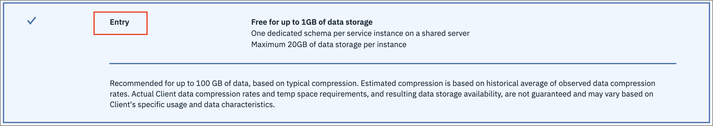

# Pre-work

This section is broken up into the following steps:

1. [About the data set](#1-about-the-data-set)
1. [(Optional) Seeding our Db2 database](#2-optional-seeding-our-db2-database)
1. [Setting up a project](#3-setting-up-a-project)

## 1. About the data set

The data set used for this workshop is derived from [Kaggle](https://www.kaggle.com/blastchar/telco-customer-churn). It is originally from Watson Analytics, and looks at customer churn for a Telecommunication company. The data is split into three CSV files and are located in the [data](../../data) directory of this repository.

### **[billing.csv](../../data/split/billing.csv)**

This file has the following attributes:

* Customer ID
* Contract *(Month-to-month, one year, two year)*
* Paperless Billing *(Yes, No)*
* Payment Method *(Bank transfer, Credit card, Electronic check, Mailed check)*
* Monthly Charges *($)*
* Total Charges *($)*
* Churn *(Yes, No)*

### **[customer-service.csv](../../data/split/customer-service.csv)**

* Customer ID
* Gender *(Male, Female)*
* Senior Citizen *(1, 0)*
* Partner *(Yes, No)*
* Dependents *(Yes, No)*
* Tenure *(1-100)*

### **[products.csv](../../data/split/products.csv)**

* Customer ID
* Phone Service *(Yes, No)*
* Multiple Lines *(Yes, No, No phone service)*
* Internet Service *(DSL, Fiber optic, No)*
* Online Security *(Yes, No, No internet service)*
* Online Backup *(Yes, No, No internet service)*
* Device Protection *(Yes, No, No internet service)*
* Tech Support *(Yes, No, No internet service)*
* Streaming TV *(Yes, No, No internet service)*
* Streaming Movies *(Yes, No, No internet service)*

## 2. (Optional) Seeding our Db2 Warehouse database

> **NOTE** If you do not wish to perform this step, your instructor will provide you credentials for a Db2 Warehouse instance.

### Log in and provision a Db2 Warehouse database

Log into (or sign up for) [IBM Cloud](https://cloud.ibm.com).

From the dashboard click on the *Create resource* button to go to the *Catalog*.

Find the [Db2 Warehouse](https://cloud.ibm.com/catalog/services/db2-warehouse) tile from the *Database* section.

Choose the `Entry` plan as it is compatible with a `Lite` account.

Once the Db2 Warehouse service is created click on *Open Console*.

You'll be directed to a Db2 web console dashboard where you can load data by clicking the *Load* button.

### Load the Db2 Warehouse database

Select the [`billing.csv`](../../data/split/billing.csv) file in the [data](../../data) folder.

On the next panel we configure where the data will go in the database. We'll use the *DASH100239* schema, and opt to create a new table. Call it `BILLING`, and click *Next*.

On the next panel click *Begin Load* to start loading the data.

Verify all the rows were loaded.

Repeat the process for [`products.csv`](../../data/split/products.csv) and [`customer-service.csv`](../../data/split/customer-service.csv), call these tables `PRODUCTS` and `CUSTOMERS`. Note that there will be an additional panel to configure data, the defaults are accetable.

### Jot down the credentials

Before we go to Cloud Pak for Data, we need to create credentials for our Db2 Warehouse by going back to our service, clicking on the *Service credentials* button, and creating a new credential. Copy these down somewhere as we'll need them in the next section.

## 3. Setting up a project

> **NOTE** Your instructor will provide a URL and credentials to log into Cloud Pak for Data!

Log into Cloud Pak for Data.

Go the (☰) menu and click *Projects*

Click on *New project*

Create a new project, give it a unique name and click *OK.

