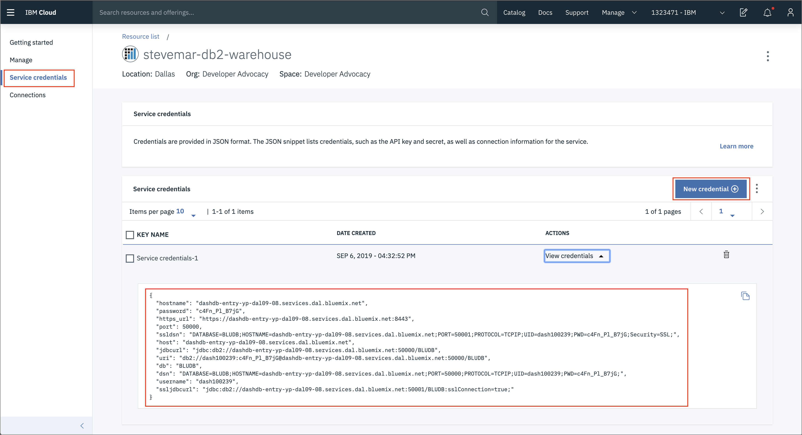

# Pre-work

## Setting up a project

> **IMPORTANT** Your instructor will provide a URL and credentials to log into Cloud Pak for Data!

Log into Cloud Pak for Data.

Go the hamburger menu and click *Projects*

Click on *New project*

Create a new project, give it a unique name.

## About the data set

The data set used for this workshop is derived from [Kaggle](https://www.kaggle.com/blastchar/telco-customer-churn). It is originally from Watson Analytics, and looks at customer churn for a Telecommunication company. The data is split into three CSV files and are located in the [data](../../data) directory of this repository.

**[billing.csv](billing.csv)**

This file has the following attributes:

* Customer ID
* Amount $

**[customer-service.csv](customer-service.csv)**

* Customer ID
* Senior, Y/N

**[products.csv](products.csv)**

* Customer ID
* Has cable, Y/N

## (Optional) Seeding our Db2 database

> **NOTE** If you do not wish to perform this step, your instructor will provide you credentials for a Db2 Warehouse instance.

Log into (or sign up for) [IBM Cloud](https://cloud.ibm.com).

Create a [Db2 Warehouse](https://cloud.ibm.com/catalog/services/db2-warehouse) service on IBM Cloud. Choose the `Entry` plan as it is compatible with a `Lite` account.

Once created click on *Open Console*.

overview

Load csv

config?

start loading

loaded

extra options with customers and products

  |   |   |
  | - | - |
  |  |

Back on IBM Cloud, check credentials

  
