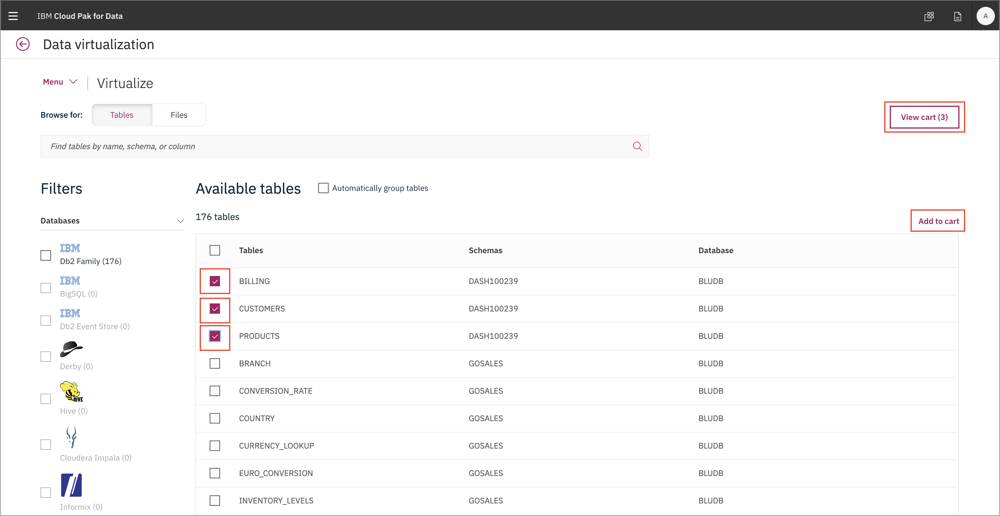
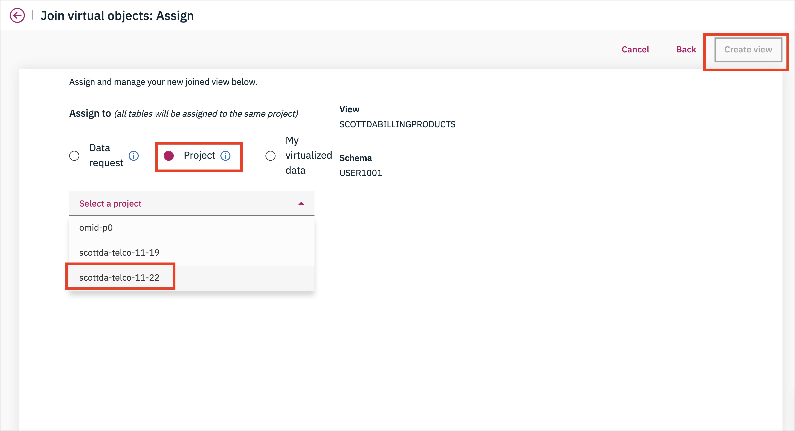
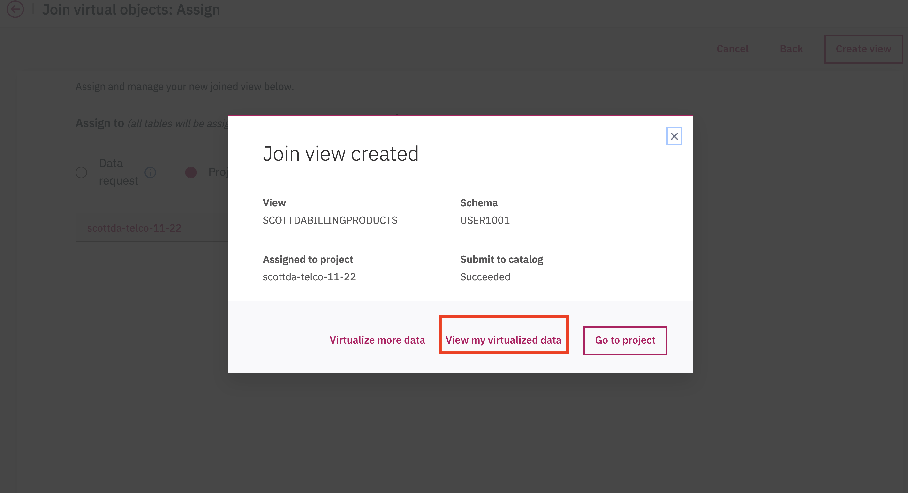

# Exercise 1: Data Analysis

## Add a new Data Source connection

1. Go the hamburger menu and click *Connections*

   

1. The overview will appear

   

1. Add in details about your Db2 Warehouse connection from the pre-work

   

1. The new connection will be listed

   

## Virtualize Db2 data with Data Virtualization

1. Go the hamburger menu and click *Collect -> Virtualized data*.

   

1. See the overview, there are no data sources.

   

1. Add a data source, the one we made in the previous step.

   

1. Ta-da, now it appears

   

1. Click on the *Virtualize* menu

   

1. Find the `CUSTOMER`, `PRODUCT` and `BILLING` tables. Add them to your cart and click *View Cart*.

   

1. Assign these to your project.

   

1. Virtual tables have been created!

   

1. Before we add that data to our project let's join all the tables so we have a complete picture.

   

1. Map `customerID` on one table to `customerID` on the other.

   

1. Review the joined table

   

1. Assign it to your project

   

1. Ta-da it is done!

   

1. Repeat this again for the third table. Going back to your project you should see a data set that has all three tables.

   

## Visualize data with Cognos Dashboards

Instructions go here

## (Optional) Business glossary

Instructions go here

## (Optional) Data Refinery

Instructions go here

## (Optional) Knowledge Catalog

Instructions go here
