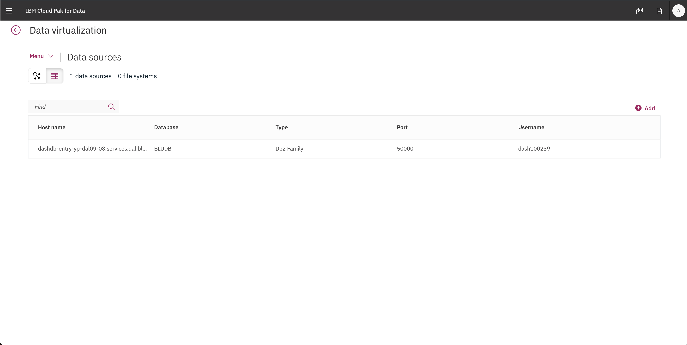

# DB Connection and Virtualization [Admin User]

This section is broken up into the following steps:

1. [Add a new Data Source connection](#1-add-a-new-data-source-connection)
1. [Add a Data Source to Data Virtualization](#2-add-a-data-source-to-data-virtualization)
1. [Grant access to the virtualized data](#3-grant-access-to-the-virtualized-data)

## 1. Add a new Data Source connection

For Cloud Pak for Data to read our Db2 Warehouse data we need to add a new *Data Source* to Cloud Pak for Data. This requires inputting the usual JDBC details.

To add a new data source, go to the (☰) menu and click on the *Connections* option.

At the overview, click *Add connection*.

Start by giving your new *Connection* a name and select *Db2 Warehouse on Cloud* as your connection type. More fields should apper. Fill the new fields with the same credentials for your own Db2 Warehouse connection from the previous section (or ask your instructor for shared credentials). Click `Test Connection` and, after that succeeds, click `Add`.

The new connection will be listed in the overview.

## 2. Add a Data Source to Data Virtualization

To launch the data virtualization tool, go the (☰) menu and click *Collect* and then *Virtualized data*.

At the empty overview, click *Add* and choose *Add data source*.

Select the data source we made in the previous step, and click *Next*.

The new connection will be listed as a data source for data virtualization.

### Start virtualizing data

In this section, since we now have access to the Db2 Warehouse data, we can virtualize the data to our Cloud Pak for Data project. Click on the *(☰) Menu* button and choose *Virtualize*.

Several tables will appear (many are created as sample data when a Db2 Warehouse instance is provisioned) in the table. Find the tables you created earlier, the instructions suggested naming them: `CUSTOMER`, `PRODUCT` and `BILLING`. Once selected click on *Add to cart* and then on *View Cart*.
You can search for the Schema `NULLIDRA` and they should show up:

The next panel prompts the user to choose which project to assign the data to, choose the project you created in the previous exercise. Click *Virtualize* to start the process.

You'll be notified that the virtual tables have been created! Let's see the new virtualized data from the Data Virtualization tool by clicking *View my data*.

### Join the virtualized data

Now we're going to **join** the tables we created so we have a merged set of data. It will be easier to do it here rather than in a notebook where we'd have to write code to handle three different data sets. Click on any two tables (`PRODUCTS` and `BILLING` for instance) and click the *Join view* button.

To join the tables we need to pick a key that is common to both data sets. Here we choose to map `customerID` from the first table to `customerID` on the second table. Do this by clicking on one and dragging it to another. When the line is drawn click on *Join*.

In the next panel we'll give our joined data a unique name (to be consistent with SQL standards, pick an all uppercase name), I chose `XXXBILLINGPRODUCTS` (where `XXX` is my user ID), then review the joined table to ensure all columns are present and only one `customerID` column exists. Click *Next* to continue.

Next we choose which project to assign the joined view to, choose the project you created in the previous exercise. Click *Create view* to start the process.

You'll be notified that the join has succeeded! Click on *View my data*. to repeat this again so we have all three tables.

**IMPORTANT** Repeat the same steps as above, but this time choose to join the new joined view (`XXXBULLINGPRODUCTS`) and the last virtualized table (`CUSTOMERS`), to create a new joined view that has all three tables, let's call it `XXXBILLINGPRODUCTSCUSTOMERS`. Switching to our project should show all three virtualized tables, and two joined tables. Do not go to the next section until this step is performed.

## 3. Grant access to the virtualized data

In order for other users to have access to the data that you just virtualized, you need to grant them access. Follow these steps to make your Virtualized data visible to them.

Go to *Data Virtualization* option from the (☰) menu. Click on *User management*

Click on *Add user* and ensure all users who you want to grant access to have the *Steward* role.

## Conclusion

In this section we learned how to make connection to databases that contain our data, how to virtualize them, and how to allow other to collaborate with us and use the virtualized data. 

Remember that you can add data from different databases and servers if you need to. Moreover, you can virtualized these data from different sources together as well! The goal is to take care of bringing the data to the platform early on so all the data scientists can use it without reinventing the wheel while you keep full control of who has access to what data.

