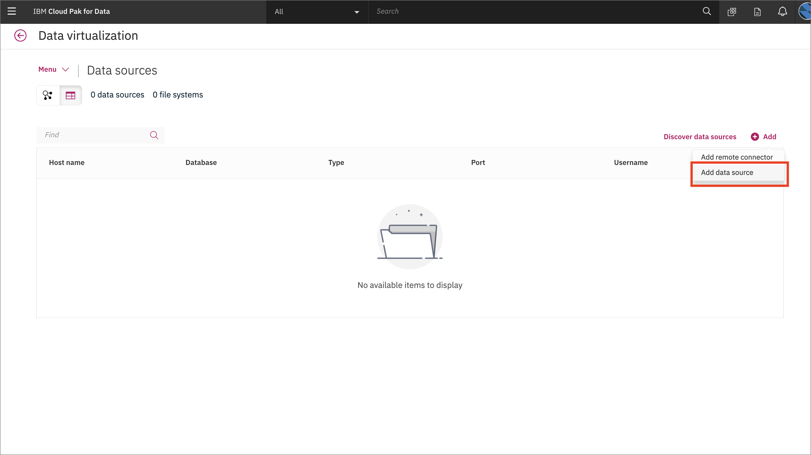
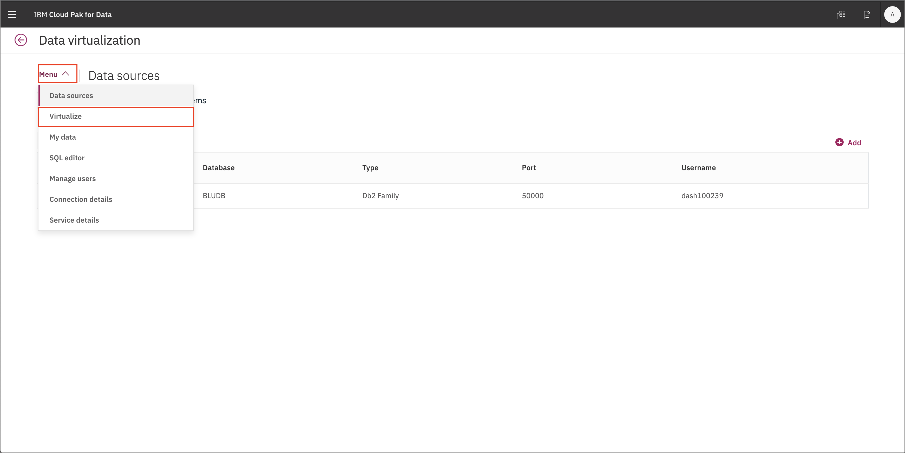

# Exercise 1: Data Analysis

## Add a new Data Source connection

Go the (☰) menu and click *Connections*

The overview will appear

Add in details about your Db2 Warehouse connection from the pre-work

The new connection will be listed

## Virtualize Db2 data with Data Virtualization

Go the (☰) menu and click *Collect -> Virtualized data*.

See the overview, there are no data sources.

Add a data source, the one we made in the previous step.

Ta-da, now it appears

Click on the *Virtualize* menu

Find the `CUSTOMER`, `PRODUCT` and `BILLING` tables. Add them to your cart and click *View Cart*.

Assign these to your project.

Virtual tables have been created!

Before we add that data to our project let's join all the tables so we have a complete picture.

Map `customerID` on one table to `customerID` on the other.

Review the joined table

Assign it to your project

Ta-da it is done!

Repeat this again for the third table. Going back to your project you should see a data set that has all three tables.

## Visualize data with Cognos Dashboards

Instructions go here

## (Optional) Data Refinery

Instructions go here
