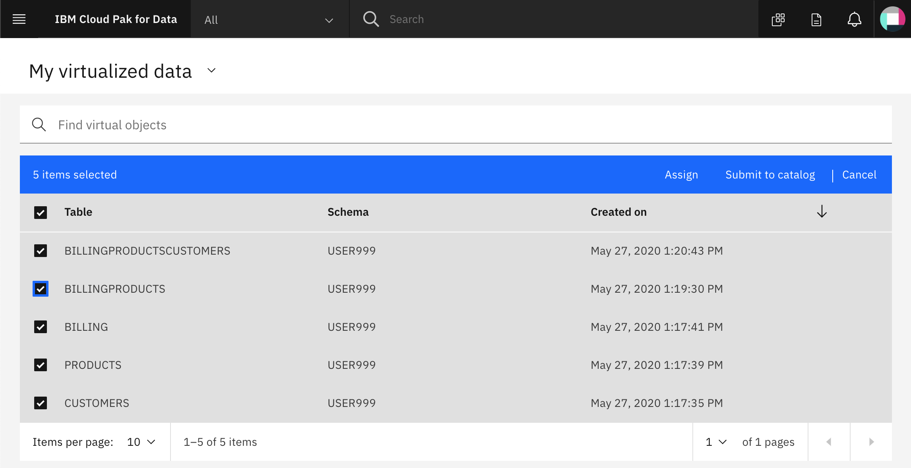
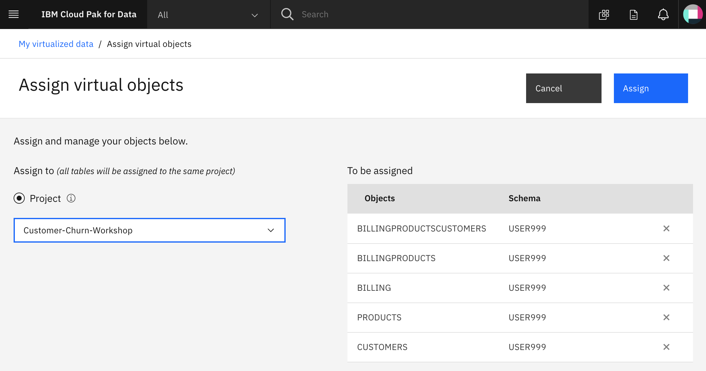
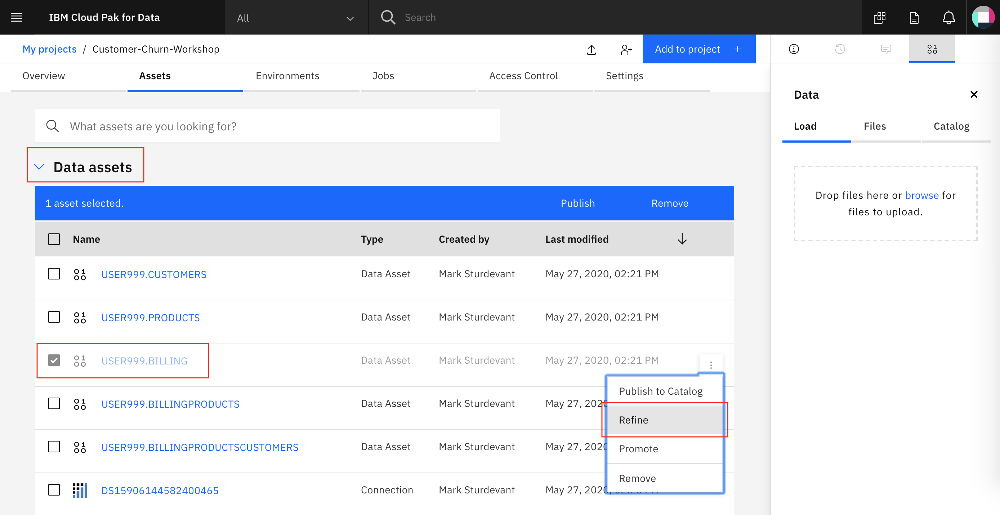
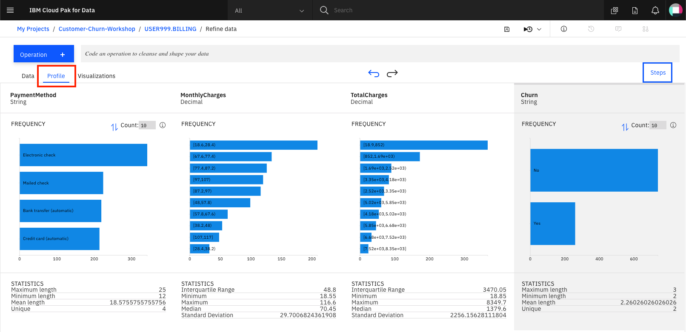
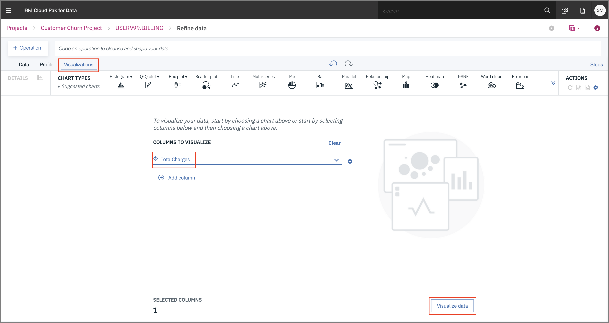

# Exercise 1: Data Analysis

This section is broken up into the following steps:

1. [Add a new Data Source connection](#1-add-a-new-data-source-connection)
1. [Assign virtualized data to your project](#2-assign-virtualized-data-to-your-project)
1. [Use Data Refinery to visualize and clean data](#3-use-data-refinery-to-visualize-and-clean-data)

## 1. Add a new Data Source connection

For Cloud Pak for Data to read our Db2 Warehouse data we need to add a new *Data Source* to Cloud Pak for Data. This requires inputting the usual JDBC details.

To add a new data source, go to the (☰) menu and click on the *Connections* option.

At the overview, click *Add connection*.

Start by giving your new *Connection* a name and select *Db2 Warehouse on Cloud* as your connection type. More fields should apper. Fill the new fields with the same credentials for your own Db2 Warehouse connection from the previous section (or ask your instructor for shared credentials). Click `Test Connection` and, after that succeeds, click `Add`.

The new connection will be listed in the overview.

> **IMPORTANT**: A note to the instructors of this workshop. At this point go to the [Admin Guide](../admin-guide/README.md#virtualize-db2-data-with-data-virtualization) and follow the `Virtualize Db2 data with Data Virtualization` section.

## 2. Assign virtualized data

For this section we'll now use the Data Virtualization tool to import the data from Db2 Warehouse, which is now exposed as an Connection in Cloud Pak for Data.

### Assign the data to your project

From the menu click on *Collections -> Virtualized Data*, you'll be brought to the *My data* section. Here you should see the data that the administrator has assigned to you. Choose the three data sets available and click *Assign* to start importing it to your project.

From here, choose the project you previously created.

Switching to our project should show all three virtualized tables, and two joined tables. Do not go to the next section until this step is performed.

## 3. Use Data Refinery to visualize and clean data

Before we build our model we're going to take a quick detour to the *Data Refinery* tool. Data Refinery can quickly filter and mutate data, create quick visualizations, and do other data cleansing tasks from an easy to use user interface.

### Load the *BILLING* data table into data refinery

From the *Project* home, click on *Data sets*, *TABLE*, and choose the *USER123.BILLING* table.

Data Refinery should launch and open the data like the image below:

The *Operation* button can perform many tasks related to data cleansing such as: substituting values, removing and renaming columns, converting column types, etc.

Clicking on the *Profile* tab will bring up a quick view of several histograms about the data.

Clicking on the *Visualizations* tab will bring up an option to choose which columns to visualize. In this case, we'll pick *TotalCharges*. Click on *Visualize data* when ready.

We can quickly see the data in a histogram by default, switching between different chart types in seconds.

