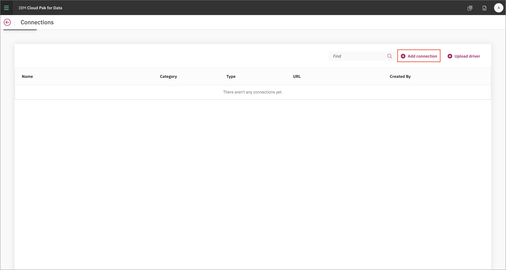
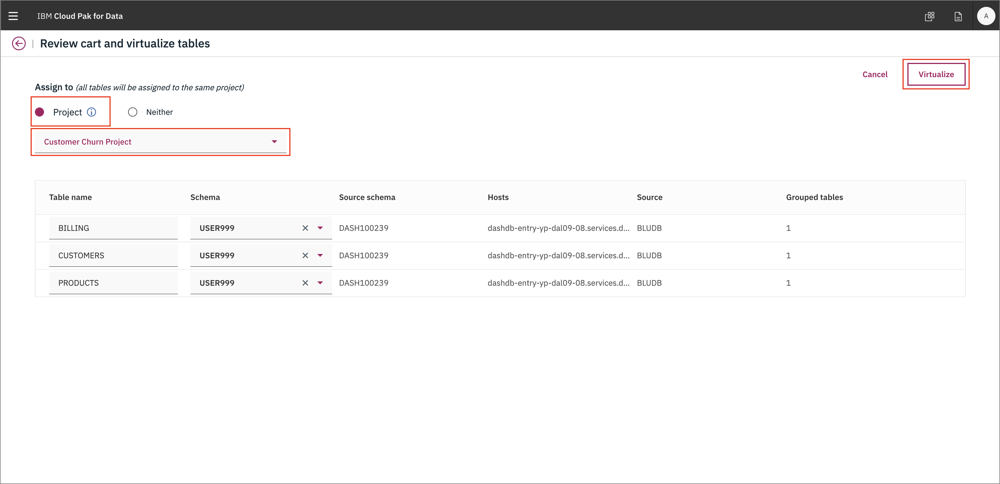
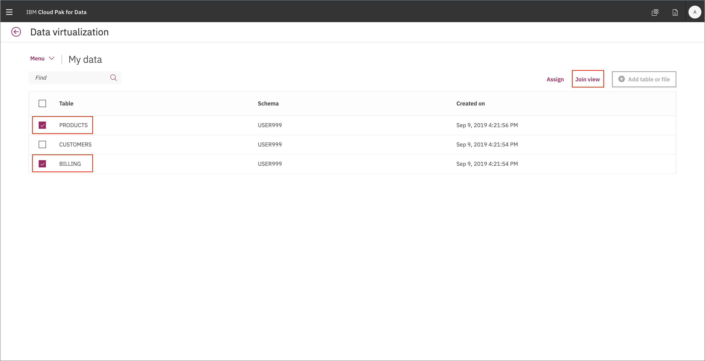

# Exercise 1: Data Analysis

This section is broken up into the following steps:

1. [Add a new Data Source connection](#add-a-new-data-source-connection)
1. [Virtualize Db2 data with Data Virtualization](#virtualize-db2-data-with-data-virtualization)
1. [Visualize data with Cognos Dashboards](#visualize-data-with-cognos-dashboards)

## Add a new Data Source connection

To add a new data source, go the (☰) menu and click on the *Connections* option.

At the empty overview, click *Add connection*.

Start by giving your new *Connection* a name and select *Db2 Warehouse on Cloud* as your connection type. More fields should apper. Fill the new fields with the same credentials for your own Db2 Warehouse connection from the previous section (or ask your instructor for shared credentials).

The new connection will be listed in the overview.

## Virtualize Db2 data with Data Virtualization

To launch the data virtualization tool, go the (☰) menu and click *Collect* and then *Virtualized data*.

At the empty overview, click *Add* and choose *Add remote connector*.

Select the data source we made in the previous step, and click *Next*.

The new connection will be listed as a data virtualization option.

Click on the *Virtualize* menu

Find the `CUSTOMER`, `PRODUCT` and `BILLING` tables. Add them to your cart and click *View Cart*.

Assign these to your project.

Virtual tables have been created!

Before we add that data to our project let's join all the tables so we have a complete picture.

Map `customerID` on one table to `customerID` on the other.

Review the joined table

Assign it to your project

Ta-da it is done!

Repeat this again for the third table. Going back to your project you should see a data set that has all three tables.

## Visualize data with Cognos Dashboards

TBD
