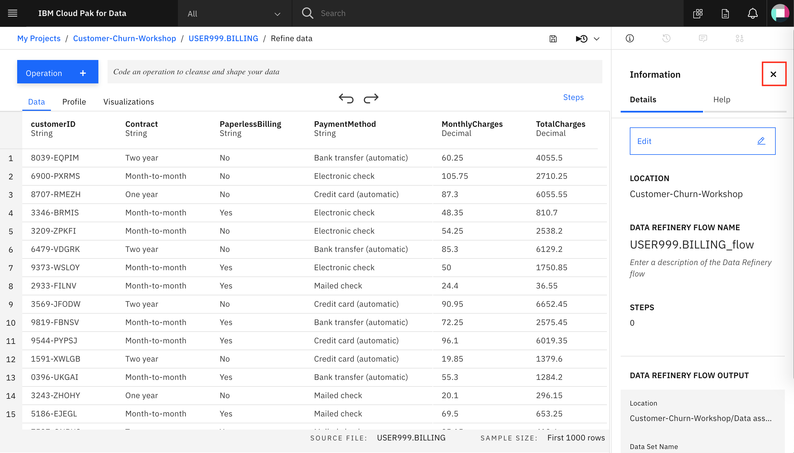

# Data Visualization with Data Refinery

Before we build our model we're going to take a quick detour to the *Data Refinery* tool. Data Refinery can quickly filter and mutate data, create quick visualizations, and do other data cleansing tasks from an easy to use user interface.

## Load the *BILLING* data table into data refinery

From the *Project* home, click on *Data sets*, *TABLE*, and choose the *USER123.BILLING* table.

Data Refinery should launch and open the data like the image below:

## Refine your data

We'll start out in the *Data* tab.

### Transform your sample data set by entering R code in the command line or selecting operations from the menu

For example, type *filter* on the Command line and observe that autocomplete will give hints on the syntax and how to use the command:

 Alternatively, hover over an operation or function name to see a description and detailed information for completing the command. When you're ready, click Apply to apply the operation to your data set.

Highlight the *TotalCharges* column and click the `+Operation` button:

First, we notice that *TotalCharges* is a string, but since it represents a decimal number, let's convert the values to decimal. Choose the Operator `Convert Column Type`:

Then pick *Decimal* for the type, and click `Apply`:

Click on `filter` and choose the *TotalCharges* column from the drop down, then the Operator *Is empty*:

We can see that there are only 3 rows with an empty value for *TotalCharges*:

It should be save to just drop these rows from the data set, so let's do that.

Choose the Operation *Remove empty rows* for the *TotalCharges* column:

Finally, we can remove the *CustomerID* column, since that won't be useful for training a machine learning model in the next exercise. Choose the *Remove* operator, and then click `Apply`:

### Use Data Flow steps to keep track of your work

What if we do something we don't want? We can undo (or redo) an action using the circular arrows:

As you refine your data, IBM Data Refinery keeps track of the steps in your data flow. You can modify them and even select a step to return to a particular moment in your data’s transformation.

To see the steps in the data flow that you have performed, click the *Steps* button. The operations that you have performed on the data will be shown:

You can modify these steps in real time and save for future use.

### Profile the data

Clicking on the *Profile* tab will bring up a quick view of several histograms about the data.

You can get insight into the data from the histograms:

* Twice as many customers are month-to-month as either 2-year or 1-year contract.

* More choose paperless billing, but around 40% still prefer a paper bill mailed out to them.

* You can see the distribution of *MonthlyCharges* and *TotalCharges*.

* From the Churn column, you can see that a significant number of customers will cancel their service.

### Visualize with charts and graphs

Choose the *Visualizations* tab to bring up an option to choose which columns to visualize. Click on the empty space for the *Columns to Visualize* where the image below says `Click  here`, choose *TotalCharges*, then Click on *Visualize data* when ready:

We first see the data in a histogram by default. You can choose other chart types. We'll pick `Scatter plot` next by clicking on it:

In the scatter plot, choose *TotalCharges* for the x-axis, *MonthlyCharges* for the y-axis, and *Churn* for the *Color map*:

Scroll down and give the scatter plot a title and sub-title if you wish. Click on the "gear" under `Actions` to perform tasks such as *Start over*, *Download chart details*, *Download chart image*, or *Global visualization preferences*:

We see that we can do things in the *Global visualization preferences* for *Titles*, *Tools*, *Color schemes*, and *Notifications*. Let's set the *Color scheme* to *Vivid*:

Now the colors for all of our charts will reflect this:

### Conclusion

We've seen a small sampling of the power of Data Refinery on IBM Cloud Pak for Data. We saw how we can transform data using R code, at the command line, or using various Operations on the columns such as changing the data type, removing empty rows, or deleting the column altogether. We next saw that all the steps in our Data Flow are recorded, so we can remove steps, repeat them, or edit an individual step. We were able to quickly profiile the data, so see histograms and statistics for each column. And finally we created more in-depth Visualizations, creating a scatter plot mapping TotalCharges vs. MonthlyCharges, with the Churn results highlighted in color.
