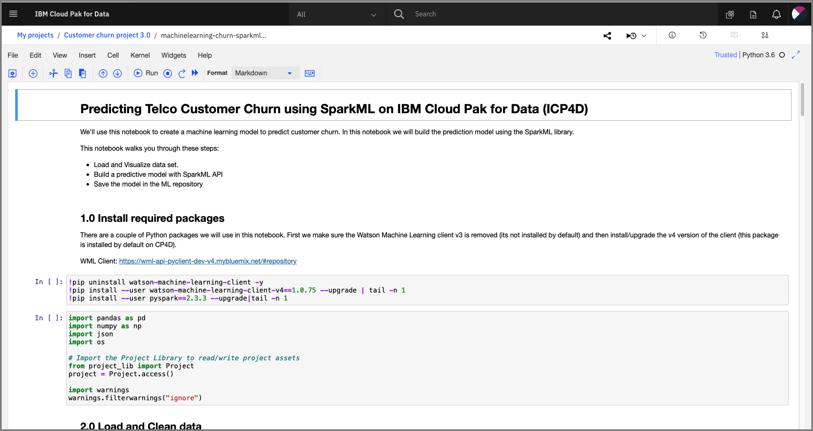

# Exercise 3: Monitoring models

This section is broken up into the following steps:

1. [Configure OpenScale in a Jupyter Notebook](#1-configure-openscale-in-a-jupyter-notebook)
1. [Setup OpenScale to utilize the dashboard](#1-setup-openscale-to-utilize-the-dashboard)

## 1. Configure OpenScale in a Jupyter Notebook

For this part of the exercise we're going to configure our Watson OpenScale service by running a Jupyter Notebook.

### Import the notebook

At the project overview click the *New Asset* button, and choose *Add notebook*.


On the next panel select the *From URL* tab, give your notebook a name, provide the following URL, and choose the Python 3.6 environment:

```bash
https://raw.githubusercontent.com/IBM/cloudpakfordata-telco-churn-workshop/master/notebooks/ConfigureOpenScale.ipynb
```

> The notebook is hosted in the same repo as [the workshop](https://github.com/IBM/cloudpakfordata-telco-churn-workshop).
>
> * **Notebook**: [ConfigureOpenScale.ipynb](https://github.com/IBM/cloudpakfordata-telco-churn-workshop/blob/master/notebooks/ConfigureOpenScale.ipynb)
> * **Notebook with output**: [with-output/ConfigureOpenScaleOutput.ipynb](https://github.com/IBM/cloudpakfordata-telco-churn-workshop/blob/master/notebooks/with-output/ConfigureOpenScaleOutput.ipynb)

<!-- TODO update -->


When the Jupyter notebook is loaded and the kernel is ready then we can start executing cells.

<!-- TODO update -->


<!-- TODO after this line -->

### Update credentials

* In the notebook section 1.2 you will add your ICP platform credentials.
* For the `url` field, change `https://w.x.y.z:31843` to use the IP address of your ICP cluster, i.e something like `https://169.26.13.7:31843`
* For the `username`, use your login username.
* For the `password`, user your login password.

### Run the notebook

Spend an minute looking through the sections of the notebook to get an overview. You will run cells individually by highlighting each cell, then either click the `Run` button at the top of the notebook. While the cell is running, an asterisk (`[*]`) will show up to the left of the cell. When that cell has finished executing a sequential number will show up (i.e. `[17]`).

## 2.Utilize the dashboard for Openscale

Now that you have created a machine learning model and configured Openscale, you can utilize the OpenScale dashboard to gather insights.
