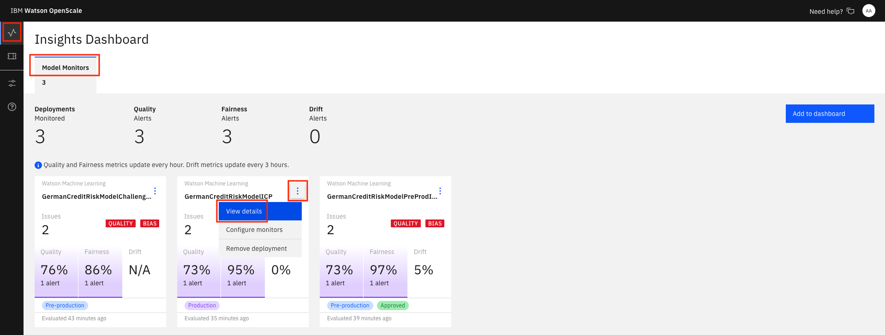

# Monitoring models with OpenScale GUI tool

This exercise shows a few of the features of the OpenScale GUI tool. It is presumed that OpenScale and Watson Machine Learning have already been configured.

## Utilize the dashboard for Openscale

Now that you have created a machine learning model and configured Openscale, you can utilize the OpenScale dashboard to gather insights.

### Use the insights dashboard

Click on the left-hand menu icon for `Insights`, then choose the tile for your configured model (or the 3-dot menu on the tile and then `View Details`:

You can see the top monitor highlighted, for the feature `Sex`.

By moving your mouse pointer over the graph, you can see the values change, and which contains bias. Click one spot to veiw the details. Later, we'll click `Configure Monitors` to get a Fairness endpoint:

Once you open the details page, you can see more information:

Click on `View Transactions` to drill deeper:

Now, go back to the top-level page when you click the Monitor Deployment tile and click `Configure Monitors`. Click the `Fairness` menu, then the `Debias Endpoint` tab:

Then scroll down for code examples on how to use the Fairness Debiased endpoint:

Similarly, you can choose the `Quality` menu and choose the `Feedback` tab to get code for Feedback Logging.

### Examine an individual transaction

Click on the left-hand menu icon for `Explain a transaction` and enter the transaction UID you copied previously into the search bar.

From the info icon next to `Details`:
"Explanations show the most significant factors when determining an outcome. Classification models also include advanced explanations. Advanced explanations are not available for regression, image, and unstructured text models."

Click on the info icon next to `Minimum changes for No Risk outcome` and look at the feature values:
"Pertinent Negative
If the feature values were set to these values, the prediction would change. This is the minimum set of changes in feature values to generate a different prediction. Each feature value is changed so that it moves towards its median value in the training data."

Click on the info icon next to `Maximum changes allowed for the same outcome` and look at the feature values:
"Pertinent Positive
The prediction will not change even if the feature values are set to these values. This is the maximum change allowed while maintaining the existing prediction. Each feature value is changed so that it moves towards its median value in the training data."

You can see under `Most important factors influencing prediction` the Feature, Value, and Weight of the most important factors for this score.

A full breakdown of the factors contributing to either "Risk" or "No Risk" are at the bottom.
