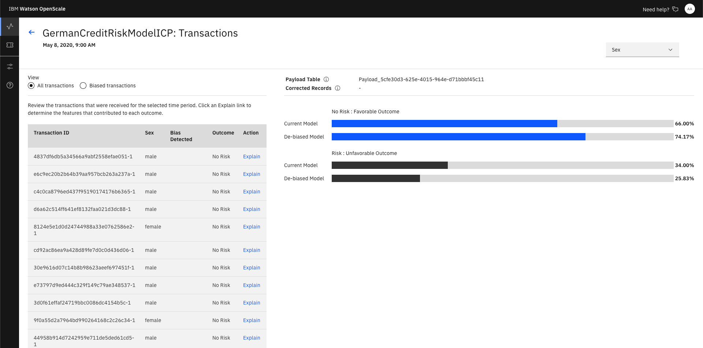
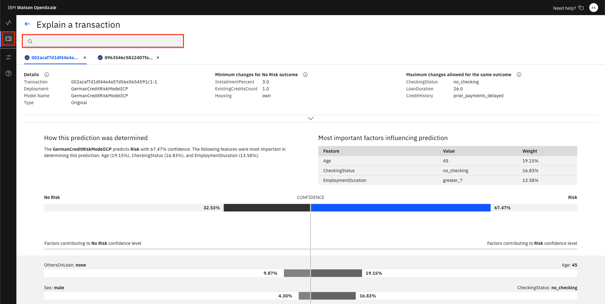

# Exercise 4: Monitoring models

This section is broken up into the following steps:

1. [Configure OpenScale in a Jupyter Notebook](#1-configure-openscale-in-a-jupyter-notebook)
1. [Utilize the dashboard for OpenScale](#2-utilize-the-dashboard-for-openscale)

## 1. Configure OpenScale in a Jupyter Notebook

For this part of the exercise we're going to configure our Watson OpenScale service by running a Jupyter Notebook.

### Import the notebook

At the project overview click the *New Asset* button, and choose *Add notebook*.


On the next panel select the *From URL* tab, give your notebook a name, provide the following URL, and choose the Python 3.6 environment:

```bash
https://raw.githubusercontent.com/IBM/cloudpakfordata-telco-churn-workshop/master/notebooks/ConfigureOpenScale.ipynb
```

> The notebook is hosted in the same repo as [the workshop](https://github.com/IBM/cloudpakfordata-telco-churn-workshop).
>
> * **Notebook**: [ConfigureOpenScale.ipynb](https://github.com/IBM/cloudpakfordata-telco-churn-workshop/blob/master/notebooks/ConfigureOpenScale.ipynb)
> * **Notebook with output**: [with-output/ConfigureOpenScaleOutput.ipynb](https://github.com/IBM/cloudpakfordata-telco-churn-workshop/blob/master/notebooks/with-output/ConfigureOpenScaleOutput.ipynb)


When the Jupyter notebook is loaded and the kernel is ready then we can start executing cells.


### Update credentials

* In the notebook section 1.2 you will add your ICP platform credentials.
* For the `url` field, change `https://w.x.y.z:31843` to use the IP address of your ICP cluster, i.e for today's workshop on 9/19/19 it will be `"url": "169.54.164.135:31843"`. Make sure you have the port appended `31843`.
* For the `username`, use your login username.
* For the `password`, user your login password.

### Run the notebook

Spend an minute looking through the sections of the notebook to get an overview. You will run cells individually by highlighting each cell, then either click the `Run` button at the top of the notebook. While the cell is running, an asterisk (`[*]`) will show up to the left of the cell. When that cell has finished executing a sequential number will show up (i.e. `[17]`).

### Get transactions for Explainability

Under `8.9 Identify transactions for Explainability` run the cell. It will produce a series of UIDs for indidvidual ML scoring transactions. Copy one of them to examine in the next section.

## 2. Utilize the dashboard for Openscale

Now that you have created a machine learning model and configured Openscale, you can utilize the OpenScale dashboard to gather insights.

### Use the insights dashboard

Click on the left-hand menu icon for `Insights`, then choose the tile for your configured model (or the 3-dot menu on the tile and then `View Details`:


You can see the top monitor highlighted, for the feature `Sex`.

By moving your mouse pointer over the graph, you can see the values change, and which contains bias. Click one spot to veiw the details. Later, we'll click `Configure Monitors` to get a Fairness endpoint:


Once you open the details page, you can see more information:


Click on `View Transactions` to drill deeper:



Now, go back to the top-level page when you click the Monitor Deployment tile and click `Configure Monitors`. Click the `Fairness` menu, then the `Debias Endpoint` tab:


Then scroll down for code examples on how to use the Fairness Debiased endpoint:


Similarly, you can choose the `Quality` menu and choose the `Feedback` tab to get code for Feedback Logging.

### Examine an individual transaction

Click on the left-hand menu icon for `Explain a transaction` and enter the transaction UID you copied previously into the search bar.



From the info icon next to `Details`:
"Explanations show the most significant factors when determining an outcome. Classification models also include advanced explanations. Advanced explanations are not available for regression, image, and unstructured text models."

Click on the info icon next to `Minimum changes for No Risk outcome` and look at the feature values:
"Pertinent Negative
If the feature values were set to these values, the prediction would change. This is the minimum set of changes in feature values to generate a different prediction. Each feature value is changed so that it moves towards its median value in the training data."

Click on the info icon next to `Maximum changes allowed for the same outcome` and look at the feature values:
"Pertinent Positive
The prediction will not change even if the feature values are set to these values. This is the maximum change allowed while maintaining the existing prediction. Each feature value is changed so that it moves towards its median value in the training data."

You can see under `Most important factors influencing prediction` the Feature, Value, and Weight of the most important factors for this score.

A full breakdown of the factors contributing to either "Risk" or "No Risk" are at the bottom.
