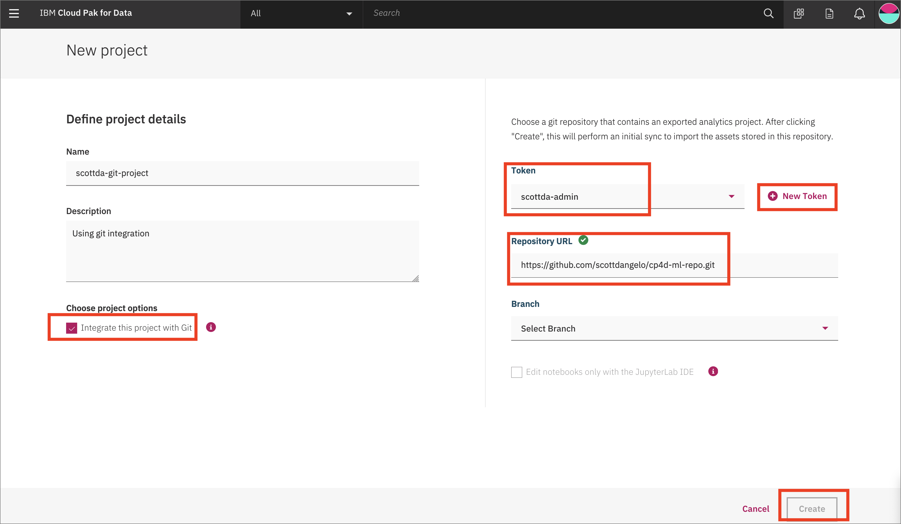

# Git repository integration

A Cloud Pak for Data project can be integrated with a git repository.

### Generate a token in GitLab

To create a token for Gitlab, login to [GitLab](https://about.gitlab.com/), click on your user account in the top right and choose `Settings`:

![GitLab user account]

From the left navigation bar select `Access tokens` and fill in the *name*, *expiration date*, and check the boxes for *read_repository* and *write_repository*. Finally, click `Create personal access token` button:

![GitLab select Access Tokens]

On the resulting page, you'll see your personal access token. Copy this.

> NOTE: This token gives access to your git repository. Do not share with anyone.

![GitLab copy Access Token]

Now go back to the Cloud Pak for Data *Create project* page and we'll add the token.

### Create a project with git integration

Go the (☰) menu and click *Projects*

Click on *New project*

Create a new project, choose `Analytics project`. Give the project a name.

Click the box for `Integrate this project with Git`. Add the token that you have created, and then select it. Put in the repository URL, Select a branch, and click `Create`.

