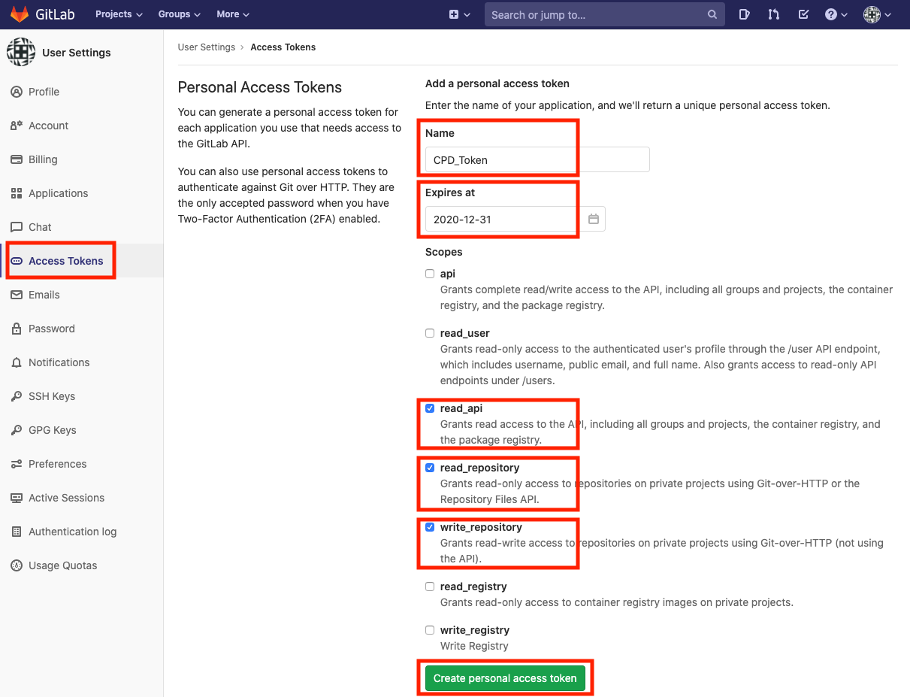
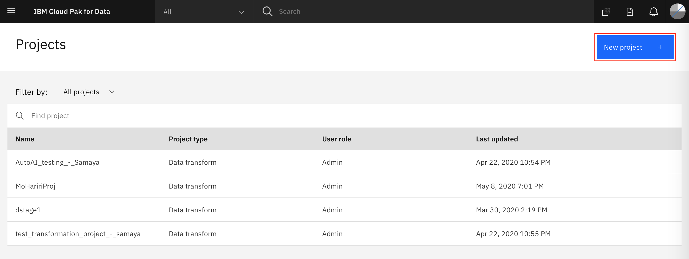
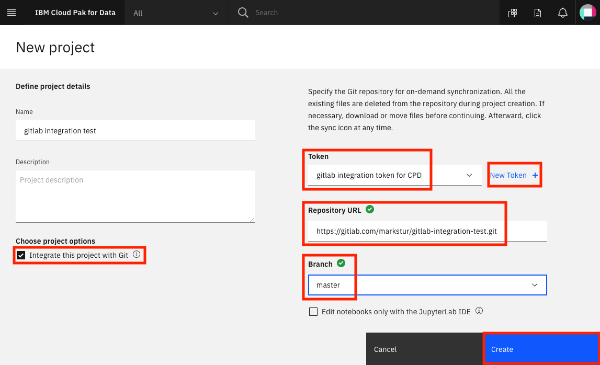
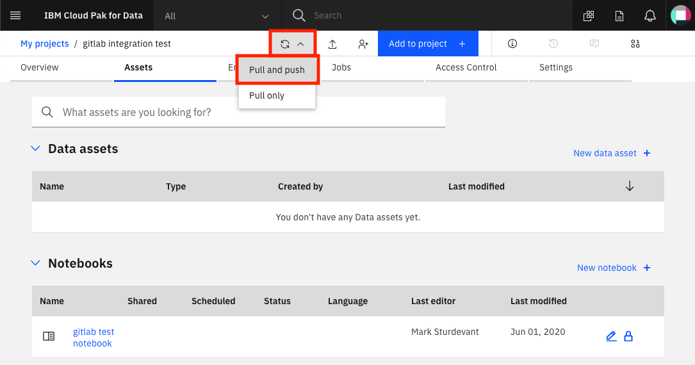
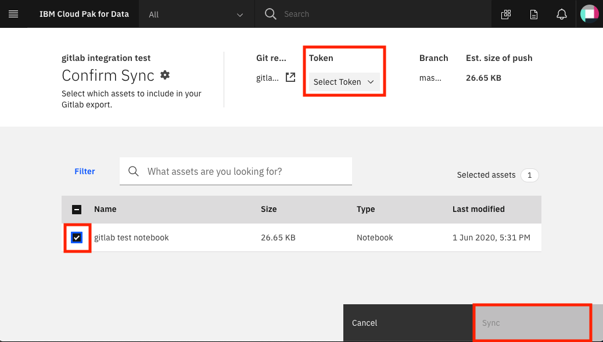

# Git repository integration

A Cloud Pak for Data project can be integrated with a git repository.

## Create an empty repository

Use the GitLab menu to create a project and an empty repository.

## Generate a token in GitLab

To create a token for GitLab, login to [GitLab](https://about.gitlab.com/), click on your user account in the top right and choose `Settings`:


From the left navigation bar select `Access tokens` and fill in the *name*, *expiration date*, and check the boxes for *read_api*, *read_repository* and *write_repository*. Finally, click `Create personal access token` button:



On the resulting page, you'll see your personal access token. Copy this.

> NOTE: This token gives access to your git repository. Do not share with anyone.


Now go back to the Cloud Pak for Data *Create project* page and we'll add the token.

## Create a project with git integration

Go the (☰) menu and click *Projects*


Click on *New project +*



Create a new project

* Choose `Analytics project` and click *Next*.
* Click on `Create an empty project`.
* Give the project a name.
* Click the box for `Integrate this project with Git`.

Click on `New Token +`

* Select `Gitlab` in the `Platform` pulldown.
* Paste the token that you have created under `Access token`.
* Enter your GitLab username and give your token a name.
* Click *Continue*.

Use the `Token` pulldown and select the token you created.

Put in the repository URL, select a branch, and click `Create`.



When project creation completes, click on `View new project`.

## Create assets and push to git

Now if we create an asset in the project, we can push to git.

At the project overview, click the `Add to project +` button, and choose `Notebook`:


On the next panel select the *From URL* tab, give your notebook a name, provide the following URL, and choose the Python 3.6 environment:

```bash
https://raw.githubusercontent.com/IBM/cloudpakfordata-telco-churn-workshop/master/notebooks/TelcoChurnICP4D.ipynb
```

Click *Create notebook*.

Now, go back to the top-level project page, click the "circular arrow" sync-icon, and choose `Pull and push`:



On the *Confirm Sync* page, select your token, check the box for your notebook, and click `Sync`:



The next screen will verify "Did you remove credentials from assets?". After confirming this, click `Continue export`.

After syncing, the screen will show Success. You can click `Back to project`.

You can integrate git into your workflow in your usual way, syncing with teammates via 'git pull' and using 'git push' to upload your changes to the git remote repository.
