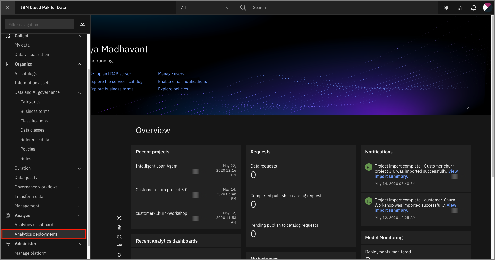
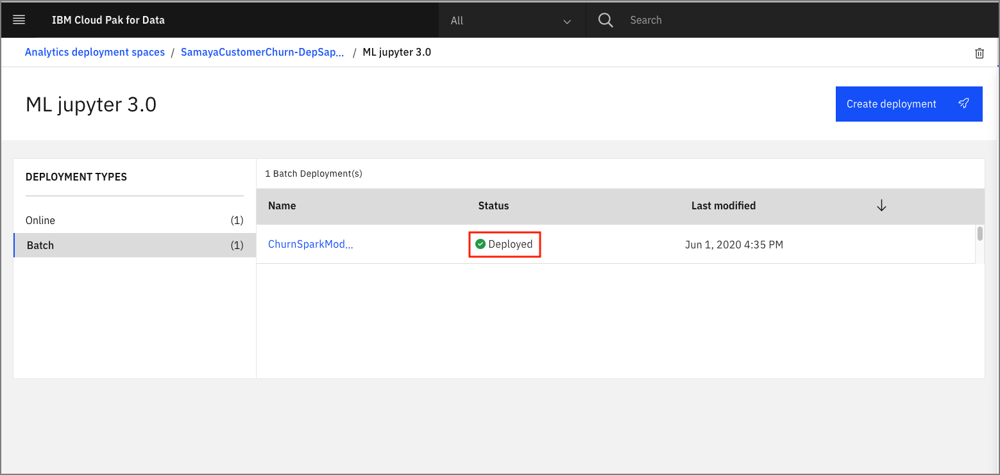

# Machine Learning Model Deployment and Scoring

In this module, we will go through the process of deploying a machine learning model so it can be used by others. Deploying a model allows us to put a model into production, so that data can be passed to it to return a prediction. The deployment will result in an endpoint that makes the model available for wider use in applications and to make business decisions. There are several types of deployments available ([depending on the model framework used](https://www.ibm.com/support/producthub/icpdata/docs/content/SSQNUZ_current/wsj/analyze-data/pm_service_supported_frameworks.html)), of which we will explore:

1. Online - Creates an endpoint to generate a score or prediction in real time.
1. Batch - Creates an endpoint to schedule the processing of bulk data to return predictions.

This module is broken up into the following steps:

1. [Deploy the Model](#1-deploy-the-model)
1. [Create and Schedule a Job](#2-create-and-schedule-job)

>*Note: The lab instructions below assume you have a project and a deployment space already. If not, follow the instructions in the pre-work section to create a project and a space.*

## 1. Deploy the Model

We will first create the deployment for the model in our deployment space. Note that although these steps use the Cloud Pak for Data UI to create the deployment, the same can be done programmatically.

* Navigate to the left-hand (☰) hamburger menu and choose `Analyze` -> `Analytics deployments`:

* Choose the deployment space you created previously by clicking on the name of the space.

* In your space overview, select the model name that you built previously and click the 3 dots under `Actions`, and choose `Deploy`:

* On the 'Configure and deploy' screen, choose `Batch` for the *Deployment Type*, give the Deployment a name and optional description and click `Create`:

* Once the status shows as *Deployed* , you will be able to click on the deployment name to begin testing:

## 2. Create and Schedule a Job

Next we can schedule a job to run against our batch deployment. We are going to do this programmatically using the Python client SDK. For this part of the exercise we're going to use a Jupyter notebook to create and submit a batch job to our model deployment.

>*Note: The batch job input is impacted by the machine learning framework used to build the model. There is a known issue with SparkML based models where batch jobs require inline payload to be used. For other frameworks, we can use data assets (i.e CSV files) as the input payload.*

### Run the Batch Notebook (SparkML)

The Jupyter notebook is already included as an asset in the project you imported earlier.

Open the notebook:

* From the project overview page, *click* on the `Assets` tab to open the assets page where your project assets are stored and organized.

* Scroll down to the `Notebooks` section of the page and *Click* on the pencil icon at the right of the `machinelearning-churn-batchscoring` notebook.

When the Jupyter notebook is loaded and the kernel is ready, we will be ready to start executing it in the next section.

### Run the notebook

Spend an minute looking through the sections of the notebook to get an overview. A notebook is composed of text (markdown or heading) cells and code cells. The markdown cells provide comments on what the code is designed to do.

You will run cells individually by highlighting each cell, then either click the `Run` button at the top of the notebook or hitting the keyboard short cut to run the cell (Shift + Enter but can vary based on platform). While the cell is running, an asterisk (`[*]`) will show up to the left of the cell. When that cell has finished executing a sequential number will show up (i.e. `[17]`).

**Please note that some of the comments in the notebook are directions for you to modify specific sections of the code. Perform any changes as indicated before running / executing the cell.**

#### Notebook sections

With the notebook open, you will notice:

* Section `1.0 Install required packages` will install some of the libraries we are going to use in the notebook (many libraries come pre-installed on Cloud Pak for Data). Note that we upgrade the installed version of Watson Machine Learning Python Client. Ensure the output of the first code cell is that the python packages were successfully installed.

* Section `2.0 Create Batch Deployment Job` will create a job for the batch deployment. To do that, we the Watson Machine Learning client to get our deployment and create a job.

  * In the first code cell for Section2.1, be sure to update the `wml_credentials` variable.

    * The url should be the hostname of the Cloud Pak for Data instance.
    * The username and password should be the same credentials you used to log into Cloud Pak for Data.

  * In section 2.2, be sure to update the `DEPLOYMENT_SPACE_NAME` variable with your deployment space name.

  * In section 2.3, be sure to update the `DEPLOYMENT_NAME` variable with the name of the batch deployment you created above.

* Continue to run the cells.

* Section `3.0 Monitor Batch Job Status` will start polling the job status until it completes or fails. The code cell will output the status every 5 seconds as the job goes from queued to running to completed or failed.

* Once the job completes, continue to run the cells until the end of the notebook.

## Conclusion

In this section we covered how the followings:

* Creating a Batch Deployment
* Creating a Job for Batch Predictions

> **Important**: *Make sure that you stop the kernel of your notebook(s) when you are done, in order to conserve resources! You can do this by going to the Asset page of the project, selecting the notebook you have been running and selecting to `Stop Kernel` from the Actions menu. If you see a lock icon on the notebook, click it to unlock the notebook so you can stop the kernel.*

