# Monitoring models with OpenScale GUI tool using Fastpath setup

This exercise shows a few of the features of the OpenScale GUI tool. When you first provision Watson OpenScale, either in the IBM Cloud or on Cloud Pak for Data, you will be offered the choice to automatically configure and setup OpenScale. This is called the Fastpath, and it walks the admin through the required steps and loads some sample data to demonstrate the features of OpenScale. We will use this automated Fastpath setup in this lab.
It is presumed that OpenScale Fastpath and Watson Machine Learning have already been configured.

## Use the insights dashboard

The *Insights Dashboard* provides an overview of the models that OpenScale is monitoring.

* Open the `Services` tab by clicking the icon in the upper right. Click on the `Watson OpenScale` tile under the `AI` category:

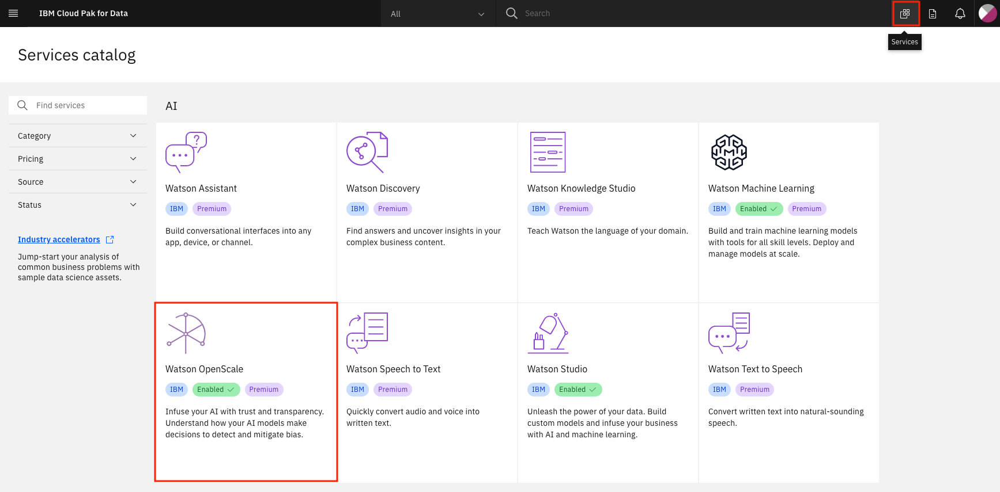

OpenScale will begin with the *Insights Dashboard*. This can contain tiles for many configured monitors. The tile for `GermanCreditRiskModelICP` will be the one we will use for this lab, which was configured using the Fastpath script.

* Click on the left-hand menu icon for `Insights`, make sure that you are on the `Model Monitors` tab, and then choose the tile for the `GermanCreditRiskModelICP` model (or the 3-dot menu on the tile and then `View details`):

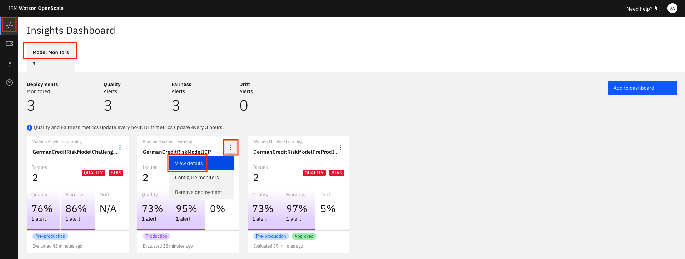

Notice the red alert indicators. You should see a red indicator under `Fairness` for `Sex (female)`.

* Click on the `Fairness` score.

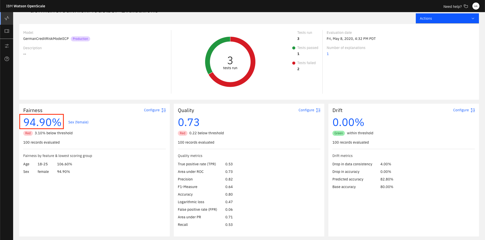

You will see the triangle with `!` under `Fairness` -> `Sex`. This indicates that there has been an alert for the `Fairness` monitor. Alerts are configurable, based on thresholds for fairness outcomes which can be set and altered as desired.

* Click on `Fairness` -> `Sex` in the sidebar. To see the trend chart.

* By moving your mouse pointer over the graph, you can see the values change, and which contains bias. Click one spot to view the details. Later, we'll click `Configure monitors` to get a Fairness endpoint:

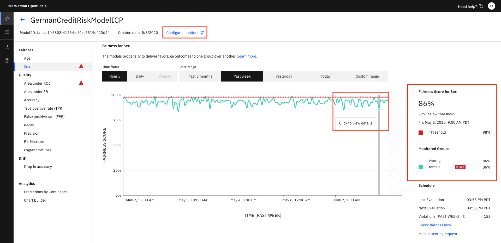

* After you `Click to view details`, you can see more information. Note that you can choose the radio buttons for your choice of data (Payload + Perturbed, Payload, Training, Debiased):

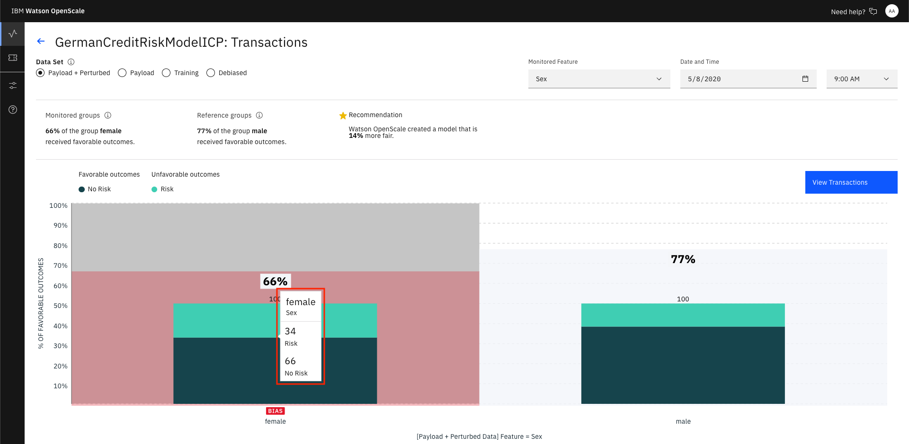

* Click on `View Transactions` to drill deeper. Here you have radio buttons for *All transactions* and *Biased transactions*. Each of the individual transactions can be examined to see them in detail. Doing so will cache that transaction, as we will see later. Note that the Explainability feature requires 1000's of REST calls to the endpoint using variations of the data that are slightly perturbed, which can require several seconds to complete:

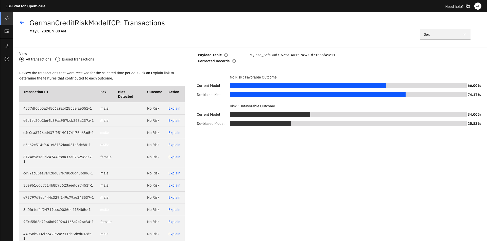

* Now, go back to the *Insights Dashboard* page by clicking on the left-hand menu icon for `Insights`. Make sure that you are on the `Model Monitors` tab. Click on the 3-dot menu on the tile for your configured model and then click `Configure monitors`):

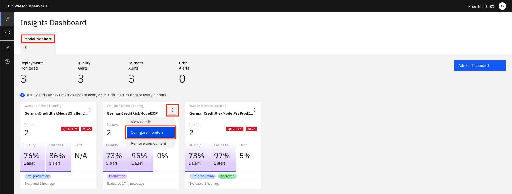

* Click the `Endpoints` menu, then the `Endpoints` tab. Use the `Endpoint` pulldown to select `Debiased transactions`. This is the REST endpoint that offers a debiased version of the credit risk ML model, based on the features that were configured (i.e. Sex and Age). It will present an inference, or score, that attempts to remove the bias that has been detected. Use the `Code language` pulldown to see example code for using the Fairness Debiased endpoint. You can see code snippets using cURL, Java, and Python, which can be used in your scripts or applications.

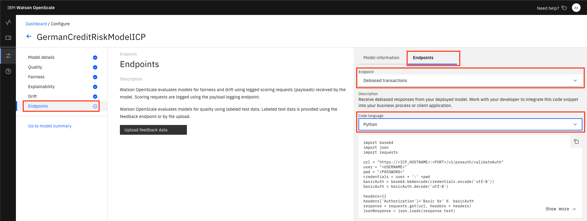

Similarly, you can choose the `Feedback logging` endpoint to get code for Feedback Logging. This provides an endpoint for sending fresh test data for ongoing quality evaluation. You can upload feedback data here or work with your developer to integrate the code snippet provided to publish feedback data to your Watson OpenScale database.

### Examine an individual transaction

* Click on the left-hand menu icon for `Explain a transaction` and click one of the transactions that have been run. These are the tranactions that have been cached. Alternately, enter the transaction UID you copied previously into the search bar, if you've run the `Run the OpenScale notebook` code.

> NOTE: Each time you create the Explainibility data, the perterbation algorithm is sending 1000's of requests to the deployed Machine Learning REST endpoint, so the first time this is done can take a few seconds.

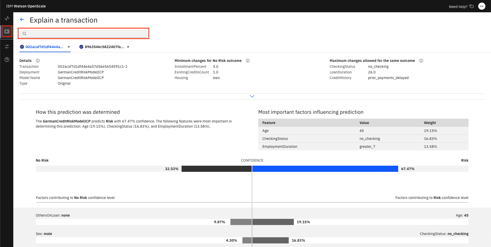

* From the info icon next to `Details`:

  > "Explanations show the most significant factors when determining an outcome. Classification models also include advanced explanations. Advanced explanations are not available for regression, image, and unstructured text models."

* Click on the info icon next to `Minimum changes for No Risk outcome` and look at the feature values:

  > "Pertinent Negatives (PN) are feature values obtained by changing the value of each feature away from its median such that the model prediction changes. If the feature attributes were set to these values, the prediction would change. This is the minimum set of changes in feature values to generate a different prediction."

* Click on the info icon next to `Maximum changes allowed for the same outcome` and look at the feature values:

  > "Pertinent Positives (PP) are feature values obtained by changing the value of each feature towards its median such that the model prediction remains the same. The prediction does not change, even if the feature attributes are set to these values. This is the maximum change while maintaining the existing prediction. Each feature value changes so that it moves towards its median value in the training data."

You can see under `Most important factors influencing prediction` the Feature, Value, and Weight of the most important factors for this score.

A full breakdown of the factors contributing to either "Risk" or "No Risk" are at the bottom.

## Using the Analytics tools

* Click on the left-hand menu icon for `Insights`, make sure that you are on the `Model Monitors` tab, and then choose the tile for the `GermanCreditRiskModelICP` model (or the 3-dot menu on the tile and then `View details`).

* Click on the `Fairness` score.

* In the sidebar, click on `Analytics` -> `Chart Builder`. Here you can create charts using various Measurements, Features, and Dimensions of your machine learning model. Change them and examine the charts that are created:

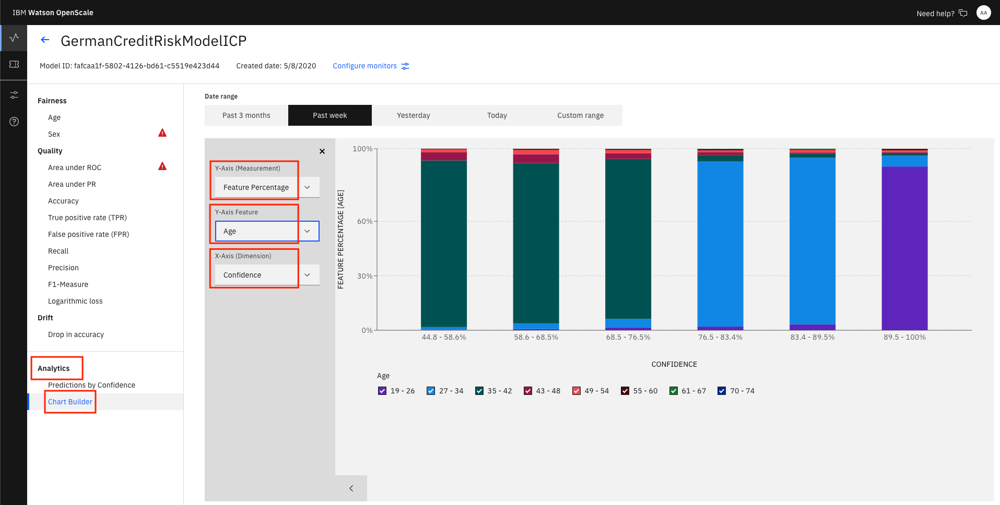

* You can also see a chart that breaks down *Predictions by Confidence*:

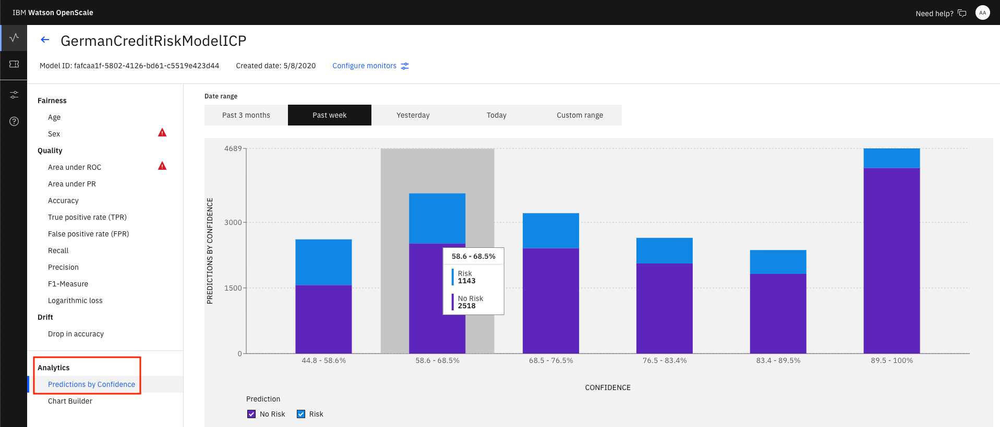

## Recap

This lab provides a walkthrough of many of the GUI features using the Watson OpenScale tools. The Fastpath deployment creates a machine learning model, deploys it, and inserts historical data to simulate a model that has been used in production over time. The OpenScale monitors are configured, and the user can then explore the various metrics and data. Please continue to explore on your own.

> NOTE: Returning to the Cloud Pak for Data requires altering the URL in the browser, so that the cluster name is the only thing present. Remove anything in the browser URL containing `/aiopenscale/*`.
