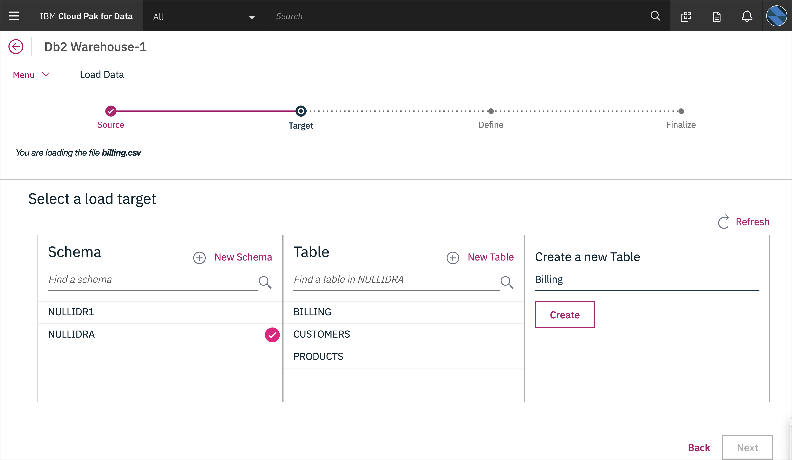
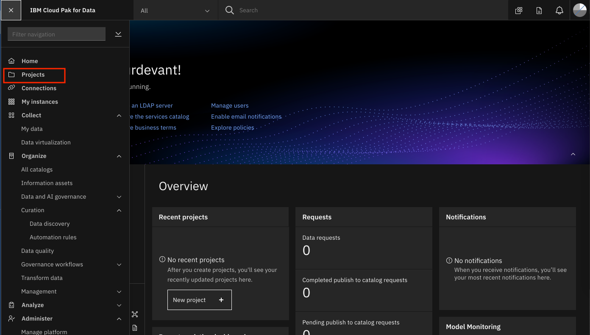
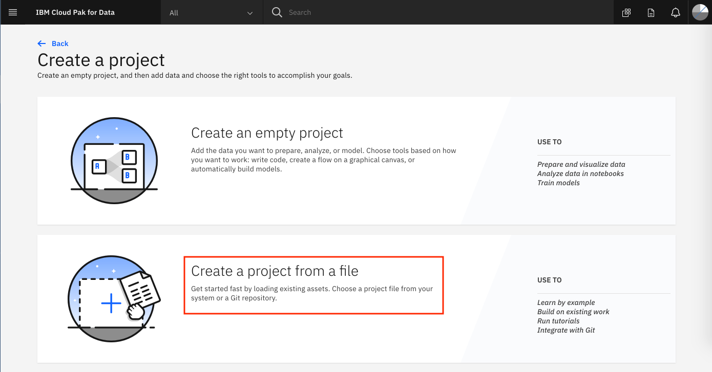
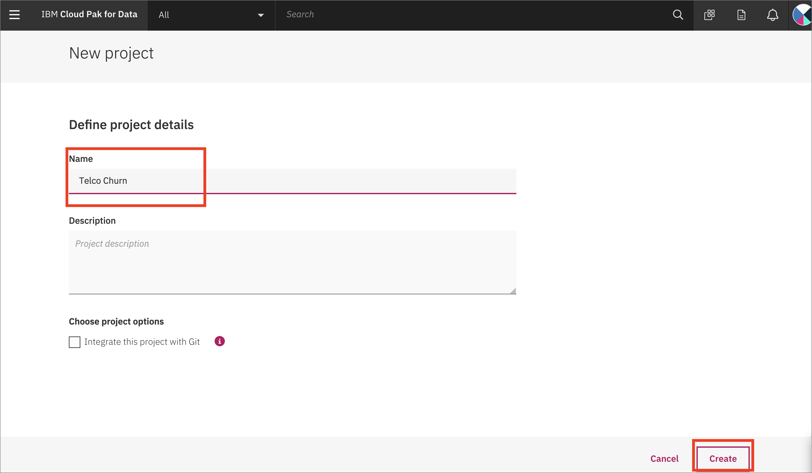
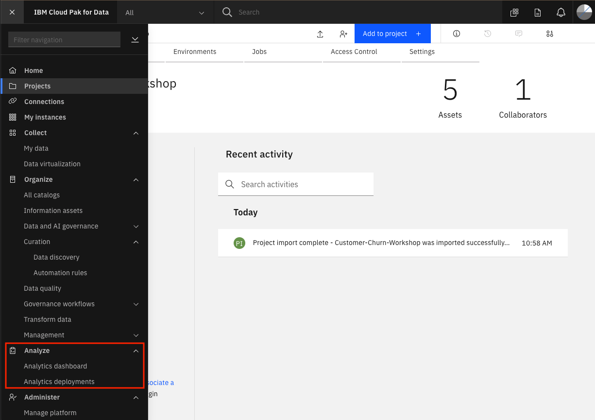

# Pre-work

This section is broken up into the following steps:

1. [Download or Clone the repo](#1-download-or-clone-the-repo)
1. [About the data set](#2-about-the-data-set)
1. [(Optional) Seeding our Db2 Warehouse database](#3-optional-seeding-our-db2-warehouse-database)
1. [Creating a new Cloud Pak for Data project](#4-creating-a-new-cloud-pak-for-data-project)
1. [Create a Space for Machine Learning Deployments](#5-create-a-space-for-machine-learning-deployments)

## 1. Download or clone the repo

Various parts of this workshop will require the attendee to upload files or run scripts that we've stored in the repository. So let's get that done early on, you'll need [`git`](https://git-scm.com) on your laptop to clone the repository directly, or access to [GitHub.com](https://github.com/) to download the zip file.

To Download, go to the [GitHub repo for this workshop](https://github.com/IBM/cloudpakfordata-telco-churn-workshop) and download the archived version of the workshop and extract it on your laptop.


Alternately, run the following command:

```bash
git clone https://github.com/IBM/cloudpakfordata-telco-churn-workshop
cd cloudpakfordata-telco-churn-workshop
```

## 2. About the data set

The data set used for this workshop is originally from Watson Analytics and was used on a [Kaggle](https://www.kaggle.com/blastchar/telco-customer-churn) project, it contains information about customer churn for a Telecommunications company. The data is split into three CSV files and are located in the [data](https://github.com/IBM/cloudpakfordata-telco-churn-workshop/tree/master/data/split) directory of this repository.

### **[billing.csv](../../data/split/billing.csv)**

This file has the following attributes:

* Customer ID
* Contract *(Month-to-month, one year, two year)*
* Paperless Billing *(Yes, No)*
* Payment Method *(Bank transfer, Credit card, Electronic check, Mailed check)*
* Monthly Charges *($)*
* Total Charges *($)*
* Churn *(Yes, No)*

### **[customer-service.csv](../../data/split/customer-service.csv)**

* Customer ID
* Gender *(Male, Female)*
* Senior Citizen *(1, 0)*
* Partner *(Yes, No)*
* Dependents *(Yes, No)*
* Tenure *(1-100)*

### **[products.csv](../../data/split/products.csv)**

* Customer ID
* Phone Service *(Yes, No)*
* Multiple Lines *(Yes, No, No phone service)*
* Internet Service *(DSL, Fiber optic, No)*
* Online Security *(Yes, No, No internet service)*
* Online Backup *(Yes, No, No internet service)*
* Device Protection *(Yes, No, No internet service)*
* Tech Support *(Yes, No, No internet service)*
* Streaming TV *(Yes, No, No internet service)*
* Streaming Movies *(Yes, No, No internet service)*

## 3. (Optional) Seeding our Db2 Warehouse database

We'll need a place to store our data. For this workshop we've opted to use Db2 Warehouse on our local Cloud Pak for Data cluster. Note that CP4D can work with any Database with a JDBC connector, so this is only one of many choices.

### Load Data into Local DB2 Warehouse

These instructions are for loading the data into the local CP4D version of DB2 Warehouse. They will be similar for the IBM Cloud version.

Click the (☰) hamburger menu in the upper left corner and choose `Collect` -> `My data`:


Go to the *Databases* tab, click on the 3 vertial lines on the *DB2 Warehouse* tile, and click `Open`:


Under `Menu` choose `Load` and `Load Data`:


Choose `Browse files`:


Navigate to where you cloned this repository, then to `data/split/` and choose `billing.csv`, then click `Next`.


Choose Schema `NULLIDRA` and click `+ New table`. Under "New Table Name" type "BILLING" and click `Create`, then `Next`.



Accept the defaults and click `Next`. Click `Begin Load`.


Repeat for the `products.csv` file, naming the table `PRODUCTS` and the `customer-service.csv` file, naming the table `CUSTOMERS`.

### Examine connection information

You can see connection information by going to *Menu* -> *Connection Information*. Here you can see instructions for various platforms (Linux, Mac, PowerLinux, Windows, zLinux) and the information you need to connect, with the exception of the *password*. The *password* is only available to users with *Admin* privileges:


## 4. Creating a new Cloud Pak for Data project

At this point of the workshop we will be using Cloud Pak for Data for the remaining steps.

### Log into Cloud Pak for Data

Launch a browser and navigate to your Cloud Pak for Data deployment

> **NOTE** Your instructor will provide a URL and credentials to log into Cloud Pak for Data!


### Create a new project

Go the (☰) menu and click *Projects*



Click on *New project*


Either

[Create project from file](#create-project-from-file-for-openscale-configuration)

if you are doing the manual configuration of OpenScale for this workshop,or

[Create a blank project](#create-empty-project-if-you-are-not-using-openscale-configuration)

if you aren't using OpenScale, or using OpenScale with the Fast Path configuration.

#### Create project from file for OpenScale configuration

Select the _*Create a project from a sample or file*_option:



Navigate to where you cloned this repository, then to `notebooks/` and choose `openscalelab.zip`. Give the project a name and click `Create`:


#### Create empty project if you are not using OpenScale configuration

Click on the top tile for `Create an empty project`:


Give the project a unique name and click `Create`:



## 5. Create a Space for Machine Learning Deployments

Go the (☰) menu and click `Analyze` -> `Analytics deployments`:



Click on `+ New deployment space`:


Give your deployment space a unique name, optional description, then click `Create`. You will use this space later when you deploy a machine learning model.
