# Pre-work

This section is broken up into the following steps:

1. [Download or Clone the Repository](#1-download-or-clone-the-repository)
1. [Create an Analytics Project and Deployment Space](#2-create-a-project-and-deployment-space)

## 1. Download or Clone the Repository

Various parts of this workshop will require the attendee to upload files or run scripts that we've stored in the repository. So let's get that done early on, you'll need [`git`](https://git-scm.com) on your laptop to clone the repository directly, or access to [GitHub.com](https://github.com/) to download the zip file.

To Download, go to the [GitHub repo for this workshop](https://github.com/IBM/cloudpakfordata-telco-churn-workshop) and download the archived version of the workshop and extract it on your laptop.


Alternately, run the following command:

```bash
git clone https://github.com/IBM/cloudpakfordata-telco-churn-workshop
cd cloudpakfordata-telco-churn-workshop
```

## 2. Create a Project and Deployment Space

At this point of the workshop we will be using Cloud Pak for Data for the remaining steps.

### Log into Cloud Pak for Data

Launch a browser and navigate to your Cloud Pak for Data deployment

> **NOTE:** Your instructor will provide a URL and credentials to log into Cloud Pak for Data!

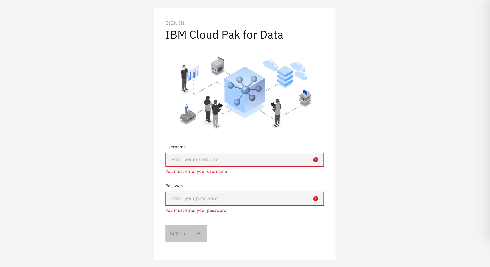

### Create a New project

In Cloud Pak for Data, we use the concept of a project to collect / organize the resources used to achieve a particular goal (resources to build a solution to a problem). Your project resources can include data, collaborators, and analytic assets like notebooks and models, etc.

* Go the (☰) menu and click *Projects*

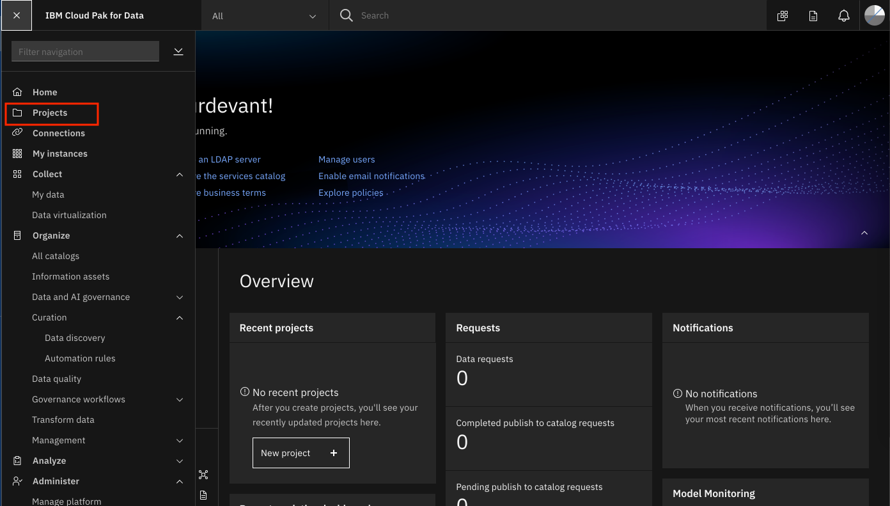

* Click on *New project +*

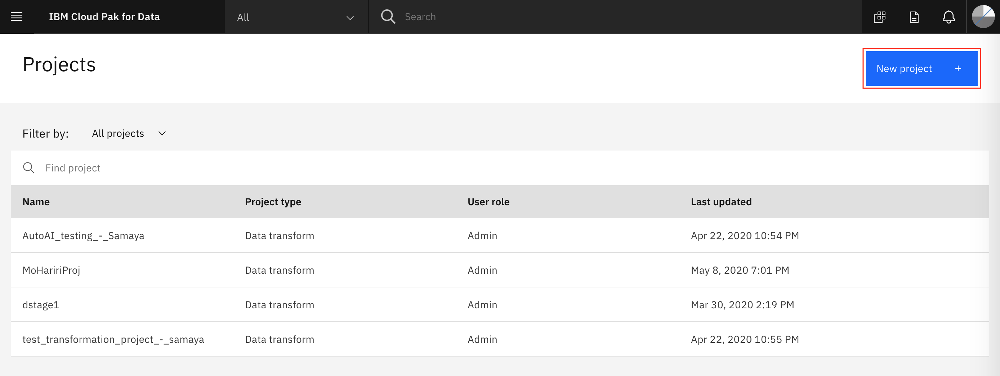

* Select *Analytics project* for the project type and click on *Next*

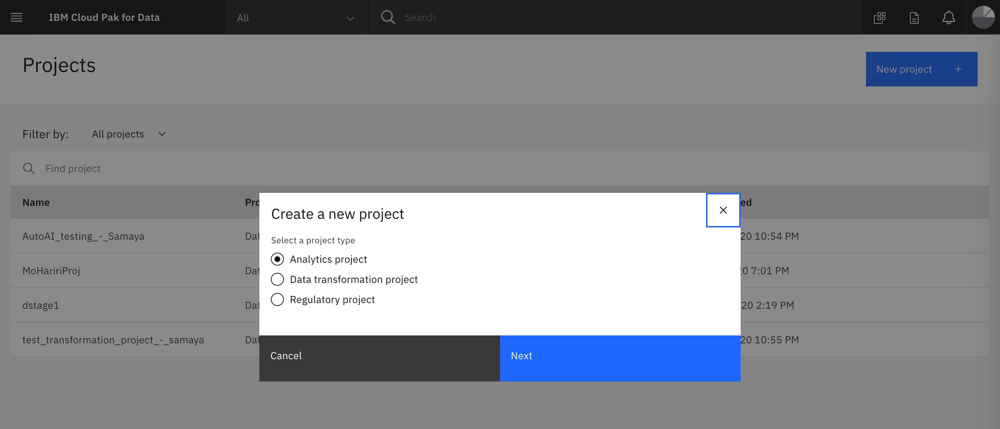

* We are going to create a project from an existing file (which contains assets we will use throughout this workshop), as opposed to creating an empty project. Select the _*Create a project from a file*_ option:

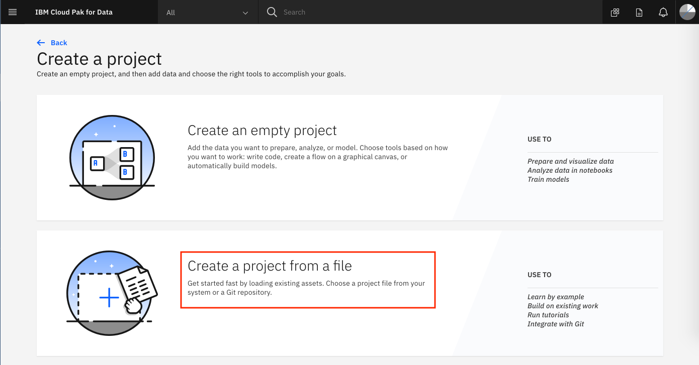

* Navigate to where you cloned this repository, then to `projects/` and choose `Customer-Churn-Project.zip`. Give the project a name and click `Create`:

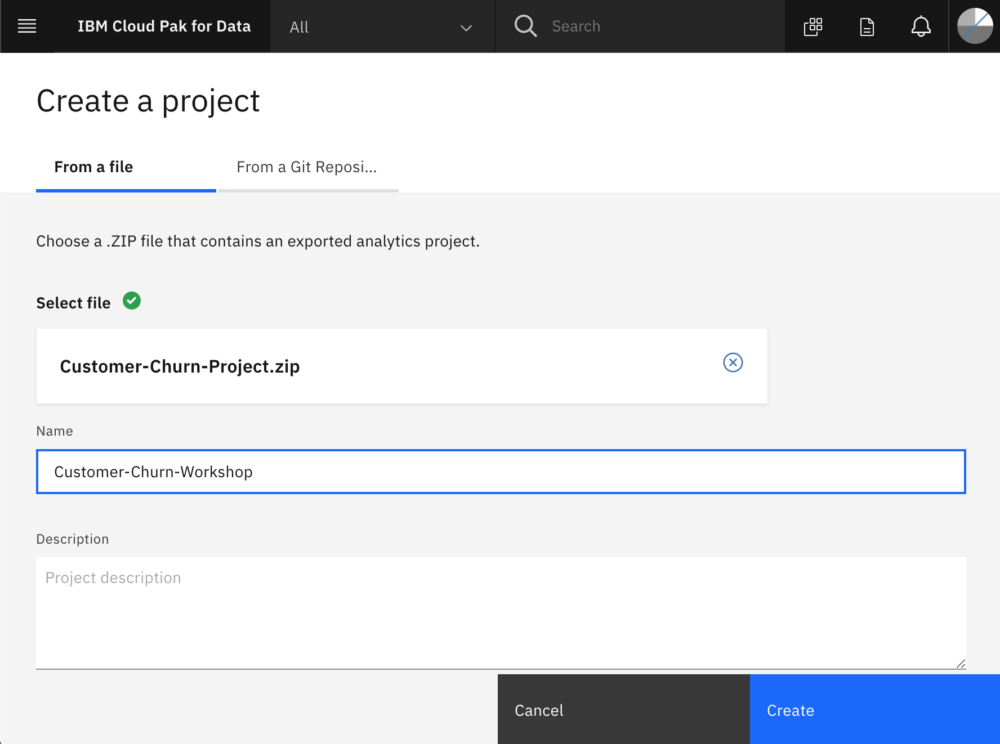

* After succesful creation, click on *View new project*

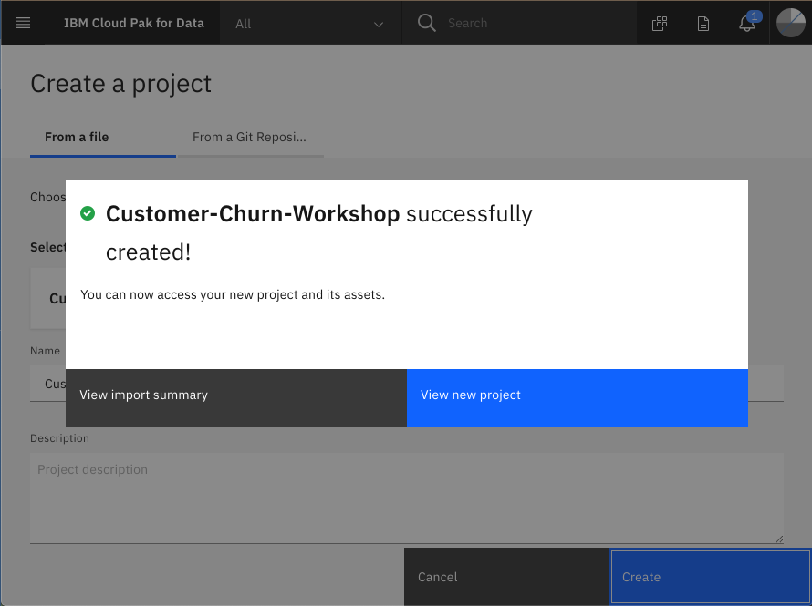

### Create a Deployment Space

Cloud Pak for Data uses the concept of `Deployment Spaces` to configure and manage the deployment of a set of related deployable assets. These assets can be data files, machine learning models, etc.

* Go the (☰) menu and click `Analyze` -> `Analytics deployments`:

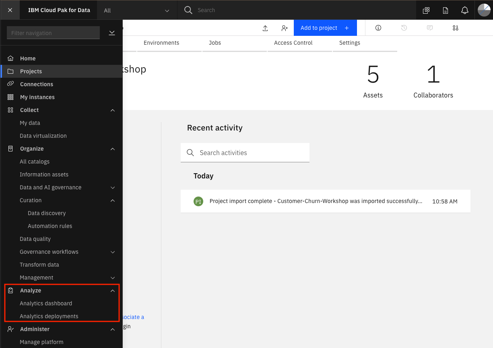

* Click on `+ New deployment space`:

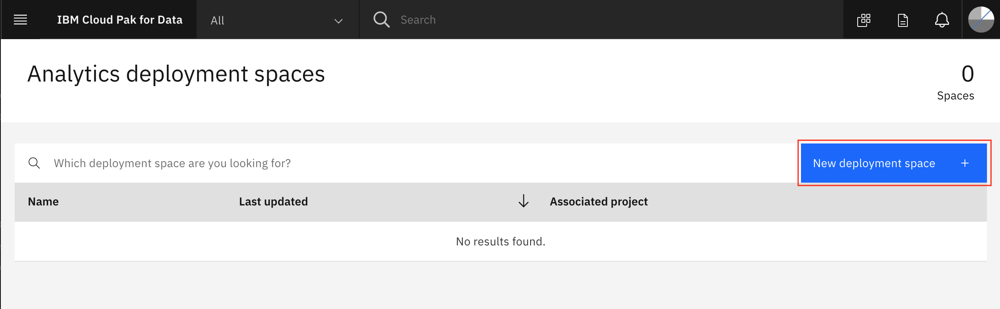

* Select the _*Create an empty space*_ option.

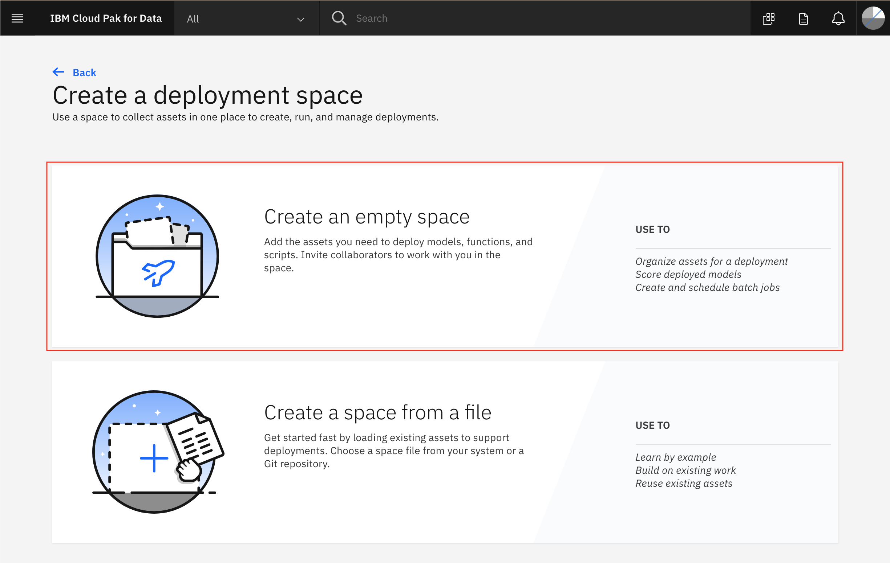

* Give your deployment space a unique name, optional description, then click `Create`. You will use this space later when you deploy a machine learning model.

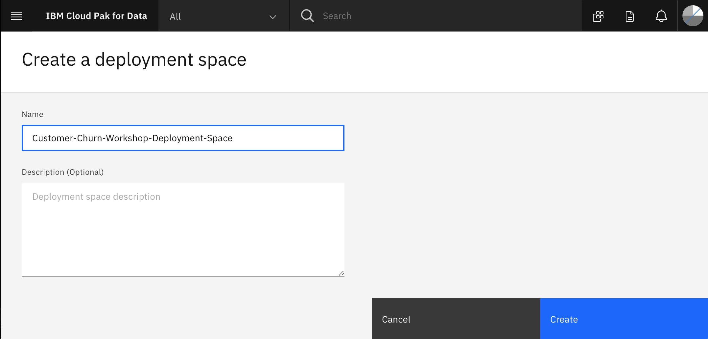

* Next, we will add a collaborator to the new deployment space, so that assets we deploy can be monitored in the OpenScale model monitoring lab.

* Click on the `Access control` tab and then click on `Add collaborators +` on the right.

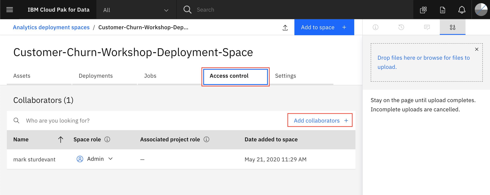

* Enter "admin" as a Collaborator and select the user from the drop down list. Then click on the `Add to list +` button.

> **NOTE:** We are adding the user that configured the machine learning instance for OpenScale monitoring. In this case, the user is the admin user.

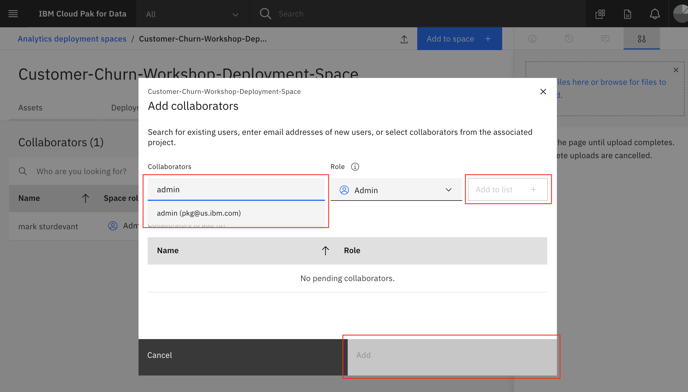

* Click the `Add` button to finish adding the collaborator. You should be brought back to the deployment space page and see your user ID along with the `Admin` user as collaborators for this space.
