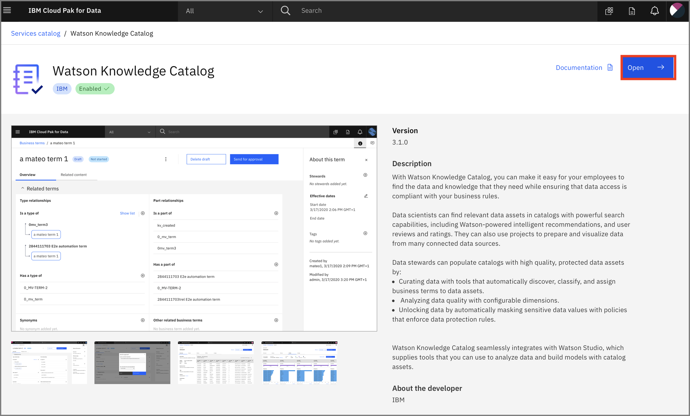
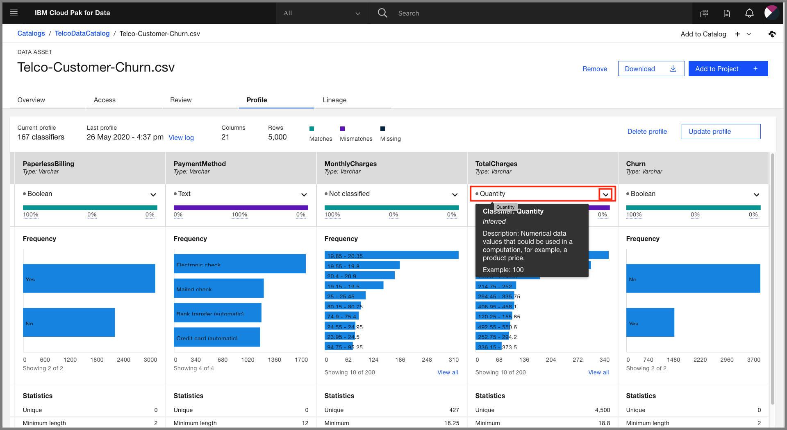

# Watson Knowledge Catalog for Admins

This exercise demonstrates how to solve the problems of enterprise data governance using Watson Knowledge Catalog on the Cloud Pak for Data platform. We'll explain how to use governance, data quality and active policy management in order to help your organization protect and govern sensitive data, trace data lineage and manage data lakes. This knowledge will help users quickly discover, curate, categorize and share data assets, data sets, analytical models and their relationships with other members of your organization. It serves as a single source of truth for data engineers, data stewards, data scientists and business analysts to gain self-service access to data they can trust.

You will need the *Admin* role to create a catalog.

This section is comprised of the following steps:

1. [Set up Catalog and Data](#1-set-up-catalog-and-data)
1. [Add collaborators and control access](#2-add-collaborators-and-control-access)
1. [Add categories](#3-add-categories)
1. [Add data classes](#4-add-data-classes)
1. [Add Business terms](#5-add-business-terms)
1. [Add rules for policies](#6-add-rules-for-policies)

## 1. Set up Catalog and Data

> NOTE: The default catalog is your enterprise catalog. It is created automatically after you install the Watson Knowledge Catalog service and is the only catalog to which advanced data curation tools apply. The default catalog is governed so that data protection rules are enforced. The information assets view shows additional properties of the assets in the default catalog to aid curation. Any subsequent catalogs that you create can be governed or ungoverned, do not have an information assets view, and supply basic data curation tools.

First we'll create a catalog and load some data

### Create the catalog

#### Provision Watson Knowledge Catalog the First Time

If you haven't yet started Watson Knowledge Catalog, you'll need to provision it.

* Open Watson Knowledge Catalog by clicking the *Services* icon at the top right of the home page:

* Under the *Data Governance* section, click on the *Watson Knowledge Catalog* tile:

#### Open Watson Knowledge Catalog

* Click open on the top-right corner to launch Watson Knowledge Catalog.

* Go to the upper-left (☰) hamburger menu and choose `Organize` -> `All catalogs`:

* From the *Your catalogs* page, click either `Create catalog` or `New Catalog`:

* Give your catalog a name and optional description, check  `Enforce data protection rules` and click `create`:

* Click `OK` on the pop-up that shows up when you checked the checkbox in the previous screen

### Option 1 - Add data assets 

* Under the *Browse Assets* tab, below "Now you can add assets!" click `here` to add your data:

*OR* you can click `Add to catalog +` in the top right and, for example, choose `Local files`:

* Browse to the `/data/merged/Telco-Customer-Churn.csv` file and double-click or click `Open`. Add an optional description and click `Add`:

>NOTE: Stay in the catalog until loading is complete! If you leave the catalog, the incomplete asset will be deleted.

* The newly added *Telco-Customer-Churn.csv* file will show up under the *Browse Assets* tab of your catalog:

### Option 2 - Add Connection

* You can add a connection to a remote DB, for example *DB2 Warehouse in IBM Cloud*, by choosing `Add to catalog +` -> `Connection`:

* Choose your remote DB and click:

* Enter the connection details and click `Create`:

* The connection now shows up in the catalog:

### Options 3 - Add Virtualized Data

Virtualized data can be added to the *Default* catalog by someone with Administrator or Editor access to that catalog.

* Go to the upper-left (☰) hamburger menu and choose `Organize` -> `All catalogs`. Click `Add to Catalog +` -> `Connected asset`:

* Click *Source* -> `Select source`. Browse under `DV` to you Schema (i.e. UserXYZW) and choose the joined table. Click `Select`.

A user can now add this to a project like any other asset from a catalog.

## 2. Add collaborators and control access

* Under the *Access Control* tab you can click `Add Collaborator` to give other users access to your catalog:

* You can search for a user, click on the name to select them, choose a role for the user - Admin, Editor, or Viewer and click `Add`:

* To access data in the catalog, click on the name of the data:

* A preview of the data will open, with metadata and the first few rows:

* You can click the `Review` tab and rate the data, as well as comment on it, to provide feedback for your teammates:

## 3. Add categories

The fundamental abstraction in Watson Knowledge Catalog is the Category. A category is analogous to a folder.

* Add a category for your assets by going to the upper-left (☰) hamburger menu, choose `Organize` -> `Data and AI Governance` -> `Categories`, 

You can import them in .csv format(option 1) , or you can add categories manually(option 2).

### Option 1 - Import categories

* Click `Import`:

* Click `Add file` and navigate to where you cloned the workshop repository, choosing `data/wkc/glossary-organize-categories.csv`.

* Under `Select merge option` choose `Replace all values` and click `Import`:

* You will see "The import completed succesfully" when it is completed.

In this way, you can import Categories, Business Terms, Classifications, Policies, etc. to populate your governance catalogs.

### Option 2 - Add category manually

*  then click `Create category`:

* Give your category a name, such as *Billing*, and an optional description, and then click `Save`:

* Now, if you hit `Create category` again on the *Billing* category screen, you can create a sub-category, such as *Total Charges*:

* For the *Billing* category you can select a *Type*, such as `Business term`:

* We can also create classifications for assets, similar to *Confidential*, *Personally Identifiable Information*, or *Sensitive Personal Information* in a similar way, by going to the upper-left (☰) hamburger menu, choose `Organize` -> `Data and AI Governance` -> `Classifications`. 

* Click `New classification` dropdown and select `Create new classification`. These classifications can then be added to your category as a *Type*: 

## 4. Add data classes

When you profile your assets, a data class will be inferred from the contents where possible. We'll see more on this later. You can also add your own data classes.

* Add a data class for your assets by going to the upper-left (☰) hamburger menu, choose `Organize` -> `Data and AI Governance` -> `Data classes`, then click `New data class` -> `Create new data class`:

* Give your new data class a name, i.e. *alphanumeric*, and an optional Primary category and/or description, and click `Save as draft`:

* Once the data class is created, we can add *Stewards* for this class, and also associate *classifications* and *business terms*. When you are ready, click `Publish`:

Now let's add that data class to a column in our *Telco-Customer-Churn.csv* asset.

* Go back to your Telco catalog and open it up to the column view ((☰) hamburger menu `Organize` -> `All catalogs` and choose `Telco catalog`). Under the *Browse assets* tab, click on the data set *Telco-Customer-Churn.csv* to get the column/row preview. Scroll right to get to the *CustomerID* column and click the down arrow next to "Customer Number" and then *View all*:

* In the window that opens, search for your newly created data class, *alphanumeric* and click it when it returns in the search. Then click *Select*:

## 5. Add Business terms

You can use [Business terms](https://dataplatform.cloud.ibm.com/docs/content/wsj/governance/dmg16.html) to standardize definitions of business concepts so that your data is described in a uniform and easily understood way across your enterprise.

You already saw how to create a category and make it a *business term*. You can also create the business term as it's own entity.

* From the upper-left (☰) hamburger menu, choose `Organize` -> `Data and AI Governance` -> `Business terms`:

* Click on the upper-right `New business term` drop down and choose `Create new business term` button:

* Give the new Business term a name such as *Billing* and optional description, and click `Save as draft`. NOTE that others on the platform will be creating a business term for this workshop, so perhaps pre-pend your term with something unique, i.e *scottda-Billing*:

* A window will come up once the term is created. You can see a rich set of options for creating related terms and adding other metadata. For now, click `Publish` to make this term available to users of the platform:

* Add an optional comment and click `Publish` in the new window:

* Now go back to your Telco catalog and open it up to the column view ((☰) hamburger menu `Organize` -> `All catalogs` and choose `Telco catalog`). Under the *Browse assets* tab, click on the data set *Telco-Customer-Churn.csv* to get the column/row preview. Scroll right to get to the *TotalCharges* column and click the *Column information* icon (looks like an "eye"):

* In the window that opens, click the *edit* icon (looks like a "pencil") next to *Business terms* :

* Enter *Billing* (or your uniquely named term such as *scottda-Billing*) under *Business terms* and the term will be searched for. Click on the `Billing` term that is found, and click `Apply`:

Close that window once the term has been applied.
Now, do the same thing to add the *Billing* Business term to the *MonthlyCharges* column.

* You will now be able to search for these terms from within the platform. For example, going back to your top level *Telco Catalog*, in the search bar with the comment "What assets are you searching for?" enter your unique *<unique_string>Billing* term:

The *Telco-Customer-Churn.csv* data set will show up, since it contains columns tagged with the *Billing* business term.

## 6. Add rules for policies

We can now create rules to control how a user can access data.

* Create a business term called *CustomerID* and assign it to your *CustomerID* column in the data set using the instructions above. See below if you need details, but try it yourself first, and skip to *Adding a rule* below if you do not need a reminder.

### How to create a Business term review

* From the upper-left (☰) hamburger menu, choose `Organize` -> `Data and AI Governance` -> `Business terms`.

* Click on the upper-right `+ Create Business term` button.

* Give the new Business term the name *CustomerID* and optional description, and click `Save as draft`. In the next window, click `Publish`.

* Now go back to your Telco catalog and open it up to the column view ((☰) hamburger menu `Organize` -> `All catalogs` and choose `Telco catalog`). Under the *Browse assets* tab, click on the data set *Telco-Customer-Churn.csv* to get the column/row preview. Scroll right to get to the *CustomerID* column and click the *Column information* icon (looks like an "eye"):

* In the window that opens, click the *edit* icon (looks like a "pencil") next to *Business terms* :

* Enter *CustomerID* under *Business terms* and the term will be searched for. Click on the `CustumerID` term that is found, and click `Apply`.

### Adding a rule

* From the upper-left (☰) hamburger menu, choose `Organize` -> `Data and AI Governance` -> `Rules`, 

* then click `New rule` -> `Create new rule`.

* For the *New rule* -> *Select the type of rule to create* choose `Data protection rule`.

* Under *Details* give your rule a *Name*, *Type* = *Access*, and a *Business definition*.

* Next, under *Rule builder* *Condition1* fill out If *Business term* *Contains any* *CustomerID*  and Action then *mask data* *in columns containing* *alphanumeric*. Choose the tile for `Substitute`, which will make a non-identifiable hash. This obscures the actual CustomerID, but allows actions like database joins to still work. Click `Create`:

* Now if we go back to our *Telco-Customer-Churn.csv* asset in the catalog at the *CustomerID* column, it will look the same as before. But a non-admin user will see the "lock" icon and see that the customerID has now been substituted with a hash value:

* To add a rule to *Obfuscate* data, go to the `Profile` tab and scroll to the *TotalCharges* column. You can see that the data has been inferred to be classified as a *Quantity*:

Here is where you could change the classification if the inferred one was not what you wanted.

* You can build a rule to *Obfuscate* this *TotalCharges* column:

* And now that column will have data that is replaced with similarly formatted data:

This ends the Watson Knowledge Catalog for Admins lab.
